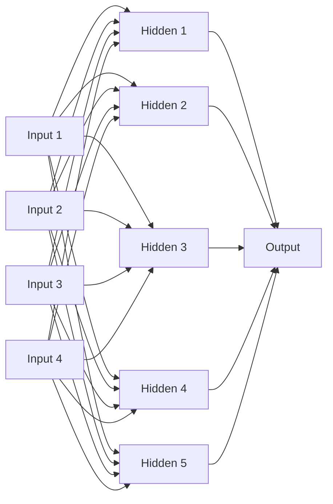
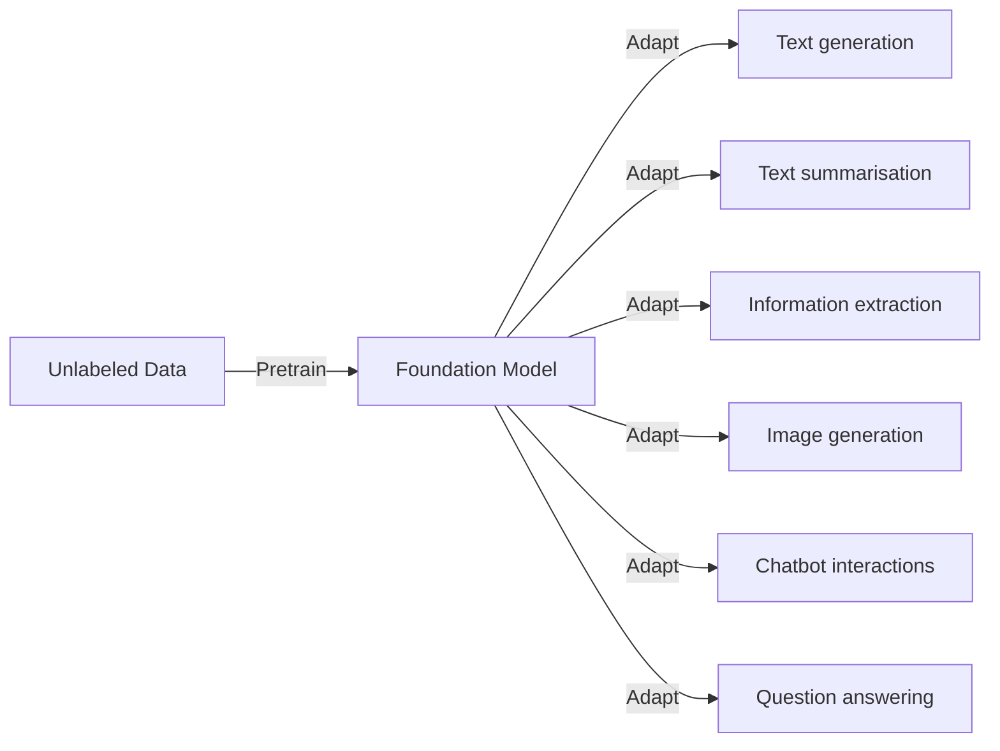
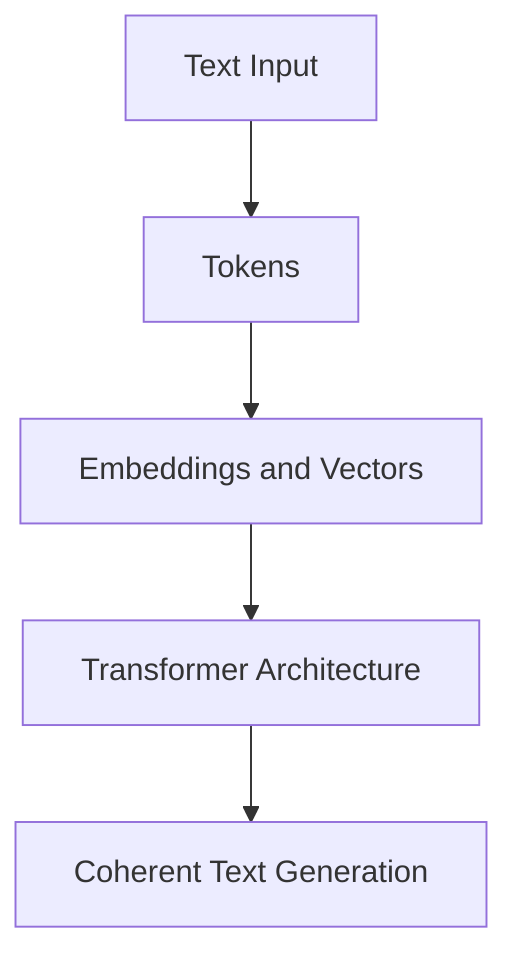
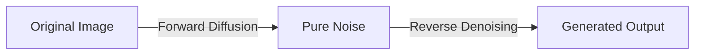
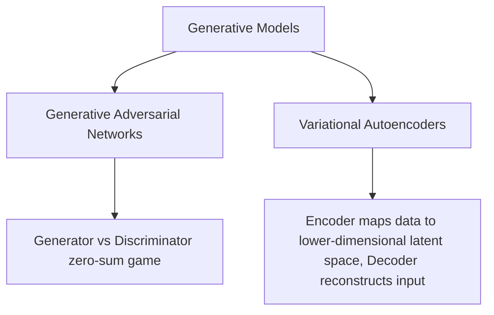
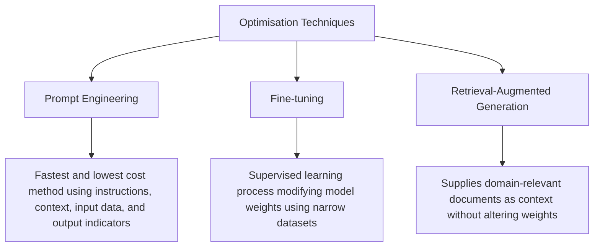
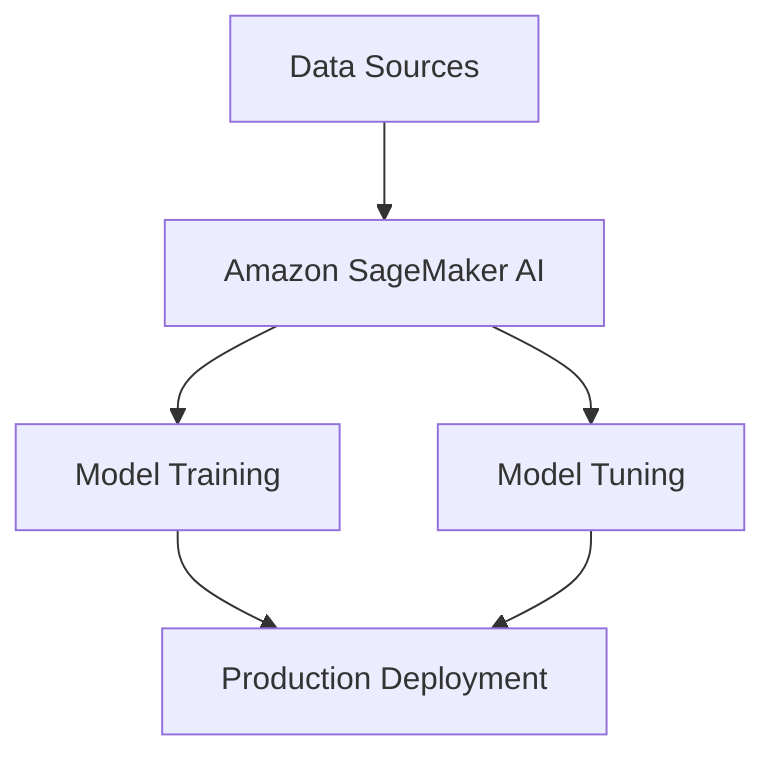
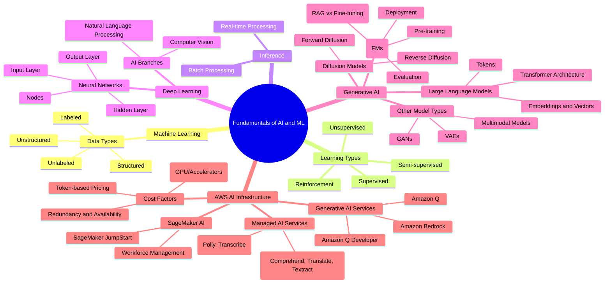

#  Machine Learning Fundamentals

Building a machine learning model means collecting and preparing data, picking a good algorithm, training the model, and checking how well it works.

## Sorting Out the Data

The process begins with gathering data. Bad data gives bad results, often called garbage in, garbage out. An ML model only works as well as the data used to train it. Preparing data takes time, but it is the most vital step. If you rush it, the model will fail.

Here is a look at the different types of data you will use.

| Data Type | What it means |
|---|---|
| Labeled | Data tagged with clear answers. |
| Unlabeled | Raw data without any tags. |
| Structured | Organised data, like numbers in a SQL database. |
| Unstructured | Messy data, like text documents or photos. |

## How the Machine Actually Learns

Next, we feed the prepared data into algorithms. The learning process splits into a few main types.

| Learning Type | How it works | Goal |
|---|---|---|
| Supervised | Learns from labeled data. | Predict outputs for new data. |
| Unsupervised | Learns from unlabeled data. | Find hidden patterns or structures. |
| Reinforcement | Uses rewards and penalties. | Improve decision making over time based on feedback. |
| Semi supervised | Uses some labeled data. | Guide the learning when you lack fully labeled data. |

## Putting It to Work

Once trained, the model starts making predictions. We call this inferencing. You have two main ways to do this.

| Inferencing Type | Process | Best For |
|---|---|---|
| Batch | Analyses massive chunks of data all at once. | Tasks where speed matters less than accuracy. |
| Real time | Makes quick decisions as new data arrives. | Instant answers, like chatbots or self driving cars. |

Your specific needs will decide which method you use. [Inference] Self driving cars rely heavily on real time processing to stay safe.

## Questions You Might Have Missed

**What happens if the training data is biased?**
[Inference] The model will learn and repeat that bias. You must check your data carefully to avoid unfair results.

**Can a model keep learning after we deploy it?**
[Inference] Yes, some models use continuous learning. They take in new data and update themselves while running.

**How much data do I actually need?**
[Inference] It depends on the task. Simple tasks need a few thousand examples, while big models need billions of data points.
# Deep Learning Fundamentals

Deep learning mimics brain function using artificial neural networks. These models use tiny units called nodes arranged in layers.

## Neural Network Structure

Networks learn by adjusting node links when shown data examples. Once trained, they can predict outcomes for new data.

## AI Branches

- **Computer Vision:** Helps computers understand images and videos for tasks like object detection.
    
- **Natural Language Processing:** Deals with human language for tasks like translation and sentiment analysis.
    

### Questions You Might Have Missed

- **What are the layers in a neural network?** An input layer, hidden layers, and an output layer.
    
- **What does computer vision do?** It helps computers make sense of digital images and videos.

# Generative AI Fundamentals

Generative AI emerged due to massive investments in computing resources, hiring large teams, and developing big ideas.

## Foundation Models (FMs)

Foundation models are pretrained on internet-scale data. Rather than gathering labeled data for individual models, a single FM adapts to perform multiple tasks, serving as a starting point for specialised systems.

### FM Lifecycle Stages

- **Data Selection:** Uses massive unstructured and unlabeled datasets from diverse sources.
    
- **Pre-training:** Employs self-supervised learning to autogenerate labels from data structure, teaching the model word meanings and contexts. Continuous pre-training expands knowledge across domains.
    
- **Optimisation:** Enhances pre-trained models using prompt engineering, retrieval-augmented generation, or fine-tuning.
    
- **Evaluation:** Measures performance using appropriate metrics and benchmarks against business requirements.
    
- **Deployment:** Integrates the model into production software, APIs, or applications.
    
- **Feedback and Continuous Improvement:** Monitors performance and collects user input to guide future iterations, retraining, or fine-tuning.
    

## Large Language Models (LLMs)

Most state-of-the-art LLMs use the transformer architecture to understand and generate human-like text by learning relationships between words and phrases.

### Tokens, Embeddings, and Vectors

- **Tokens:** Basic processing units like words, phrases, or characters that standardise input data.
    
- **Embeddings and Vectors:** Numerical representations assigning a list of numbers to each token to capture semantic relationships in space. For instance, the vector for "cat" sits close to "feline" and "kitten".
    

## Diffusion Models

Diffusion models start with pure noise and iteratively add meaningful information to create clear outputs like images or text.

Code snippet

- **Forward Diffusion:** Gradually adds noise to an input until only random noise remains.
    
- **Reverse Diffusion:** Gradually denoises random data until a new, coherent output is generated.
    

## Multimodal Models

Multimodal models process and generate multiple data types simultaneously, such as combining text and images. They understand how different modalities influence each other to handle tasks like video captioning or visual question answering.

## Other Generative Models

- **GANs:** Feature a generator creating synthetic data and a discriminator trying to distinguish real data from generated data until outputs become indistinguishable.
    
- **VAEs:** Combine autoencoders and variational inference using an encoder to map input to a latent space and a decoder to reconstruct original data from sampled probability distributions.
    

## Optimising Model Outputs

### Questions You Might Have Missed

- **What is continuous pre-training?** It is an additional pre-training phase on extra data meant to expand a model's knowledge base and improve generalization across new domains.
    
- **How does RAG differ from fine-tuning regarding model weights?** RAG supplies external document context without changing underlying foundation model weights, whereas fine-tuning modifies those weights using task-specific datasets.

# AWS AI and Machine Learning Infrastructure

AWS provides a comprehensive suite of machine learning and generative AI services designed to support intelligent applications. This document outlines core architectural components, machine learning frameworks, managed AI capabilities, and cost considerations for enterprise workloads.

## Machine Learning Frameworks and Core Infrastructure

### Amazon SageMaker AI

Amazon SageMaker AI manages traditional machine learning workflows, including building, training, and deploying models.

- Provides fully managed infrastructure and tools.
    
- Removes heavy lifting from each step of the machine learning process.
    
- Speeds up production with lower cost and reduced effort.
    
- Supports efficient building, training, and running of large language models and foundational models.
    

## Managed AI Services Layer

AWS offers ready-to-use services that provide machine learning capabilities without requiring extensive infrastructure management or specialised expertise.

### Natural Language and Text Processing

- **Amazon Comprehend**: Uses natural language processing to uncover insights and relationships in unstructured data. Performs language identification, key phrase extraction, sentiment analysis, tokenisation, and topic modeling.
    
- **Amazon Translate**: Neural machine translation service using deep learning models to deliver accurate and natural-sounding translations for applications and documents.
    
- **Amazon Textract**: Automatically extracts text, handwritten data, and table contents from scanned documents, going beyond traditional optical character recognition.
    

### Conversational and Speech Services

- **Amazon Lex**: Fully managed service to design, build, test, and deploy conversational interfaces using automatic speech recognition and natural language understanding.
    
- **Amazon Polly**: Converts text into lifelike speech using advanced deep learning technologies across multiple languages.
    
- **Amazon Transcribe**: Automatic speech recognition service that converts audio files or live audio streams into text with word-level timestamps.
    

## Generative AI Services

The generative AI layer offers specialised tools for advanced content creation, data synthesis, and interactive experiences.

|**Service**|**Primary Function**|**Key Capability**|
|---|---|---|
|**Amazon SageMaker JumpStart**|Model acceleration|Provides fully customizable reference architectures and one-click deployment for over 150 open-source models.|
|**Amazon Bedrock**|Foundational model access|Fully managed service providing access to high-performing foundational models through a single API with private customisation options.|
|**Amazon Q**|Enterprise assistant|Connects to company information repositories and codebases to provide immediate answers and streamline tasks.|
|**Amazon Q Developer**|Code generation|Integrates with integrated development environments to generate entire functions and code blocks for developers.|

## Cost Considerations and Trade-offs

When deploying AWS AI and machine learning services, architectural choices directly impact financial and operational overhead:

- **Responsiveness and Availability**: Lower latency and multi-Region deployments increase pricing compared to standard availability guarantees.
    
- **Redundancy**: Deploying across multiple Availability Zones or regions incurs additional costs for resource provisioning and data replication.
    
- **Compute Options**: High-performance hardware options, such as graphics processing units and custom accelerators, increase infrastructure costs in exchange for workload performance improvements.
    
- **Pricing Models**: Token-based pricing charges based on the volume of text or code generated or processed by services like Amazon Bedrock and Amazon Q Developer.
    
- **Provisioned Throughput**: Pre-allocating capacity for services like Amazon Polly and Amazon Transcribe ensures predictable performance for time-sensitive workloads at a higher cost.
    
- **Custom Models**: Training, fine-tuning, and deploying custom models incur additional expenses based on dataset complexity and compute duration.
    

## Review Questions and Answers

### What is the primary function of Amazon SageMaker JumpStart?

SageMaker JumpStart accelerates machine learning adoption by providing pre-built solutions, reference architectures, and one-click deployment for over 150 popular open-source models.

### How does Amazon Bedrock deliver foundational models to developers?

Amazon Bedrock provides access to foundational models from Amazon and leading artificial intelligence startups through a single serverless application programming interface.

### What pricing model applies to services like Amazon Q Developer and Amazon Bedrock?

These services typically utilise a token-based pricing model where customers pay for the exact volume of text or code processed or generated.

# Mindmap

