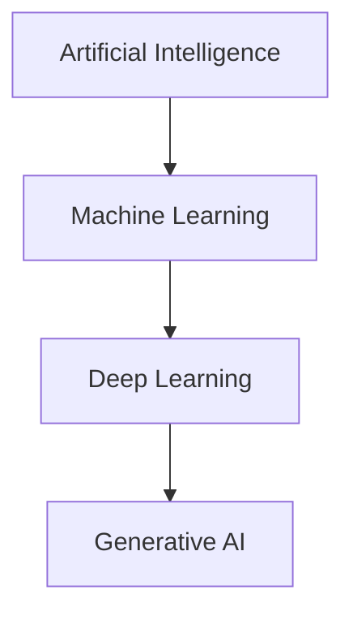
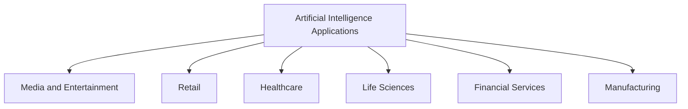
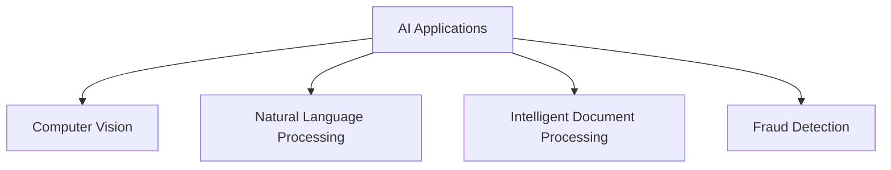
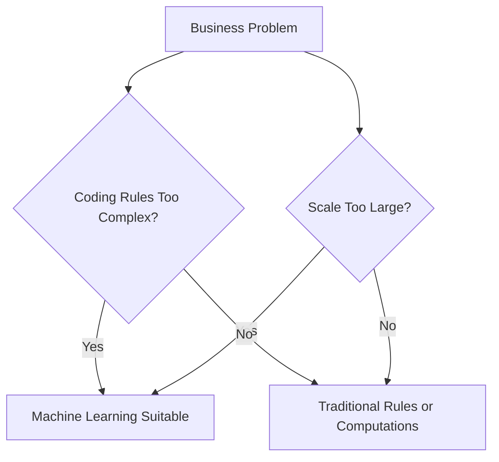
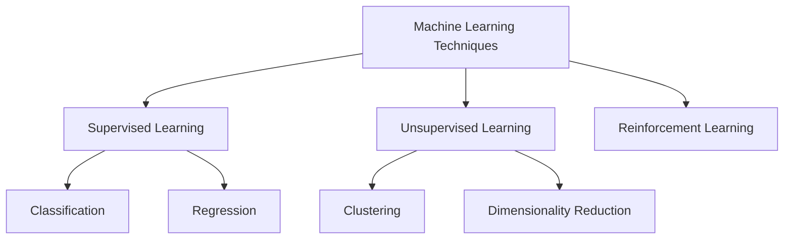
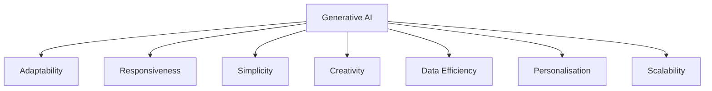
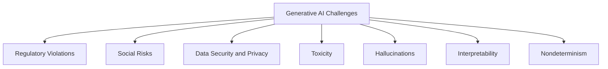
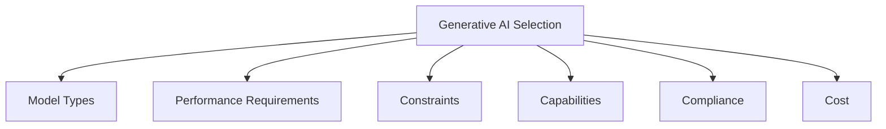
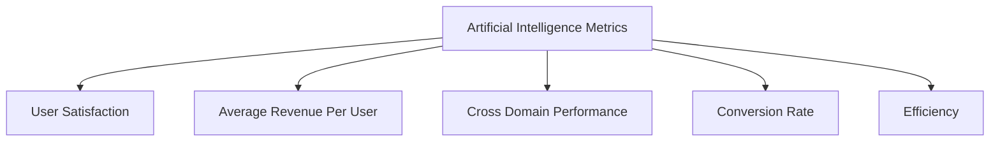
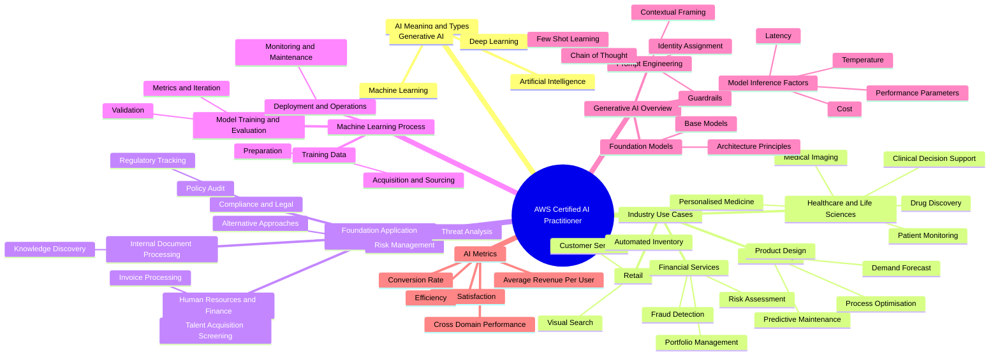

# Artificial Intelligence (AI)

## Hierarchy of Terms

## Definitions

|**Term**|**Definition**|**Key Characteristics**|
|---|---|---|
|Artificial Intelligence|Broad field for building systems that perform tasks requiring human intelligence.|Umbrella term for various techniques and approaches.|
|Machine Learning|Subset of artificial intelligence focused on methods for machines to learn.|Uses data to improve computer performance on set tasks.|
|Deep Learning|Subset utilizing concepts of neurons and synapses modelled on the human brain.|Mimics biological neural wiring.|
|Generative AI|Subset of deep learning capable of creating new content.|Adapts models without retraining or fine tuning.|

## Applications of Generative AI

Generative AI builds new data using patterns and structures learned from training data. It creates multiple forms of content, including:

- Conversations
    
- Stories
    
- Images
    
- Videos
    
- Music
    
- Code

# Real-World Artificial Intelligence Applications

## Sector Overview

## Industry Use Cases

| Sector | Application | Function |
| --- | --- | --- |
| Media and Entertainment | Content Generation | Creates scripts, dialogues, and stories for films, television shows, and games. |
| Media and Entertainment | Virtual Reality | Builds immersive and interactive environments for gaming and simulations. |
| Media and Entertainment | Automated Journalism | Generates articles and summaries using raw data feeds. |
| Retail | Review Summaries | Compiles customer feedback so shoppers find key details quickly. |
| Retail | Pricing Optimisation | Models pricing scenarios to maximise profit margins. |
| Retail | Virtual Try-Ons | Creates digital customer models to preview clothing online. |
| Retail | Layout Optimisation | Designs efficient floor plans to boost sales and flow. |
| Healthcare | AWS HealthScribe | Analyses patient and clinician conversations to generate clinical notes automatically. |
| Healthcare | Personalised Medicine | Generates treatment plans based on genetics, lifestyle, and disease progression. |
| Healthcare | Medical Imaging | Enhances and reconstructs X-rays, MRIs, and CT scans for diagnosis. |
| Life Sciences | Drug Discovery | Proposes new molecular structures to accelerate pharmaceutical pipelines and reduce costs. |
| Life Sciences | Protein Folding | Predicts three-dimensional protein structures from amino acid sequences. |
| Life Sciences | Synthetic Biology | Designs engineered biological systems and circuits. |
| Financial Services | Fraud Detection | Simulates money laundering patterns using synthetic datasets to train detection systems. |
| Financial Services | Portfolio Management | Simulates market scenarios to build robust investment strategies. |
| Financial Services | Debt Collection | Generates communication strategies to increase successful recovery rates. |
| Manufacturing | Predictive Maintenance | Analyses historical production data to schedule servicing before machine failure. |
| Manufacturing | Process Optimisation | Models production variables to minimise cost and maximise resource efficiency. |
| Manufacturing | Product Design | Generates multiple design options based on constraints like cost and materials. |
| Manufacturing | Material Science | Formulates new material compositions with specific physical properties. |
# Artificial Intelligence Applications and Business Value

## Core Application Domains

## Technical Overview of Applications

| **Application Domain**          | **Description**                                                                                               | **Primary Industries**                         | **Key Business Value**                                                    |
| ------------------------------- | ------------------------------------------------------------------------------------------------------------- | ---------------------------------------------- | ------------------------------------------------------------------------- |
| Computer Vision                 | Interprets digital images and videos using deep learning techniques like classification and object detection. | Autonomous Driving, Healthcare, Public Safety  | Enhance customer experience, improve operations, and secure environments. |
| Natural Language Processing     | Manages computer and human language interactions for sentiment analysis and generation.                       | Insurance, Telecommunications, Education       | Sensitive data redaction and customer engagement.                         |
| Intelligent Document Processing | Extracts and classifies unstructured data to generate summaries and actionable insights.                      | Financial Services, Legal, Healthcare          | Automation and improved business operations.                              |
| Fraud Detection                 | Identifies and prevents unauthorised behavior or fraudulent transactions.                                     | Financial Services, Retail, Telecommunications | Improve business operations and transaction security.                     |

## Industry Use Cases

### Computer Vision

- **Autonomous Driving:** Car manufacturers use vision technology to make self driving vehicles safer and more reliable.
    
- **Healthcare:** Medical imaging analysis improves the accuracy and speed of diagnoses, leading to better treatment outcomes and increased life expectancy. **Business value:** Improve business operations.
    
- **Public Safety:** Image and facial recognition identify unlawful entries or persons of interest to foster safer communities and deter crime. **Business value:** Enhance customer experience.
    

### Natural Language Processing

- **Insurance:** Firms extract policy numbers, expiration dates, and personal details automatically. **Business value:** Sensitive data redaction.
    
- **Telecommunications:** Companies analyse customer text messages to suggest tailored recommendations. **Business value:** Customer engagement.
    
- **Education:** Students utilise question and answer chatbots to address academic queries. **Business value:** Enhance student experience and engagement.
    

### Intelligent Document Processing

- **Financial Services:** Lenders extract data from mortgage applications to accelerate customer response times and review loan packages, tax forms, and pay stubs during underwriting. **Business value:** Improve business operations and automation.
    
- **Legal:** OCR and NLP combinations eliminate manual effort when processing contractual documents, agreements, court filings, and legal dockets. **Business value:** Improve business operations.
    
- **Healthcare:** Organisations process claims and doctor notes quickly and accurately. **Business value:** Improve business operations.
    

### Fraud Detection

- **Financial Services:** Institutions run identity verification, payment monitoring, transaction surveillance, and anti money laundering sanctions. **Business value:** Improve business operations.

# Machine Learning Foundations

Machine Learning is a subset of artificial intelligence focused on developing algorithms and statistical models. These systems learn from data to make predictions or decisions without explicit programming. Models identify patterns and relationships from large datasets, improving performance over time as they process more information.

## When to Use Machine Learning

### Appropriate Use Cases

- **Coding rules is a challenge:** Tasks with excessive variables, overlapping conditions, or the need for fine tuning resist simple rule-based programming. Spam filtering exemplifies this complexity, where static definitions fail against shifting patterns.
    
- **Scale of the project is a challenge:** Manual processing of large volumes becomes inefficient. While a human handles a few hundred items, machine learning scales to millions of data points effortlessly.
    

### Alternative Approaches

Machine learning is unnecessary if a target value derives from simple rules, deterministic computations, or fixed sequential steps. Traditional programming without data-driven learning remains the correct choice when a problem lacks scale and complexity.

# Machine Learning Techniques and Use Cases

## Supervised Learning

Supervised learning requires a supervisor in the form of labeled training data. Algorithms learn by example, establishing patterns and relationships between inputs and outputs.

### Subcategories of Supervised Learning

- **Classification:** Assigns discrete labels or categories to new, unseen data instances based on trained patterns.
    
    - **Use cases:** Fraud detection, image classification, customer retention, diagnostics.
        
- **Regression:** Predicts continuous numerical values by modelling the relationship between dependent and independent variables.
    
    - **Use cases:** Advertising popularity prediction, weather forecasting, market forecasting, estimating life expectancy, population growth prediction.
        

## Unsupervised Learning

Unsupervised learning trains models on unlabeled data, requiring the system to discover hidden structures, emerging properties, and inherent relationships without guidance.

### Subcategories of Unsupervised Learning

- **Clustering:** Groups data points by similarity or distance to clarify attributes within a specific subset.
    
    - **Use cases:** Customer segmentation, targeted marketing, recommendation systems.
        
- **Dimensionality Reduction:** Decreases feature count while preserving key information and structural patterns.
    
    - **Use cases:** Big data visualisation, meaningful compression, structure discovery, feature elicitation.
        

## Reinforcement Learning

Reinforcement learning relies on trial and error within an environment, using performance feedback, rewards, and penalties to refine decision-making over time.

- **Example:** In the AWS DeepRacer simulator, the virtual car acts as the agent navigating a racetrack environment by adjusting steering and throttle to maximise track completion speed.

# Generative Artificial Intelligence and Capabilities

## Core Operational Attributes

Generative artificial intelligence sits as a subset of deep learning. It adapts pre-built models without retraining or fine-tuning, creating novel outputs from learned training data structures. Organisations deploy these systems to automate routine duties and analyse complex trends.

- **Adaptability:** Models adjust to varied tasks and domains by learning from data to generate context-specific content across multiple industries.
    
- **Responsiveness:** Systems produce output instantly, enabling live interactions for virtual assistants and conversational interfaces.
    
- **Simplicity:** Language models automate text creation, reducing human effort required for document generation.
    
- **Creativity and Exploration:** Algorithms combine elements uniquely to foster novel ideas and design solutions.
    
- **Data Efficiency:** Certain architectures learn effectively from small sample sizes when training material remains scarce.
    
- **Personalisation:** Models tailor content to individual user characteristics, elevating engagement levels.
    
- **Scalability:** Trained models rapidly produce large content volumes to match high volume demands.

# Challenges of Generative AI

## Risk and Mitigation Overview

Deploying generative models requires managing significant operational risks to prevent unethical outcomes, data breaches, and unreliable performance.

|**Challenge**|**Risk Profile**|**Mitigation Strategy**|
|---|---|---|
|Regulatory Violations|Exposing personally identifiable information from sensitive training data.|Implement strict data anonymisation and conduct compliance audits.|
|Social Risks|Generating unwanted content that harms organisational reputation.|Test and evaluate models rigorously prior to production deployment.|
|Data Security and Privacy|Processing user data in ways that breach privacy legislation.|Enforce encryption, least privilege IAM roles, and AWS Bedrock Guardrails.|
|Toxicity|Producing inflammatory, offensive, or inappropriate text.|Curate training sets to strip harmful phrases and deploy guardrail filters.|
|Hallucinations|Delivering inaccurate responses disconnected from training facts.|Require human verification and mark generated content as unverified.|
|Interpretability|Users drawing incorrect conclusions from model outputs.|Apply domain specific knowledge to shape model inputs and performance.|
|Nondeterminism|Producing varying outputs for identical inputs, hurting reliability.|Run repeated tests and compare outputs to ensure system consistency.|j
# Factors to Consider When Selecting a Generative AI Model 

## Core Selection Criteria

Choosing a generative AI model requires evaluating multiple technical and operational dimensions to align the system with business goals.

## Model Evaluation Matrix

|**Factor**|**Description**|**Key Considerations**|
|---|---|---|
|**Model Types**|Choosing between provider architectures (such as Amazon Nova, Anthropic Claude, Meta Llama, or Cohere Command) based on target tasks.|Text generation, multimodal processing, code synthesis, or embeddings.|
|**Performance Requirements**|Assessing accuracy, output reliability, and consistency across varied datasets.|Continuous monitoring and benchmark testing against production distributions.|
|**Constraints**|Evaluating physical limits such as computational power, memory, data availability, and deployment topology.|GPU availability, on-premises versus cloud execution, and training corpus size.|
|**Capabilities**|Determining output quality, customisation levels, and modal focus (text-to-image, long-context text analysis).|Matching specific task workflows to model architectural strengths.|
|**Compliance**|Managing moral and regulatory risks, particularly in sensitive sectors like healthcare, finance, and legal.|Fairness, transparency, traceability, toxicity control, and PII safeguarding.|
|**Cost**|Balancing the economic trade-offs between model size, inference speed, and deployment expenses.|Larger models offer high precision but incur higher compute overhead; smaller models scale efficiently.|

## Foundation Model Providers on Amazon Bedrock

|**Provider**|**Representative Family**|**Primary Tasks and Focus**|
|---|---|---|
|**AI21 Labs**|Jamba Models|Hybrid SSM-Transformer architectures for long-context handling.|
|**Amazon**|Titan and Nova Families|Multimodal text, image generation, speech processing, and embedding vector generation.|
|**Anthropic**|Claude Series|Advanced reasoning, complex document analysis, and agentic tool use.|
|**Stability AI**|Stable Diffusion|Image generation, editing, and visual transformation pipelines.|
|**Cohere**|Command and Embed|Enterprise search, retrieval augmented generation, and text reranking.|
|**Meta**|Llama Series|Open-weight multimodal models suited for custom tuning and cost-sensitive workflows.|
# Business Metrics for Generative AI 

## Artificial Intelligence Business Metrics

Deploying artificial intelligence applications has become common. Organisations have new opportunities for innovation, efficiency, and growth. However, the success of the initiative depends on the underlying algorithms and their tangible impact on core business objectives. By quantifying performance, effectiveness, and return on investment through relevant business metrics, organisations gain valuable insights into the value delivered. They can identify areas for improvement and make informed decisions to direct resources and strategy.

## Visual Overview of Metrics

## Core Metrics Breakdown

### User Satisfaction

User satisfaction gathers feedback to assess how happy people feel regarding artificial intelligence content or recommendations.

- Use case: Measuring and improving satisfaction for an online retail platform to increase customer loyalty, repeat purchases, and positive word of mouth.
    

### Average Revenue Per User

Average revenue per user calculates the financial return generated per customer attributed to the generative application.

- Use case: Analysing and optimising revenue generation per user to understand monetisation effectiveness and identify growth paths.
    

### Cross Domain Performance

Cross domain performance measures the model capability to function effectively across different industries or sectors.

- Use case: Monitoring and optimising a large retail platform with multiple sectors catering to different product categories and geographic regions.
    

### Conversion Rate

Conversion rate monitors the percentage of visitors who complete a desired action such as purchases, sign ups, or engagement tasks.

- Use case: Optimising an online store to turn visitors into paying customers by tracking completion metrics.
    

### Efficiency

Efficiency evaluates resource utilisation, computation time, and system capacity.

- Use case: Improving production line efficiency in manufacturing to reduce costs and increase productivity.
    
# Mindmap

