# Responsible Artificial Intelligence

Responsible artificial intelligence ensures systems are transparent and trustworthy while mitigating risks and negative outcomes. These principles apply across the entire lifecycle of an application.

## Core Responsibilities

Companies must ensure their systems meet specific standards. They must be:

- Fully transparent and accountable with monitoring mechanisms in place.
    
- Managed by leaders who are accountable for responsible strategies.
    
- Developed by experts in responsible principles and practices.
    
- Built following responsible guidelines.
    

## The Application Lifecycle

Visualising workflows is a great way to map out complex processes. Here is a visual representation of the lifecycle: 


## Comparing Traditional and Generative Systems

Both types of technology require responsible practices. This table breaks down the main differences.

| **Feature**   | **Traditional**                                                 | **Generative**                                             |
| ------------- | --------------------------------------------------------------- | ---------------------------------------------------------- |
| Core Function | Performs one task based on provided data.                       | Performs multiple tasks based on user prompts.             |
| Foundation    | Specific machine learning models.                               | Foundation models trained on massive general domain data.  |
| Capabilities  | Predictions, ranking, sentiment analysis, image classification. | Content creation, conversations, stories, code generation. |
| Examples      | Recommendation engines, gaming, voice assistance.               | Chatbots, text generation, image generation.               |

## Business Value of Generative Models

Foundation models offer significant business value and spark innovation.

- **Creativity:** Generate new content and ideas.
    
- **Productivity:** Improve efficiency across all lines of business and industries.
    
- **Connectivity:** Connect and engage with customers across organisations in new ways.
    

## Questions You Might Have Missed

**What exactly is a foundation model?**

It is a large model trained on massive amounts of general domain data that powers generative applications.

**Does traditional artificial intelligence generate new content?**

No. It analyses data to find patterns and make predictions.

**Why is transparency so important?**

It ensures systems are trustworthy and accountable for their outcomes. 
# Responsible AI Challenges in Machine Learning and Generative AI

Accuracy represents the primary challenge for developers building artificial intelligence applications. Both traditional statistical models and modern generative architectures rely on training datasets. Improperly trained models generate inaccurate predictions due to structural statistical errors.

## Model Accuracy: Bias vs Variance

The core difficulty in supervised machine learning involves finding an optimal balance between two error sources: **bias** and **variance**.

| **Metric**   | **Definition**                                                                                | **Model State** | **Characteristic**                                                                | **Graph Representation**                              |
| ------------ | --------------------------------------------------------------------------------------------- | --------------- | --------------------------------------------------------------------------------- | ----------------------------------------------------- |
| **Bias**     | Difference between expected predictions and true targets. Data features are underrepresented. | Underfitted     | High bias, low variance. Fails to capture underlying relationships.               | Straight regression line missing data points.         |
| **Variance** | Model sensitivity to small fluctuations or noise in training data.                            | Overfitted      | Low bias, high variance. Memorises training set, fails on unseen validation data. | Complex, fluctuating line fitting every noise point.  |
| **Balanced** | Optimal tradeoff where the model captures general patterns without learning noise.            | Generalised     | Low bias, low variance. Achieves low empirical error on evaluation data.          | Smooth regression curve reflecting underlying trends. |

### The Bias Variance Tradeoff

Optimisation requires tuning model parameters to achieve the lowest combined bias and variance for a given dataset.


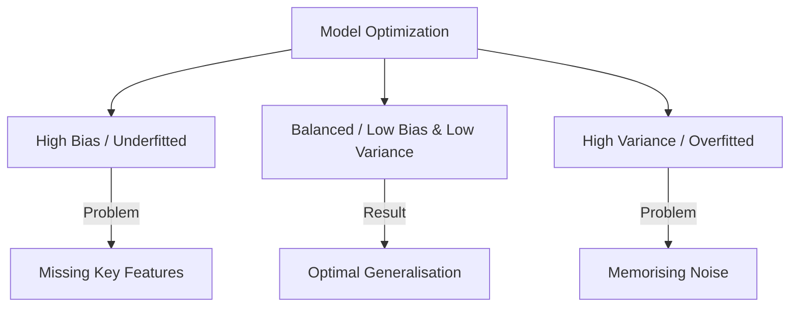

#### Underfitted:

<svg viewBox="0 0 500 300" width="100%" xmlns="http://www.w3.org/2000/svg">
  <!-- Axes -->
  <path d="M 50 30 V 250 H 450" stroke="#334155" stroke-width="3" fill="none"/>
  <!-- Points -->
  <rect x="60" y="90" width="14" height="14" fill="#34d399"/>
  <rect x="60" y="200" width="14" height="14" fill="#34d399"/>
  <rect x="90" y="140" width="14" height="14" fill="#34d399"/>
  <rect x="130" y="190" width="14" height="14" fill="#34d399"/>
  <rect x="130" y="140" width="14" height="14" fill="#34d399"/>
  <rect x="160" y="215" width="14" height="14" fill="#34d399"/>
  <rect x="185" y="170" width="14" height="14" fill="#34d399"/>
  <rect x="190" y="210" width="14" height="14" fill="#34d399"/>
  <rect x="225" y="205" width="14" height="14" fill="#34d399"/>
  <rect x="230" y="160" width="14" height="14" fill="#34d399"/>
  <rect x="260" y="200" width="14" height="14" fill="#34d399"/>
  <rect x="265" y="150" width="14" height="14" fill="#34d399"/>
  <rect x="300" y="190" width="14" height="14" fill="#34d399"/>
  <rect x="300" y="135" width="14" height="14" fill="#34d399"/>
  <rect x="330" y="180" width="14" height="14" fill="#34d399"/>
  <rect x="325" y="120" width="14" height="14" fill="#34d399"/>
  <rect x="355" y="50" width="14" height="14" fill="#34d399"/>
  <rect x="355" y="110" width="14" height="14" fill="#34d399"/>
  <rect x="370" y="160" width="14" height="14" fill="#34d399"/>
  <rect x="370" y="80" width="14" height="14" fill="#34d399"/>
  <rect x="380" y="130" width="14" height="14" fill="#34d399"/>
  <rect x="405" y="100" width="14" height="14" fill="#34d399"/>
  <!-- Trend Line -->
  <line x1="60" y1="210" x2="415" y2="150" stroke="#0284c7" stroke-width="4"/>
</svg>
In the underfitted example, the bias is high and the variance is low. Here the regression is a straight line. This shows us that the model is underfitting the data because it is not capturing all the features of the data.

#### Overfitted: 
<svg viewBox="0 0 500 300" width="100%" xmlns="http://www.w3.org/2000/svg">
  <!-- Axes -->
  <path d="M 50 30 V 250 H 450" stroke="#334155" stroke-width="3" fill="none"/>
  <!-- Points -->
  <rect x="60" y="90" width="14" height="14" fill="#34d399"/>
  <rect x="60" y="200" width="14" height="14" fill="#34d399"/>
  <rect x="90" y="140" width="14" height="14" fill="#34d399"/>
  <rect x="130" y="190" width="14" height="14" fill="#34d399"/>
  <rect x="130" y="140" width="14" height="14" fill="#34d399"/>
  <rect x="160" y="215" width="14" height="14" fill="#34d399"/>
  <rect x="185" y="170" width="14" height="14" fill="#34d399"/>
  <rect x="190" y="210" width="14" height="14" fill="#34d399"/>
  <rect x="225" y="205" width="14" height="14" fill="#34d399"/>
  <rect x="230" y="160" width="14" height="14" fill="#34d399"/>
  <rect x="260" y="200" width="14" height="14" fill="#34d399"/>
  <rect x="265" y="150" width="14" height="14" fill="#34d399"/>
  <rect x="300" y="190" width="14" height="14" fill="#34d399"/>
  <rect x="300" y="120" width="14" height="14" fill="#34d399"/>
  <rect x="330" y="180" width="14" height="14" fill="#34d399"/>
  <rect x="325" y="110" width="14" height="14" fill="#34d399"/>
  <rect x="355" y="50" width="14" height="14" fill="#34d399"/>
  <rect x="370" y="80" width="14" height="14" fill="#34d399"/>
  <rect x="355" y="110" width="14" height="14" fill="#34d399"/>
  <rect x="370" y="160" width="14" height="14" fill="#34d399"/>
  <rect x="380" y="130" width="14" height="14" fill="#34d399"/>
  <rect x="405" y="100" width="14" height="14" fill="#34d399"/>
  <!-- Overfitted Line (Connects every point) -->
  <path d="M 67 97 L 67 207 L 97 147 L 137 197 L 137 147 L 167 222 L 192 177 L 197 217 L 232 212 L 237 167 L 267 207 L 272 157 L 307 197 L 307 127 L 332 117 L 337 187 L 377 167 L 387 137 L 412 107 L 377 87 L 362 57 L 362 117" stroke="#0284c7" stroke-width="3" fill="none"/>
</svg>

In the overfitted example, bias is low and the variance is high. Here the regression curve perfectly fits the data. This means that it is capturing noise and is essentially memorizing the data. It won't perform well on new data.

#### Balanced:
<svg viewBox="0 0 500 300" width="100%" xmlns="http://www.w3.org/2000/svg">
  <!-- Axes -->
  <path d="M 50 30 V 250 H 450" stroke="#334155" stroke-width="3" fill="none"/>
  <!-- Points -->
  <rect x="60" y="90" width="14" height="14" fill="#34d399"/>
  <rect x="60" y="200" width="14" height="14" fill="#34d399"/>
  <rect x="90" y="140" width="14" height="14" fill="#34d399"/>
  <rect x="130" y="190" width="14" height="14" fill="#34d399"/>
  <rect x="130" y="140" width="14" height="14" fill="#34d399"/>
  <rect x="160" y="215" width="14" height="14" fill="#34d399"/>
  <rect x="185" y="170" width="14" height="14" fill="#34d399"/>
  <rect x="190" y="210" width="14" height="14" fill="#34d399"/>
  <rect x="225" y="205" width="14" height="14" fill="#34d399"/>
  <rect x="230" y="160" width="14" height="14" fill="#34d399"/>
  <rect x="260" y="200" width="14" height="14" fill="#34d399"/>
  <rect x="265" y="150" width="14" height="14" fill="#34d399"/>
  <rect x="300" y="190" width="14" height="14" fill="#34d399"/>
  <rect x="300" y="135" width="14" height="14" fill="#34d399"/>
  <rect x="330" y="180" width="14" height="14" fill="#34d399"/>
  <rect x="325" y="120" width="14" height="14" fill="#34d399"/>
  <rect x="355" y="50" width="14" height="14" fill="#34d399"/>
  <rect x="355" y="110" width="14" height="14" fill="#34d399"/>
  <rect x="370" y="160" width="14" height="14" fill="#34d399"/>
  <rect x="370" y="80" width="14" height="14" fill="#34d399"/>
  <rect x="380" y="130" width="14" height="14" fill="#34d399"/>
  <rect x="405" y="100" width="14" height="14" fill="#34d399"/>
  <!-- Smooth Curved Trend Line -->
  <path d="M 50 150 Q 180 230 405 105" stroke="#0284c7" stroke-width="4" fill="none"/>
</svg>
In the balanced example, the bias is low and the variance is low. Here the regression is a curve. This is what you want. Its capturing enough features of the data, without capturing noise.

## Strategies to Mitigate Bias and Variance Errors

- **Cross Validation:** Split input datasets into training and complementary evaluation subsets to evaluate generalisation and detect overfitting.
    
- **Dataset Expansion:** Add additional training samples to broaden the model learning scope.
    
- **Regularisation:** Penalise extreme weight values to prevent linear models from over-indexing on training instances.
    
- **Model Architecture Simplification:** Reduce capacity (fewer layers or parameters) if overfitted, or increase capacity if underfitted.
    
- **Dimensionality Reduction:** Apply Principal Component Analysis (PCA) to reduce feature space dimensions while preserving variance.
    
- **Early Stopping:** Terminate training before the network begins memorising noise patterns.
    

## Specific Challenges in Generative AI

Generative models introduce risks beyond traditional statistical models:

- **Toxicity:** Generation of harmful, offensive, or inappropriate text or media.
    
- **Hallucinations:** Production of factually incorrect outputs presented with high confidence.
    
- **Intellectual Property:** Unauthorised training on copyrighted material and output attribution issues.
    
- **Plagiarism and Cheating:** Academic or professional dishonesty via automated synthesis.
    
- **Disruption of Work:** Unmanaged shifts in job functions, workflows, and output validation methods.

# Core Dimensions of Responsible AI

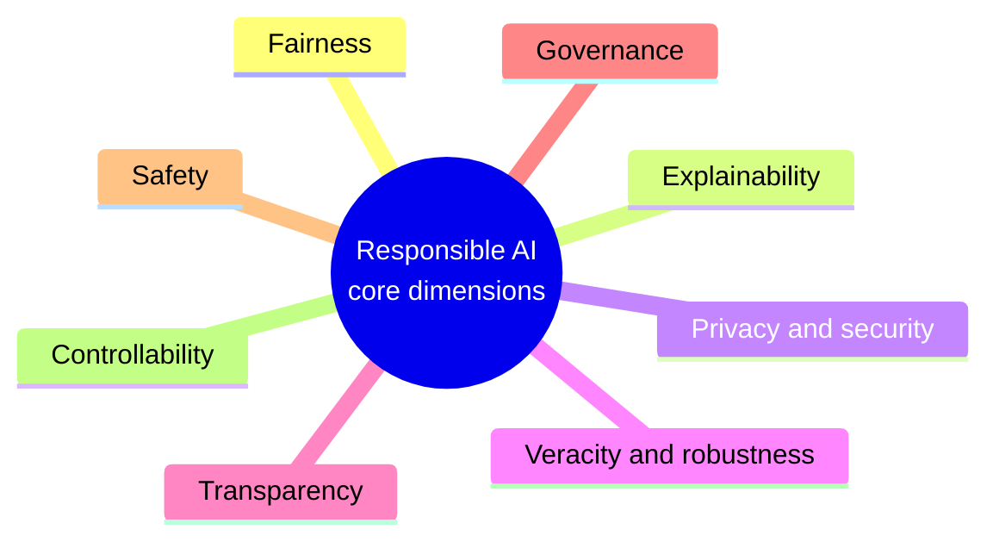

|**Dimension**|**Description**|
|---|---|
|**Fairness**|Promotes inclusion, prevents discrimination, and builds trust across society.|
|**Explainability**|Clarifies internal model mechanisms so humans understand how decisions are made.|
|**Privacy and Security**|Protects user data from unauthorized access and gives users control over data usage.|
|**Transparency**|Shares system details, limits, and processes so stakeholders can assess the tech.|
|**Veracity and Robustness**|Ensures models stay accurate and reliable during unexpected errors or data changes.|
|**Governance**|Sets organizational policies to enforce legal rules, compliance, and IP rights.|
|**Safety**|Tests algorithms to prevent unintended harm, misuse, or negative society impact.|
|**Controllability**|Provides tools to monitor and adjust model behavior to match human intent.|

## Key Business Benefits

|**Benefit**|**Impact**|
|---|---|
|**Increased Trust and Reputation**|Strengthens brand credibility with users and stakeholders.|
|**Regulatory Compliance**|Helps meet strict standards on privacy, fairness, and accountability.|
|**Mitigating Risks**|Cuts legal costs and prevents security breaches or bias issues.|
|**Competitive Advantage**|Sets the company apart as market awareness around ethics rises.|
|**Improved Decision-Making**|Delivers reliable, unbiased outputs for better data driven choices.|
|**Improved Products and Business**|Uses varied perspectives to spark creative and inclusive tools|
# AWS Responsible AI Tools and Services

## Overview of AWS Managed AI Platforms

### Amazon SageMaker AI

Amazon SageMaker AI is a managed machine learning service. Data scientists and developers use it to build, train, and deploy models into a hosted environment.

- UI experience across integrated development environments.
    
- Managed algorithms that run efficiently on large datasets in distributed environments.
    
- Built in support for custom algorithms and frameworks.
    
- Data storage and sharing without managing servers.
    
- Quick deployment from the SageMaker console to secure environments.
    

### Amazon Bedrock

Amazon Bedrock is a managed serverless service that provides foundation models through a unified API.

- Offers foundation models from leading AI startups and Amazon.
    
- Allows private model customisation using your own data without managing infrastructure.
    
- Provides built in privacy, security, and safety controls.
    

## Capabilities and Responsible AI Features

### Foundation Model Evaluation

Evaluating foundation models helps confirm suitability for specific tasks.

- **Amazon Bedrock Model Evaluation**:
    
    - Automatic evaluation: Measures predefined metrics such as accuracy, robustness, and toxicity.
        
    - Human evaluation: Evaluates custom metrics such as friendliness, style, and brand voice suitability. Reviewers can be in house staff or AWS managed teams.
        
- **Amazon SageMaker AI Clarify**:
    
    - Evaluates foundation models automatically for accuracy, robustness, and toxicity.
        
    - Supports human evaluation using internal workforces or AWS managed teams.
        

### Safeguards for Generative AI

**Guardrails for Amazon Bedrock** provides custom safeguards across foundation models including Anthropic Claude, Meta Llama 2, Cohere Command, AI21 Labs Jurassic, and Amazon Titan Text.

- **Topic Control**: Defines restricted topics using natural language descriptions to block unwanted user inputs and model outputs (for example, stopping a banking assistant from giving investment advice).
    
- **Content Filtering**: Filters harmful content across hate, insults, sexual language, and violence using configurable thresholds.
    
- **Privacy Protection**: Detects personally identifiable information in inputs and responses, allowing rejection or redaction.
    
- **Agent Integration**: Connects with Agents for Amazon Bedrock to maintain safety rules.
    

### Bias Detection and Data Balancing

- **SageMaker AI Clarify**: Identifies potential bias in datasets and models across specified features like age or gender without extensive coding. Generates visual reports describing bias metrics.
    
- **Amazon SageMaker Data Wrangler**: Balances unbalanced datasets using three operators:
    
    - Random undersampling
        
    - Random oversampling
        
    - Synthetic Minority Oversampling Technique (SMOTE)
        

### Model Prediction Explanation

- **SageMaker AI Clarify**: Calculates feature importance scores to show which inputs drive model predictions for tabular, natural language processing, and computer vision models. Displays aggregated feature importance charts for tabular data.
    
- **SageMaker AI Experiments**: Tracks, manages, analyzes, and compares machine learning experiments.
    

### Monitoring and Human Review

- **Amazon SageMaker Model Monitor**: Monitors deployed model quality in production on real time endpoints or batch transform schedules. Sends alerts when quality drifts.
    
- **Amazon Augmented AI (A2I)**: Incorporates human review workflows for model predictions.
    

### Machine Learning Governance

- **Amazon SageMaker Role Manager**: Defines minimum IAM permissions quickly using prebuilt roles.
    
- **Amazon SageMaker Model Cards**: Records and shares model details such as intended use, risk ratings, and training parameters.
    
- **Amazon SageMaker Model Dashboard**: Tracking hub for observing production model behaviour and bias metrics.
    

### Transparency Tools

- **AWS AI Service Cards**: Public documentation detailing intended use cases, limitations, design choices, and deployment guidance across four structured sections:
    
    1. Basic concepts
        
    2. Intended use cases and limitations
        
    3. Responsible AI design choices
        
    4. Guidance on deployment and performance optimization
        

## System Architecture


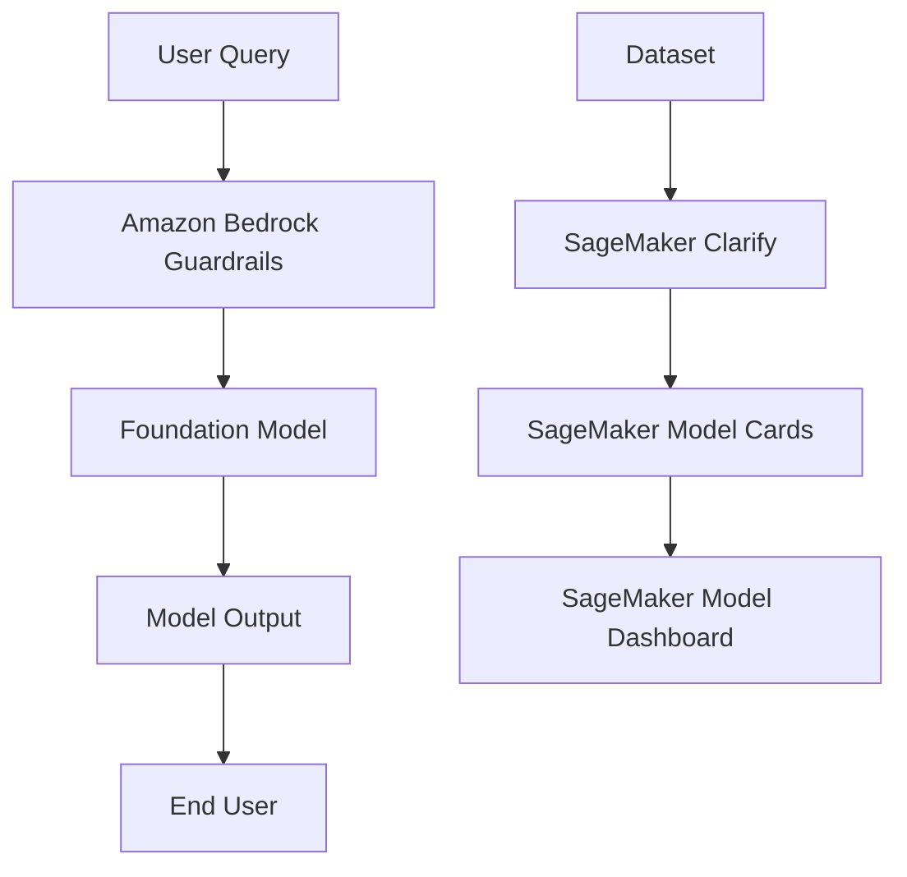

## Tool Comparison Table

|**Service or Tool**|**Primary Responsible AI Role**|**Key Metric or Output**|
|---|---|---|
|Amazon Bedrock Guardrails|Generative AI safeguards and PII redaction|Harmful content filters, topic blocks|
|Bedrock Model Evaluation|Model selection and evaluation|Robustness, toxicity, human review scores|
|SageMaker AI Clarify|Bias detection and model explainability|Feature importance charts, bias metrics|
|SageMaker Data Wrangler|Dataset balancing|SMOTE, oversampling, undersampling|
|SageMaker Model Monitor|Production quality monitoring|Deviation alerts on real time endpoints|
|SageMaker Role Manager|Access control governance|Minimal IAM permission roles|
|SageMaker Model Cards|Documentation and transparency|Risk ratings, intended uses, training data|
|AWS AI Service Cards|Public transparency|Intended usage, design limits, deployment guidance|

## Questions You Might Have Missed

### What is the difference between SageMaker AI Clarify and Bedrock Guardrails?

SageMaker AI Clarify focuses on dataset bias detection, model explainability, and offline evaluation. Bedrock Guardrails enforces runtime filters, PII redaction, and topic blocking on live user queries.

### How does SMOTE differ from random oversampling in Data Wrangler?

Random oversampling duplicates existing minority class rows. SMOTE creates synthetic data points based on feature space nearest neighbours, preventing simple data duplication.

### Why use SageMaker Model Cards alongside AWS AI Service Cards?

Model Cards document specific internal models built by your team (intended use, training parameters, risk ratings). AI Service Cards are official vendor documentation published by AWS for general AWS AI services.

# Responsible Considerations for Selecting AI Models

Selecting a model is a critical phase in developing an AI system. Model selection has strategic implications for performance across user experience, go to market, hiring, and profitability. Model evaluation tools such as Amazon Bedrock Model Evaluation or SageMaker AI Clarify allow teams to evaluate candidate models for accuracy, robustness, toxicity, and content requiring human judgment.

## Narrow Use Case Definition

Defining an AI application use case narrowly is essential because it allows targeted model tuning.

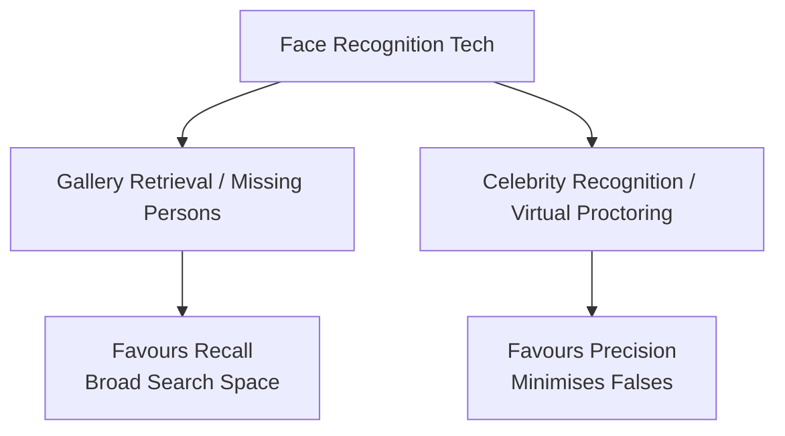

### Traditional AI Example: Face Recognition

Face recognition is a foundational technology rather than a specific use case. The application dictates model selection and tuning.

|**Metric / Aspect**|**Gallery Retrieval (e.g. Missing Persons)**|**Celebrity Recognition & Virtual Proctoring**|
|---|---|---|
|**Confounding Variation**|Ageing, makeup, hair|Background, pose, camera quality, motion blur, occlusion, expression|
|**Possible Bias**|Race, age, gender|Race, age, gender, income|
|**Consequences**|Denied access to resources|Missed sequence in media, false accusation|
|**Tuning Strategy**|Favours recall or precision (Recall brings up maximum candidate matches)|Favours precision (Avoids incorrect false positives)|

### Generative AI Example: Retail Application

Narrow definitions apply equally to generative systems.

|**Feature**|**Catalog a Product**|**Persuade to Buy**|
|---|---|---|
|**Target Audience**|Broad demographic|Narrow demographic (e.g. coastal residents for boat docking accessories)|
|**Issues**|Veracity|Veracity, unwanted bias, toxicity, detail|
|**Consequences**|Brand damage, lost sales, returns|Representative harm, brand damage, lost sales, returns|
|**Tuning Focus**|Neutrality, clarity, completeness|Highest interest problem and group benefits|

## Performance Evaluation

Model performance depends on the interaction between the model and specific test datasets. Performance is a dynamic function, not a static attribute of the model alone.

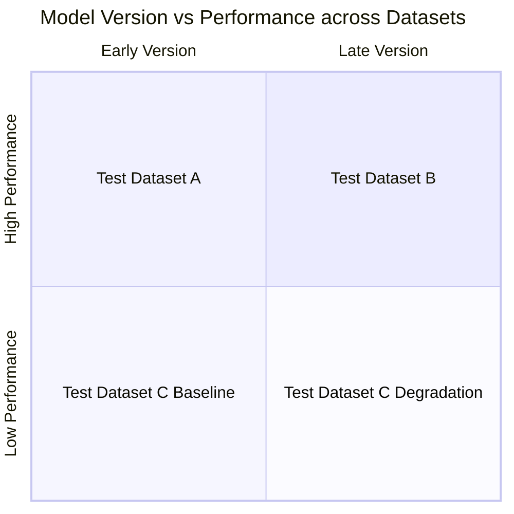

Two distinct development trajectories must be tracked concurrently:

1. **The Model Trajectory**: Updates, parameter changes, and fine tuning.
    
2. **The Dataset Trajectory**: Evolution of data distributions over time.
    

### Core Performance Factors

- **Level of Customisation**: Ranges from prompt engineering to full model retraining.
    
- **Model Size**: Learned information capacity measured by parameter count.
    
- **Inference Options**: Self managed hosting versus managed API endpoints.
    
- **Licensing Agreements**: Commercial restrictions or open source terms.
    
- **Context Windows**: Prompt token limits.
    
- **Latency**: Time required to process requests and return outputs.
    

## Sustainability Considerations

Long term deployment requires balancing social, environmental, and economic sustainability factors.

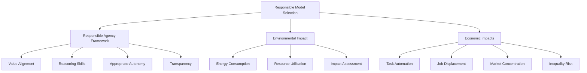

### Responsible Agency

AI systems require capabilities to evaluate decisions using ethical frameworks rather than pure utility functions.

- **Value Alignment**: Aligning system goals directly with human values.
    
- **Responsible Reasoning Skills**: Logic required to navigate moral dilemmas in novel contexts.
    
- **Appropriate Autonomy**: Clear operational boundaries paired with robust human oversight mechanisms, specifically for high stakes domains.
    
- **Transparency and Accountability**: Auditable decision processes allowing external governance.
    

### Environmental Impact

|**Challenge**|**Impact**|**Mitigation Strategy**|
|---|---|---|
|**Energy Consumption**|High electricity use and greenhouse gas emissions from large scale training and inference.|Optimise energy efficiency, utilise renewable energy sources, and track carbon footprints.|
|**Resource Utilisation**|Hardware manufacturing and data centre infrastructure build out create electronic waste.|Maximise resource efficiency, promote hardware reusability, and recycle components.|
|**Environmental Assessment**|Direct and indirect negative impacts on natural ecosystems.|Conduct formal environmental impact assessments prior to deployment and enact mitigation plans.|

### Economic Factors

AI automation increases process efficiency but carries risk regarding job displacement and economic inequality. Unchecked centralization of computational infrastructure can also create market monopolies.

## Missed Questions and Answers

### How does dataset evolution cause performance degradation over time?

Data drift occurs when production data distributions diverge from original test datasets. A model tuned on historical data may lose precision as real world inputs change, requiring continuous evaluation across updated dataset versions.

### What is the role of human oversight in autonomous AI systems?

Human in the loop architectures ensure human intervention capability during edge cases or high risk decisions. This maintains explicit boundaries around model autonomy and supports compliance standards.

# Responsible Preparation for Datasets

Preparing datasets responsibly is a foundational requirement of responsible AI development. Developing fair AI models requires balanced datasets to prevent unfair discrimination and unwanted bias. Systems such as SageMaker AI Clarify and SageMaker Data Wrangler provide automated tools to evaluate and balance datasets effectively.

## Balancing Datasets

Balanced datasets contain adequate representations of all relevant demographic groups or data topics. Ensuring equal representation prevents the model from leaning heavily towards a specific factor. This balance is critical in high stakes domains such as recruitment, lending, and criminal justice, where equity is mandatory.

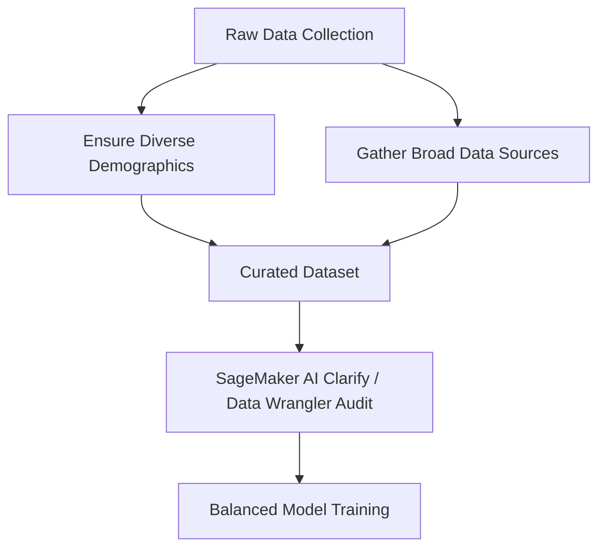

### Inclusive and Diverse Data Collection

Inclusive collection ensures that data gathering processes remain fair. Data must reflect the broad perspectives and demographics required for the specific application.

- Training a machine learning model primarily on middle aged individuals reduces predictive accuracy for younger and older cohorts.
    
- Alienating specific groups during collection risks societal harm and potential legal liability.
    
- Diversity requirements extend beyond human data to domains such as geography, climate, product catalogues, and scientific research.
    

## Data Curation Steps

Data curation involves labelling, organising, and preprocessing raw input so that the target model operates accurately without carrying forward historical bias.

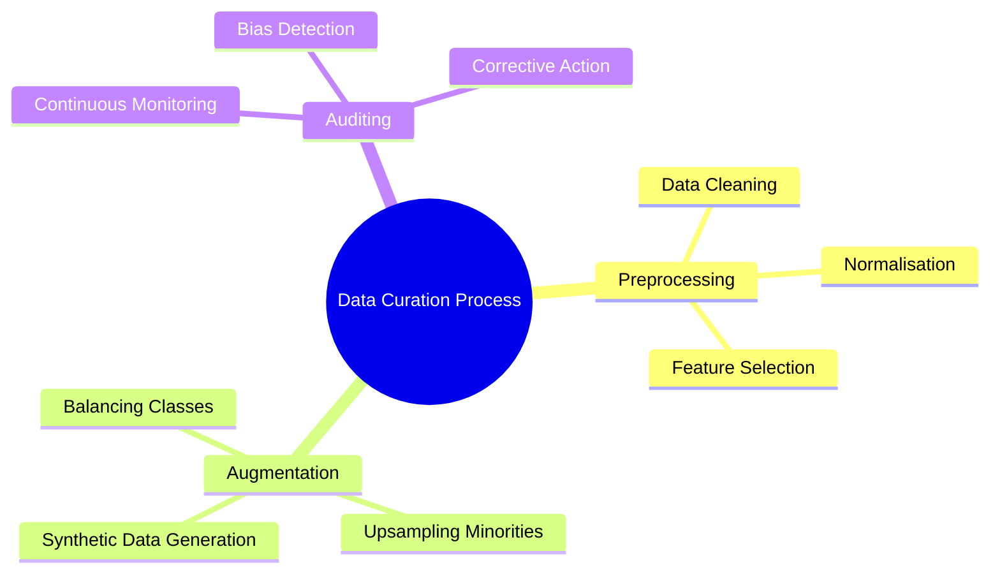

|**Curation Phase**|**Description**|**Key Techniques**|
|---|---|---|
|**Data Preprocessing**|Cleans raw inputs to remove noise, complete missing fields, and remove systemic bias.|Data cleaning, normalisation, feature selection.|
|**Data Augmentation**|Generates new synthetic instances of underrepresented groups to balance target metrics.|Synthetic data generation, oversampling minority classes.|
|**Regular Auditing**|Evaluates datasets continuously to verify that balance is maintained over time.|Bias detection scans, statistical disparity checks, corrective recalibration.|

## Tailoring Balance to Specific Use Cases

Data collection and curation strategies must always align with the narrow use case of the application.

> **Example**: An AI system engineered specifically to diagnose pediatric oncology must be trained on data curated exclusively around children, excluding adult medical datasets to avoid skewing diagnostic baselines.

## Missed Questions and Answers

### What is the primary difference between dataset preprocessing and dataset augmentation?

Preprocessing focuses on cleaning, normalising, and removing noise or existing bias from collected data. Augmentation actively generates or adds synthetic instances of underrepresented groups to achieve balance across classes.

### How do SageMaker AI Clarify and SageMaker Data Wrangler assist in dataset preparation?

SageMaker Data Wrangler provides graphical workflows to clean, transform, and normalise raw data. SageMaker AI Clarify analyses those datasets to detect pre training bias across specified demographic attributes.

# Transparent and Explainable AI Models

## Core Concepts

In responsible artificial intelligence development, trust and accountability depend on two distinct operational properties.

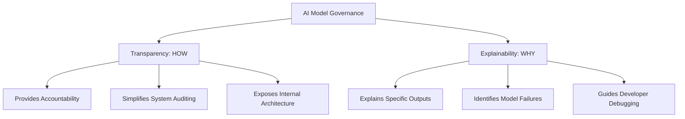

### Key Distinctions

|**Metric**|**Transparency**|**Explainability**|
|---|---|---|
|**Core Question**|HOW does the model operate?|WHY did the model make a specific choice?|
|**Primary Focus**|System architecture, data lineage, and process visibility|Interpretability of inputs, feature weights, and outputs|
|**Target Audience**|Auditors, compliance officers, and system architects|Domain experts, developers, and end users|
|**Primary Benefit**|Enables governance and system accountability|Speeds up troubleshooting and builds user trust|

## Transparent Models vs Black Box Models


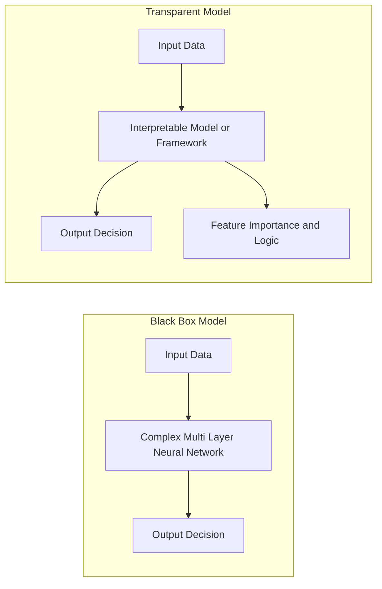

### Black Box Models

Black box systems use complex neural network layers and intricate weight matrices. They generate high accuracy predictions but obscure their internal reasoning.

### Transparent and Explainable Models

These models prioritise interpretability. They offer clear technical and operational advantages over opaque algorithms:

- **Increased Trust:** Critical fields like healthcare, security, and banking require verifiable logic before deployment.
    
- **Streamlined Debugging:** Developers can isolate faulty logic or skewed training weights faster than in black box systems.
    
- **Data Insights:** Teams gain deeper visibility into real world data distributions and decision boundaries, even when raw performance matches or slightly trails black box metrics.
    

## Implementation Frameworks and Techniques

Several open source frameworks and process controls help expose model mechanics:

### Technical Frameworks


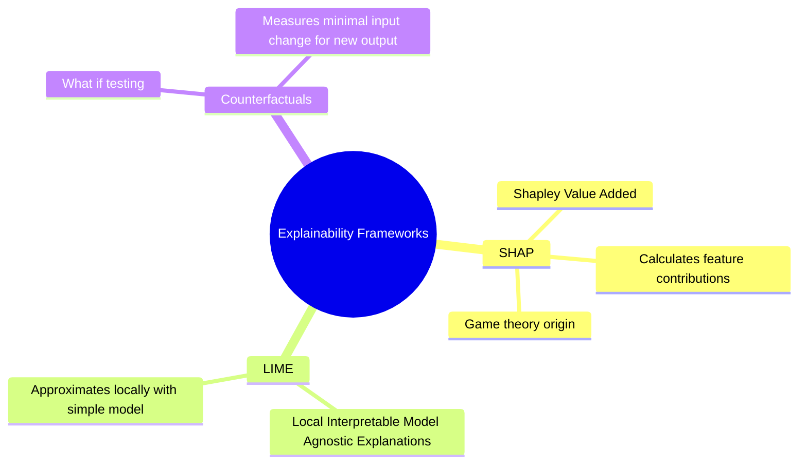

- **SHAP (SHapley Additive exPlanations):** Uses game theory mechanics to calculate how much each feature influences a final prediction.
    
- **LIME (Local Interpretable Model Agnostic Explanations):** Builds a simple, interpretable model around a specific prediction point to approximate local decision boundaries.
    
- **Counterfactual Explanations:** Identifies the minimum input changes required to flip an outcome (for example, "If income increased by £5,000, the loan would be approved").
    

### Operational Controls

- **Transparent Documentation:** Detailed architecture maps, dataset lineage, training logs, and user guides.
    
- **Monitoring and Auditing:** Continuous metric tracking to detect data drift, emergent bias, or irregular inference patterns.
    
- **Human in the Loop (HITL) Oversight:** Strategic human review checkpoints for high risk operations.
    
- **User Interface Explanations:** Clear visualisation components built directly into software interfaces for non technical users.
    

## Technical Risks and Trade Offs

Increasing transparency introduces specific engineering and business trade offs:

- **Development Complexity:** Designing explainable pipelines adds build time, computing overhead, and maintenance costs.
    
- **Security Vulnerabilities:** Exposing feature weights and model structures gives bad actors operational details that simplify adversarial attacks.
    
- **IP and Privacy Exposure:** Revealing detailed feature mechanics can leak proprietary logic or sensitive training data.
    
- **Misleading Certainty:** Oversimplified explanations can create false confidence in models that remain non deterministic.
    

## AWS Ecosystem Implementations

AWS provides dedicated tooling to address both operational documentation and model interpretability.

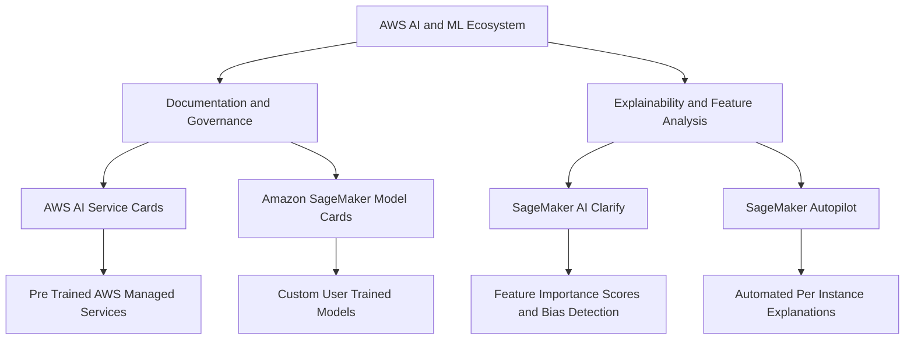

### AWS Transparency Tools

#### AWS AI Service Cards

Documentation resources provided by AWS for their managed AI services (such as Amazon Rekognition or Amazon Textract). They detail intended usage, operational boundaries, model limitations, and responsible design parameters.

#### Amazon SageMaker Model Cards

A centralised governance tool for custom machine learning models. Engineers log critical metadata, including:

- Intended usage and risk ratings
    
- Training parameters and evaluation metrics
    
- Observational notes, safety considerations, and custom operational notes
    

### AWS Explainability Tools

#### SageMaker AI Clarify

Integrates directly with SageMaker AI Experiments to measure feature attribution across tabular, natural language processing, and computer vision models.

For tabular datasets, it generates aggregated feature importance charts. These charts show which input variables exert the strongest influence on model outputs, helping engineers detect unexpected bias.

#### SageMaker Autopilot

Uses SageMaker AI Clarify under the hood to automatically explain baseline model behavior.

It provides per instance explanations during real time inference, helping engineers, compliance teams, and stakeholders verify why a specific prediction was triggered.

## Study Questions and Answers

### What is the core difference between transparency and explainability?

Transparency clarifies **HOW** an AI system operates across its overall architecture and data flows. Explainability clarifies **WHY** a model reached a specific output for a given input.

### Which AWS tool should you use to document a custom trained machine learning model for governance?

Use **Amazon SageMaker Model Cards** to record risk ratings, training metrics, and evaluation results for custom models. Use **AWS AI Service Cards** for AWS managed services.

### How does LIME create explanations for complex black box predictions?

LIME perturbs the inputs around a specific sample, feeds them through the black box model, and builds a simple, interpretable model locally around that specific data point.


# Model Trade-Offs in Machine Learning

## Model Interpretability versus Explainability

Model transparency relies on two distinct concepts: interpretability and explainability.

- **Interpretability**: The extent to which a human can inspect the inner mechanics of a system such as weights and features to understand exactly how an output was calculated.
    
- **Explainability**: The process of explaining the behaviour of a complex black box model in human terms using model agnostic methods like SHAP dependence plots, partial dependence plots, or surrogate models.

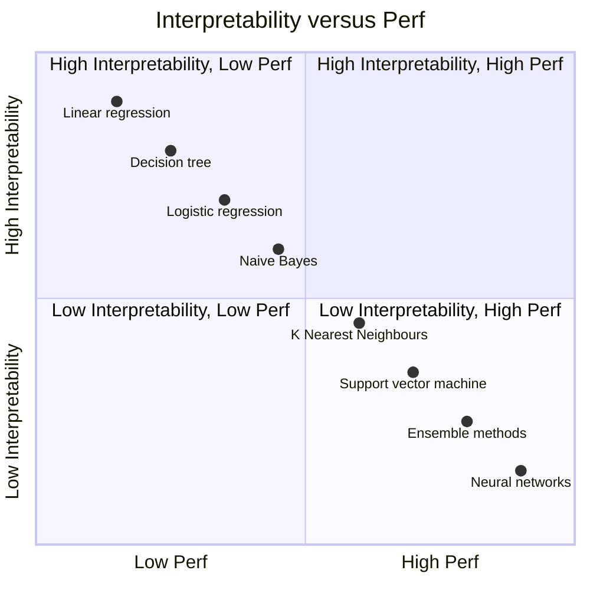
    

### Practical Examples

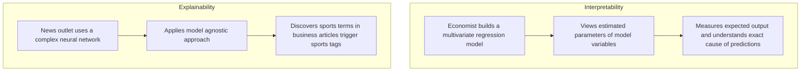

Think of interpretability like a basic AWS CloudWatch metric dashboard where every resource parameter is directly visible and measurable. Explainability is more like running an external Google Cloud trace or synthetic test on a black box microservice; you cannot see the inner code execution directly, but you can infer the cause of the output by observing how inputs affect outcomes.

## Interpretability and Performance Trade-Off

Choosing a model often requires balancing interpretability against performance. Models with simple mathematical foundations are easy to audit but may lack prediction power on complex data. Conversely, advanced architectures offer high performance at the expense of transparency.


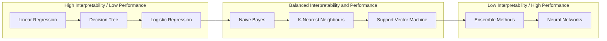

|**Model Architecture**|**Interpretability Level**|**Performance Level**|
|---|---|---|
|**Linear Regression**|High|Low|
|**Decision Tree**|High|Low to Medium|
|**Logistic Regression**|High|Low to Medium|
|**Naive Bayes**|Medium|Medium|
|**K-Nearest Neighbours**|Medium|Medium|
|**Support Vector Machine**|Medium|Medium to High|
|**Ensemble Methods**|Low|High|
|**Neural Networks**|Low|High|

If a business requires strict transparency to meet regulatory rules, choice of AI methods becomes restricted.

## Safety Transparency and Controllability

### Safety and Transparency Trade-Offs

Model safety ensures AI systems avoid causing social harm, algorithmic bias, or security vulnerabilities. Balancing safety and transparency requires careful management:

- **Accuracy**: Complex neural networks offer high accuracy but lower transparency than simpler linear models.
    
- **Privacy**: Privacy preservation techniques such as differential privacy enhance safety but obscure model inspection.
    
- **Safety Rules**: Filtering or constraining model outputs reduces visibility into original reasoning pathways.
    
- **Security**: Air-gapped models trained on private networks restrict external auditing capabilities.
    

### Model Controllability

Controllability measures how effectively you can steer model predictions by altering training data.

- **High Controllability**: Linear models allow clear steering and straightforward debugging.
    
- **Low Controllability**: Deep neural models are harder to steer directly through data edits alone.
    
- **Improvement Methods**: You can improve controllability using data augmentation and strict training constraints.

# Principles of Human-Centred Design for Explainable AI

## Core Pillars

- Design for amplified decision-making.
    
- Design for unbiased decision-making.
    
- Design for human and AI learning.
    

## Design for Amplified Decision-Making

Supports decision-makers in high-stakes situations by maximising benefits and minimising risks, especially 
under stress or pressure.

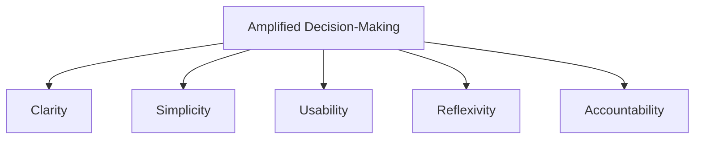

### Key Aspects

- **Clarity:** Presents information to be easily understood and interpreted without bias.
    
- **Simplicity:** Minimises information processing while retaining necessary data.
    
- **Usability:** Ensures technology is easy to use regardless of technical skill.
    
- **Reflexivity:** Prompts users to reflect on their decisions and take responsibility.
    
- **Accountability:** Attaches consequences to decisions to hold users responsible.
    

## Design for Unbiased Decision-Making

Ensures processes, systems, and tools are free from bias to promote fairness and efficient resource use.

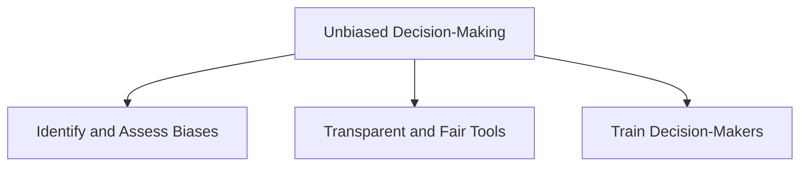

### Key Aspects

- **Transparency:** Clear and accessible processes enabling easy scrutiny using data visualisation.
    
- **Fairness:** Minimises unfairness and discrimination, ensuring equal opportunity and diverse perspectives.
    
- **Training:** Equips leaders and decision-makers to recognise and mitigate biases.
    

## Design for Human and AI Learning

Creates learning environments beneficial for both humans and AI by leveraging individual strengths and limitations.


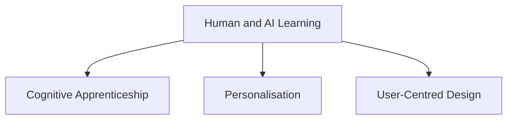

### Key Aspects

- **Cognitive Apprenticeship:** Humans learn from experts; AI learns from human instructors via simulated or real-world scenarios.
    
- **Personalisation:** Tailors learning experiences using data analytics and machine learning algorithms.
    
- **User-Centred Design:** Builds intuitive and accessible environments prioritising usability for all users.
    

## Reinforcement Learning from Human Feedback (RLHF)

A machine learning technique using human feedback to optimise models for efficient self-learning.

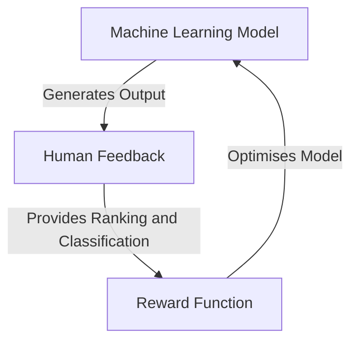

### Benefits

- Enhances AI performance.
    
- Supplies complex training parameters.
    
- Increases user satisfaction.
    

## Amazon SageMaker Ground Truth

Offers comprehensive human-in-the-loop capabilities across the machine learning lifecycle.

- Includes a data annotator for RLHF.
    
- Collects comparison and ranking data.
    
- Customises or fine-tunes models from scratch or existing weights.

# Mindmap

```mermaid
mindmap
  root((Responsible AI<br>and Model Trade-Offs))
    Core Responsibilities
      Transparency and accountability
      Leadership oversight
      Expert development
      Responsible guidelines
    Model Accuracy and Challenges
      Bias and variance tradeoff
      Mitigation strategies
      Generative AI risks
        Toxicity
        Hallucinations
        Intellectual property
    Core Dimensions
      Fairness
      Explainability
      Privacy and security
      Veracity and robustness
      Transparency
      Governance
      Safety
      Controllability
    AWS Tools and Services
      Amazon Bedrock Guardrails
      Bedrock Model Evaluation
      SageMaker AI Clarify
      SageMaker Data Wrangler
      SageMaker Model Monitor
      SageMaker Model Cards
      AWS AI Service Cards
    Model Selection and Curation
      Narrow use case definition
      Performance evaluation
      Sustainability considerations
        Responsible agency
        Environmental impact
        Economic factors
      Dataset balancing and curation
    Transparency and Explainability
      Core distinctions
      Implementation frameworks
        SHAP
        LIME
        Counterfactuals
      Model trade-offs
        Interpretability vs performance
        Safety vs transparency
        Controllability
```