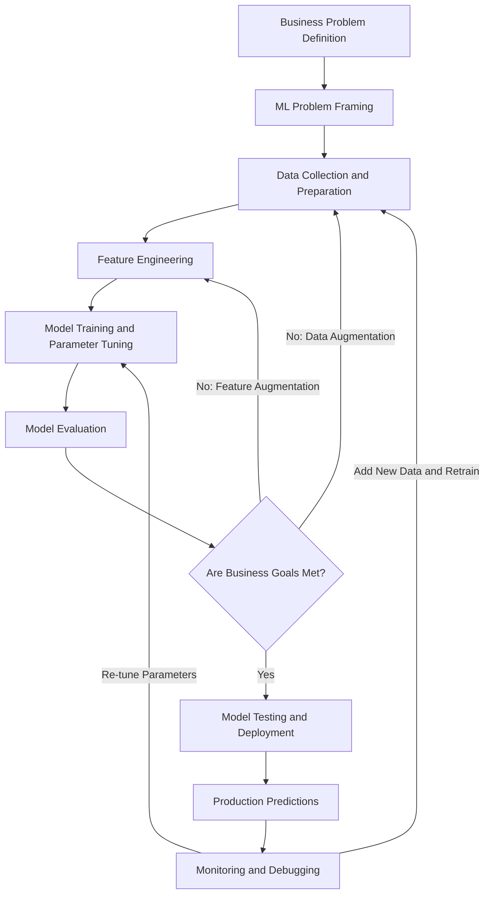
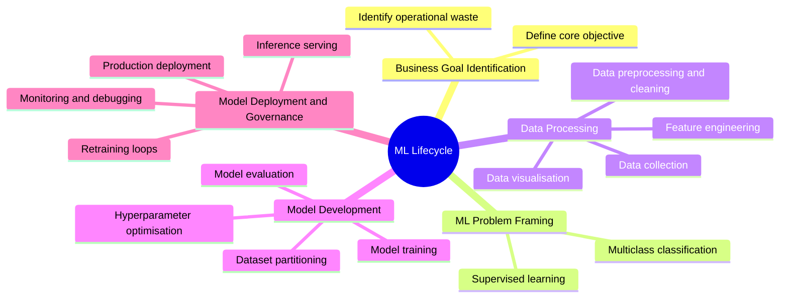
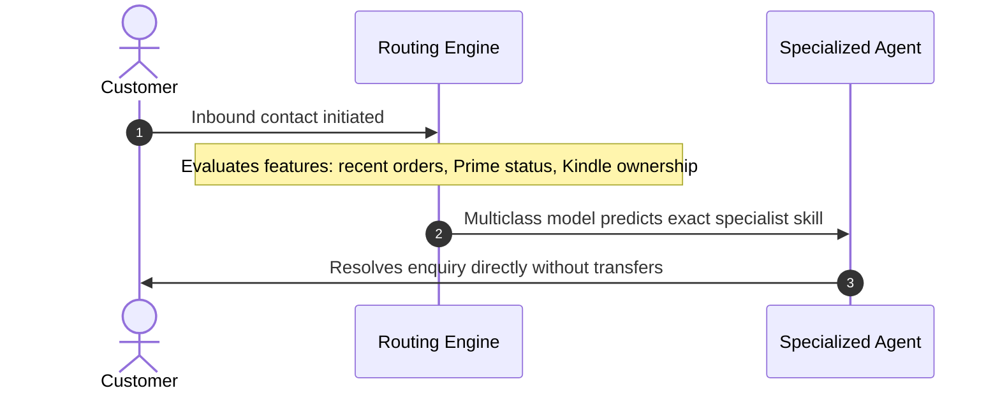
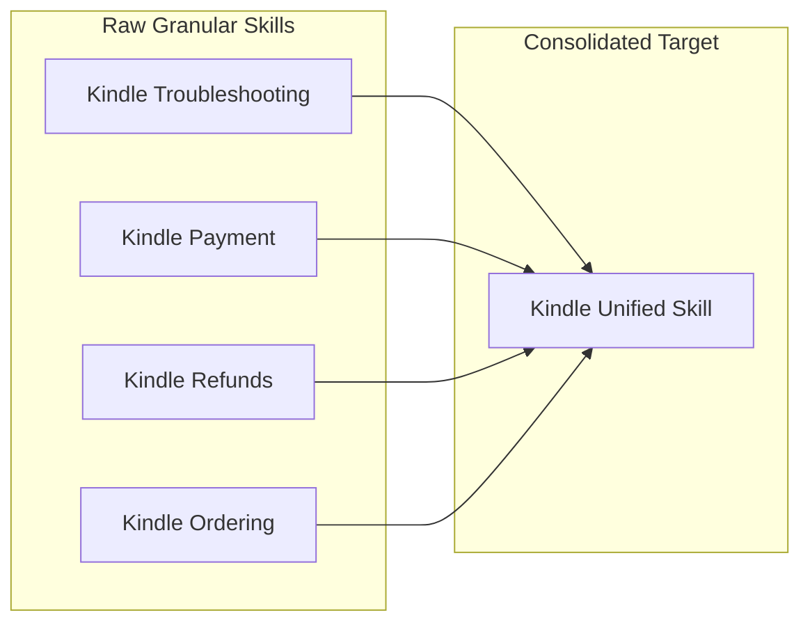
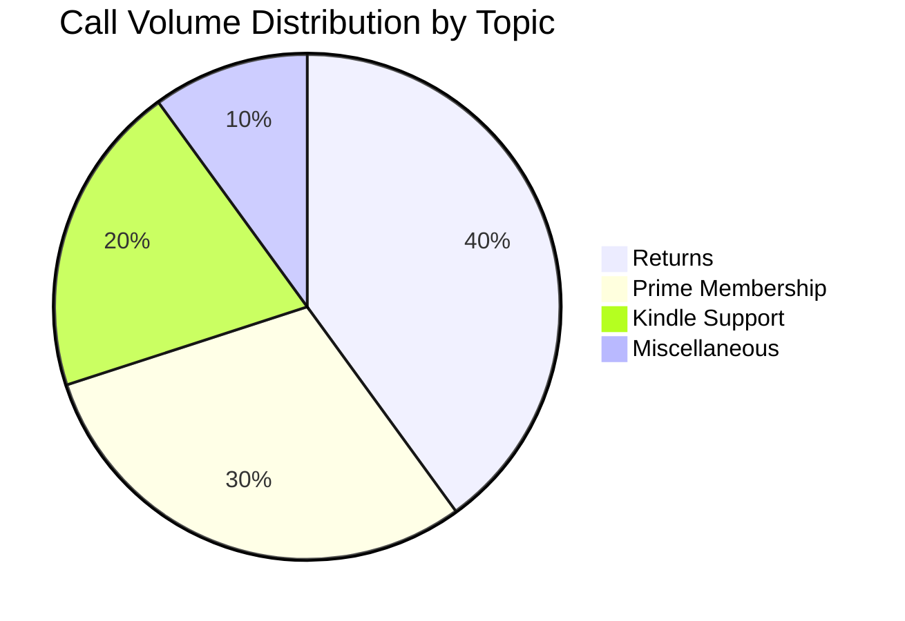
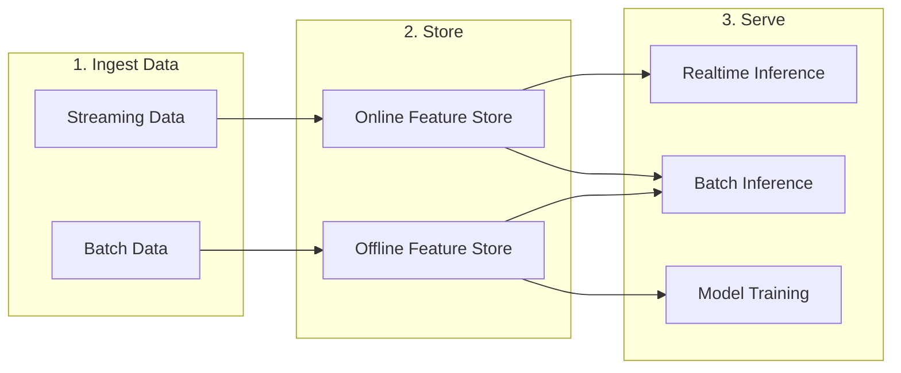
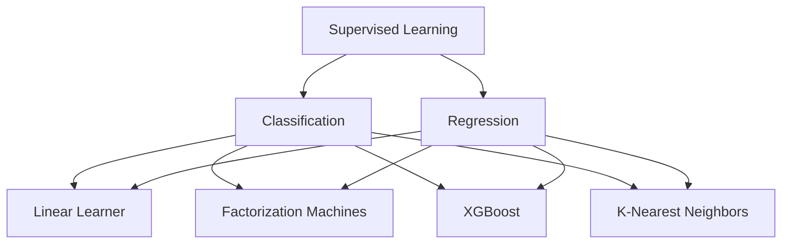
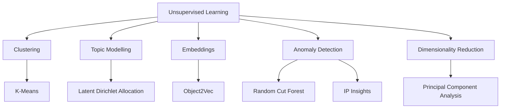
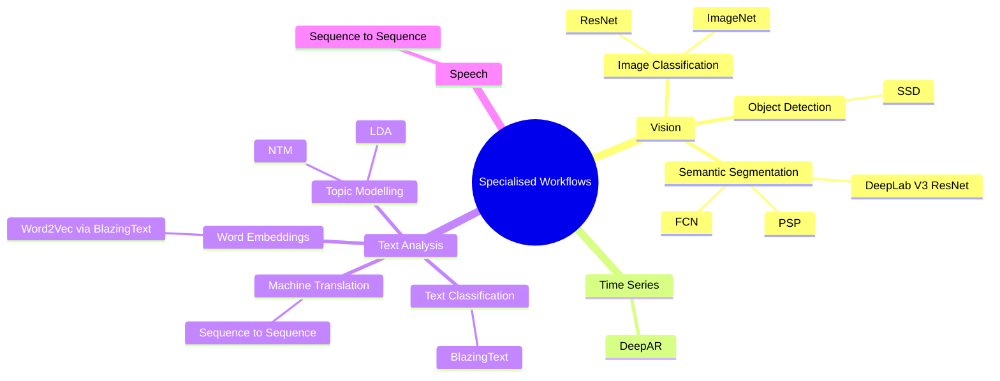

# Machine Learning Development Lifecycle

Machine learning lifecycle management represents the structured process of designing, building, serving, and governing machine learning solutions across production systems. Successful delivery requires structured cross functional collaboration among data scientists, machine learning engineers, cloud architects, and product owners.

  

## Core Phases Breakdown

|**Phase**|**Core Objective**|**Key Activities and Techniques**|
|---|---|---|
|**Business Problem Definition**|Identify domain constraints and targets|Pinpoint specific operational bottlenecks, estimate financial impact, and define measurable criteria for success|
|**ML Problem Framing**|Map business requirements to statistical methods|Determine learning paradigm such as supervised learning, select classification or regression, and define the prediction target|
|**Data Collection and Integration**|Aggregate raw training data|Gather historical inputs, unify database records, join disparate data sources, and establish ground truth labels|
|**Data Preprocessing and Visualisation**|Clean datasets and extract baseline insights|Exploratory data analysis, noise reduction, label consolidation, outlier handling, and class balance inspection|
|**Feature Engineering**|Transform raw signals into predictive inputs|Encode categorical variables, normalise continuous attributes, build aggregations, and select optimal feature subsets|
|**Model Training and Tuning**|Learn representations and fit parameters|Partition data splits, train selected algorithms, tune hyperparameters such as learning rate, and control overfitting|
|**Model Evaluation**|Validate accuracy against unseen benchmarks|Assess model performance against validation and test sets to guarantee generalization on future inputs|
|**Testing and Deployment**|Release model to production|Package container artefacts, expose inference endpoints, and run integration tests|
|**Monitoring and Retraining**|Maintain production reliability|Detect data drift, monitor inference latency, track business performance metrics, and trigger automated retraining pipelines|

## Dataset Partitioning and Validation Strategy

To guarantee that models generalise to unseen production traffic rather than memorising training examples, labeled datasets require strict partitioning.

```mermaid
gantt
    title Dataset Distribution
    dateFormat X
    axisFormat %s%%
    section Allocation
    Training Set (80%) :active, 0, 80
    Validation Set (10%) :crit, 80, 90
    Test Set (10%) :done, 90, 100
```

### Dataset Split Functions

- **Training Set (80%)**: Primary corpus used directly by the algorithm to update model weights and learn data representations.
    
      
    
- **Validation Set (10%)**: Isolated evaluation split utilised during iterative cycles to tune hyperparameters, prevent overfitting, and select optimal architectures.
    
      
    
- **Test Set (10%)**: Final blind dataset dedicated exclusively to verifying real world predictive accuracy and business viability before deployment.
    
      
    

### Key Evaluation Criteria

- **First Contact Accuracy**: Frequency of accurate routing on the initial inference pass.
    
      
    
- **Transfer Rate**: Average transfer count before reaching resolution.
    
      
    
- **Business Alignment**: Confirmation that quantitative metrics translate into target operational savings.
    
      
    

## Case Study: Customer Service Call Routing

Amazon replaced legacy Interactive Voice Response telephone menus with predictive routing based on supervised machine learning to resolve high call transfer volumes.

### Legacy Infrastructure Versus Predictive Architecture

|**Component**|**Legacy System**|**Predictive ML Architecture**|
|---|---|---|
|**Mechanism**|Static phone trees with manual menu selections|Machine learning predictive routing|
|**Model Framing**|Rule based decision trees|Supervised multiclass classification|
|**Input Signals**|Customer touch tone choices|Customer order history, Prime membership status, registered devices|
|**Label Structure**|Fragmented granular categories|Consolidated class labels covering broad functional domains|
|**Operational Impact**|Frequent reroutes, high support costs, customer friction|Direct specialist assignment, lower transfer counts, faster resolution|

### Data Preparation and Label Aggregation

During preprocessing, granular skill sets undergo consolidation to simplify model topology and improve classification performance.

### Hyperparameter Tuning Principles

- **High Learning Rate**: The optimisation algorithm updates weights too aggressively, overshooting loss minima and failing to converge.
    
      
    
- **Low Learning Rate**: Weight updates proceed too slowly, extending training duration unnecessarily and risking premature termination before reaching the optimal loss minimum.

# Amazon SageMaker AI

Amazon SageMaker AI is a fully managed machine learning service providing a unified visual interface to collect, prepare data, build, train, deploy, and monitor models.

## Core Environment

- **Amazon SageMaker Studio**: A web based interface providing unified access to all SageMaker AI tools, compute environments, and assets.
    
      
    

## Machine Learning Lifecycle and Services

|**Lifecycle Stage**|**Service / Tool**|**Primary Capability**|**Key Output / Target**|
|---|---|---|---|
|**No Code ML**|SageMaker Canvas|Visual low code / no code interface for training and inference|Predictions without coding|
|**Foundation Models**|SageMaker JumpStart|Pretrained open source models for diverse tasks|Pretrained model baselines|
|**Feature Management**|SageMaker Feature Store|Ingests streaming or batch data; serves via online or offline stores|Features for training and inference|
|**Model Training**|Training Jobs|Uses built in or custom algorithms on managed compute|Model artifacts saved to Amazon S3|
|**Experimentation**|SageMaker Experiments|Tracks iterations across data, algorithms, and parameters|Accuracy and impact metrics|
|**Tuning**|Automatic Model Tuning|Executes parallel training runs across hyperparameter ranges|Optimised metric model|
|**Deployment**|Inference Infrastructure|Scalable endpoints for predictions|Realtime and batch inference|
|**Monitoring**|SageMaker Model Monitor|Detects data quality, model quality, bias drift, and feature drift|Continuous or scheduled alerts|

## SageMaker Feature Store Architecture

## Key Technical Distinctions

- **Online Feature Store**: Low latency retrieval designed for realtime predictions.
    
      
    
- **Offline Feature Store**: High volume storage for historical analysis, batch predictions, and model training.
    
      
    
- **Model Monitor Triggers**: Evaluates against baseline thresholds on schedule or continuously.
    
      
    

## Questions You Might Have Missed

**What latency requirement determines whether to query the Online or Offline Feature Store?**

Online Feature Store is required for single digit millisecond lookups during realtime inference, whereas Offline Feature Store queries S3 for high volume batch processing.

**Where does SageMaker store final model artifacts after a training job completes?**

SageMaker automatically compresses and writes the output tarball (`model.tar.gz`) directly to a designated Amazon S3 bucket path.

**What four drift types does SageMaker Model Monitor evaluate?**

It evaluates data quality drift, model quality drift, baseline bias drift, and feature attribution drift against defined baseline constraints.

# Amazon SageMaker AI Model Implementations

## Model Implementation Options

|**Implementation Approach**|**Description**|**Effort Level**|**Use Case Fit**|
|---|---|---|---|
|Pretrained Models|Ready to deploy or fine-tune models from popular hubs via SageMaker JumpStart.|Lowest effort|Rapid deployment, standard tasks, baseline testing|
|Built-in Algorithms|Scalable, prepackaged algorithms provided natively within SageMaker AI.|Medium effort|Large datasets requiring significant training resources|
|Prebuilt Framework Containers|Preconfigured environments for TensorFlow, PyTorch, scikit-learn, MXNet, and Chainer.|High effort|Custom model architectures using standard frameworks|
|Custom Docker Images|Fully tailored containers packaged with custom libraries and dependencies.|Highest effort|Bespoke runtimes or specialised external dependencies|

## SageMaker JumpStart Overview

- **Capabilities:** Deploy, fine-tune, and evaluate pretrained models from model hubs.
    
      
    
- **Model Selection:** Pretrained open source models across common problem domains.
    
      
    
- **Infrastructure:** Preconfigured solution templates for standard machine learning use cases.
    
      
    
- **Notebooks:** Runnable example notebooks for step-by-step training and deployment workflows.
    
      
    

## SageMaker Built-in Algorithms Taxonomy

### Supervised Learning

- **Classification & Regression:**
    
      
    - **Linear Learner:** Solves linear regression, binary classification, and multiclass classification.
        
          
        
    - **Factorization Machines:** Handles high-dimensional sparse data, recommendations, and click-through prediction.
        
          
        
    - **XGBoost:** Gradient boosted tree algorithm for tabular regression and classification.
        
          
        
    - **K-Nearest Neighbors (KNN):** Non-parametric algorithm for distance-based classification and regression.
        
          
        

### Unsupervised Learning

- **Clustering:**
    
      
    - **K-Means:** Groups unlabelled data points into distinct clusters.
        
          
        
- **Topic Modelling:**
    
      
    - **Latent Dirichlet Allocation (LDA):** Discovers abstract topics across collections of documents.
        
          
        
- **Embeddings:**
    
      
    - **Object2Vec:** Maps pairs of objects into low-dimensional dense vectors.
        
          
        
- **Anomaly Detection:**
    
      
    - **Random Cut Forest:** Identifies anomalous data points within continuous data streams.
        
          
        
    - **IP Insights:** Detects suspicious behaviour or unusual patterns in IPv4 addresses.
        
          
        
- **Dimensionality Reduction:**
    
      
    - **Principal Component Analysis (PCA):** Reduces feature dimensionality while preserving variance.
        
          
        

### Vision, Text, Speech, and Time Series

- **Images & Video:**
    
      
    - **Image Classification:** Categorises images using pretrained backbones (ResNet, ImageNet, MXNet, TensorFlow).
        
          
        
    - **Object Detection:** Identifies and locates bounding boxes around objects.
        
          
        
    - **Semantic Segmentation:** Pixel-level scene parsing using Fully Convolutional Networks (FCN), Pyramid Scene Parsing (PSP), and DeepLab V3 with ResNet.
        
          
        
- **Time Series:**
    
      
    - **DeepAR:** Supervised learning algorithm for forecasting scalar time series using autoregressive recurrent neural networks.
        
          
        
- **Text Analysis:**
    
      
    - **Text Classification & Word Embeddings:** BlazingText (supports text classification and Word2Vec).
        
          
        
    - **Machine Translation:** Sequence to Sequence (Seq2Seq).
        
          
        
    - **Topic Modelling:** Latent Dirichlet Allocation (LDA) and Neural Topic Modelling (NTM).
        
          
        
- **Speech:**
    
      
    - **Speech Processing:** Sequence to Sequence (Seq2Seq).
        
          
        

### Questions You Might Have Missed

**When should you select BlazingText over custom Hugging Face containers?**

Use BlazingText when you require highly scalable text classification or Word2Vec embeddings with minimal setup overhead. Select custom containers if you need transformer-based architectures like modern BERT variants.

  

**How does Factorization Machines differ from Linear Learner on sparse datasets?**

Linear Learner tracks linear relationships directly, whereas Factorization Machines captures pairwise feature interactions, making it far superior for high-dimensional sparse tasks like recommendation engines.

  

**What is the core structural difference between LDA and NTM for topic modelling?**

LDA relies on traditional statistical Bayesian inference, whereas NTM utilises a neural network framework to learn topic representations, often scaling better with large vocabularies.

  
