# Machine Learning Development Lifecycle

Machine learning lifecycle management represents the structured process of designing, building, serving, and governing machine learning solutions across production systems. Successful delivery requires structured cross functional collaboration among data scientists, machine learning engineers, cloud architects, and product owners.

  

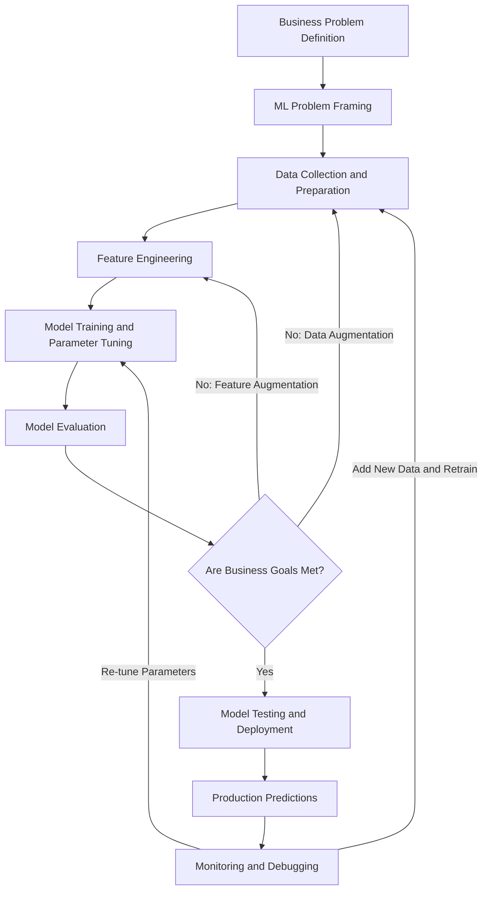


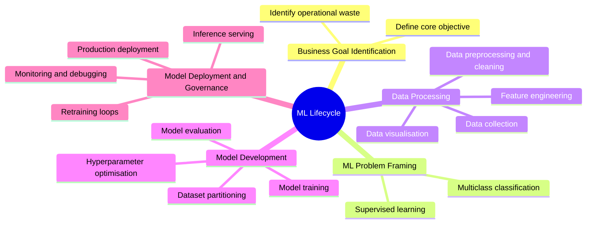

## Core Phases Breakdown

|**Phase**|**Core Objective**|**Key Activities and Techniques**|
|---|---|---|
|**Business Problem Definition**|Identify domain constraints and targets|Pinpoint specific operational bottlenecks, estimate financial impact, and define measurable criteria for success|
|**ML Problem Framing**|Map business requirements to statistical methods|Determine learning paradigm such as supervised learning, select classification or regression, and define the prediction target|
|**Data Collection and Integration**|Aggregate raw training data|Gather historical inputs, unify database records, join disparate data sources, and establish ground truth labels|
|**Data Preprocessing and Visualisation**|Clean datasets and extract baseline insights|Exploratory data analysis, noise reduction, label consolidation, outlier handling, and class balance inspection|
|**Feature Engineering**|Transform raw signals into predictive inputs|Encode categorical variables, normalise continuous attributes, build aggregations, and select optimal feature subsets|
|**Model Training and Tuning**|Learn representations and fit parameters|Partition data splits, train selected algorithms, tune hyperparameters such as learning rate, and control overfitting|
|**Model Evaluation**|Validate accuracy against unseen benchmarks|Assess model performance against validation and test sets to guarantee generalization on future inputs|
|**Testing and Deployment**|Release model to production|Package container artefacts, expose inference endpoints, and run integration tests|
|**Monitoring and Retraining**|Maintain production reliability|Detect data drift, monitor inference latency, track business performance metrics, and trigger automated retraining pipelines|

## Dataset Partitioning and Validation Strategy

To guarantee that models generalise to unseen production traffic rather than memorising training examples, labeled datasets require strict partitioning.


```mermaid
gantt
    title Dataset Distribution
    dateFormat X
    axisFormat %s%%
    section Allocation
    Training Set (80%) :active, 0, 80
    Validation Set (10%) :crit, 80, 90
    Test Set (10%) :done, 90, 100
```

### Dataset Split Functions

- **Training Set (80%)**: Primary corpus used directly by the algorithm to update model weights and learn data representations.
    
      
    
- **Validation Set (10%)**: Isolated evaluation split utilised during iterative cycles to tune hyperparameters, prevent overfitting, and select optimal architectures.
    
      
    
- **Test Set (10%)**: Final blind dataset dedicated exclusively to verifying real world predictive accuracy and business viability before deployment.
    
      
    

### Key Evaluation Criteria

- **First Contact Accuracy**: Frequency of accurate routing on the initial inference pass.
    
      
    
- **Transfer Rate**: Average transfer count before reaching resolution.
    
      
    
- **Business Alignment**: Confirmation that quantitative metrics translate into target operational savings.
    
      
    

## Case Study: Customer Service Call Routing

Amazon replaced legacy Interactive Voice Response telephone menus with predictive routing based on supervised machine learning to resolve high call transfer volumes.


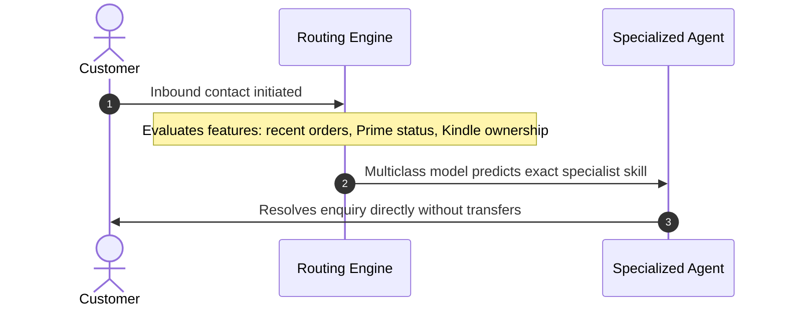

### Legacy Infrastructure Versus Predictive Architecture


|**Component**|**Legacy System**|**Predictive ML Architecture**|
|---|---|---|
|**Mechanism**|Static phone trees with manual menu selections|Machine learning predictive routing|
|**Model Framing**|Rule based decision trees|Supervised multiclass classification|
|**Input Signals**|Customer touch tone choices|Customer order history, Prime membership status, registered devices|
|**Label Structure**|Fragmented granular categories|Consolidated class labels covering broad functional domains|
|**Operational Impact**|Frequent reroutes, high support costs, customer friction|Direct specialist assignment, lower transfer counts, faster resolution|

### Data Preparation and Label Aggregation

During preprocessing, granular skill sets undergo consolidation to simplify model topology and improve classification performance.

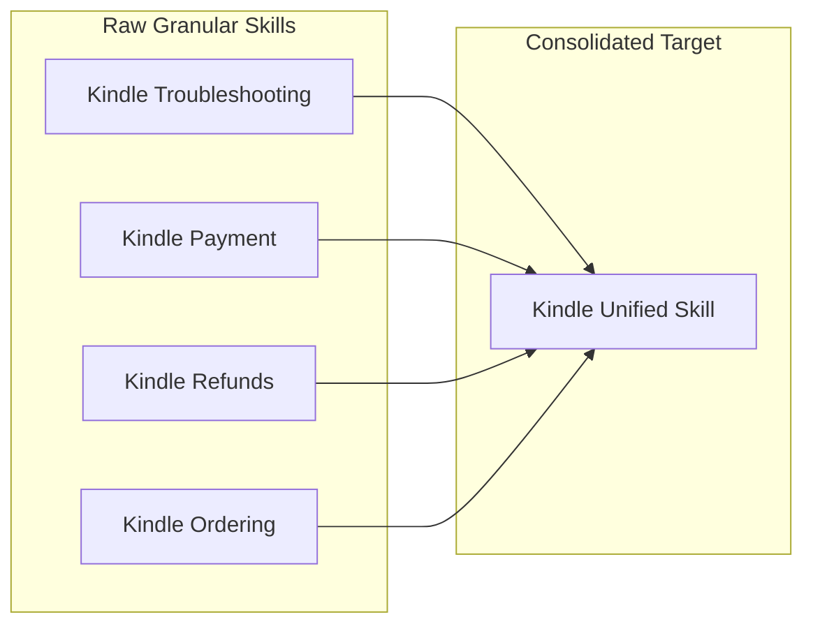


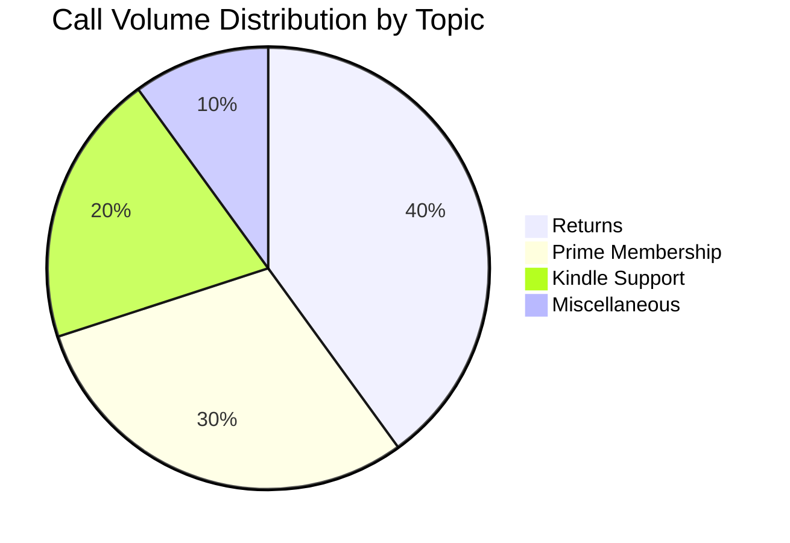

### Hyperparameter Tuning Principles

- **High Learning Rate**: The optimisation algorithm updates weights too aggressively, overshooting loss minima and failing to converge.
    
      
    
- **Low Learning Rate**: Weight updates proceed too slowly, extending training duration unnecessarily and risking premature termination before reaching the optimal loss minimum.

# Amazon SageMaker AI

Amazon SageMaker AI is a fully managed machine learning service providing a unified visual interface to collect, prepare data, build, train, deploy, and monitor models.

## Core Environment

- **Amazon SageMaker Studio**: A web based interface providing unified access to all SageMaker AI tools, compute environments, and assets.
    
      
    

## Machine Learning Lifecycle and Services

|**Lifecycle Stage**|**Service / Tool**|**Primary Capability**|**Key Output / Target**|
|---|---|---|---|
|**No Code ML**|SageMaker Canvas|Visual low code / no code interface for training and inference|Predictions without coding|
|**Foundation Models**|SageMaker JumpStart|Pretrained open source models for diverse tasks|Pretrained model baselines|
|**Feature Management**|SageMaker Feature Store|Ingests streaming or batch data; serves via online or offline stores|Features for training and inference|
|**Model Training**|Training Jobs|Uses built in or custom algorithms on managed compute|Model artifacts saved to Amazon S3|
|**Experimentation**|SageMaker Experiments|Tracks iterations across data, algorithms, and parameters|Accuracy and impact metrics|
|**Tuning**|Automatic Model Tuning|Executes parallel training runs across hyperparameter ranges|Optimised metric model|
|**Deployment**|Inference Infrastructure|Scalable endpoints for predictions|Realtime and batch inference|
|**Monitoring**|SageMaker Model Monitor|Detects data quality, model quality, bias drift, and feature drift|Continuous or scheduled alerts|

## SageMaker Feature Store Architecture


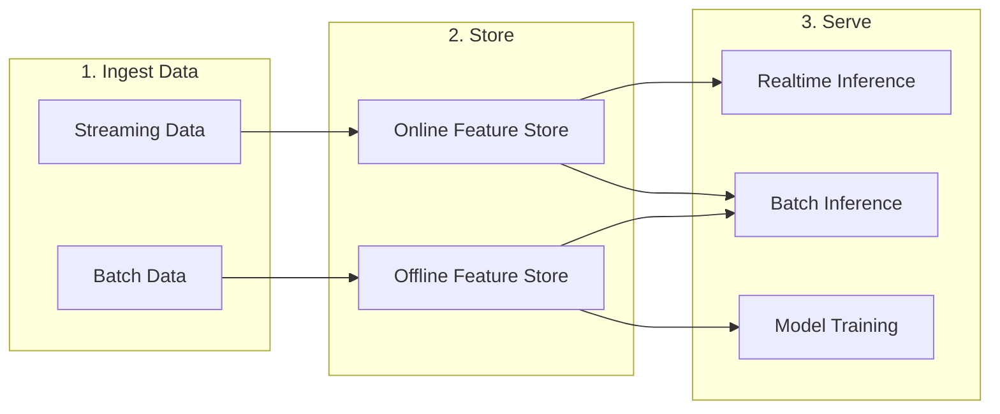

## Key Technical Distinctions

- **Online Feature Store**: Low latency retrieval designed for realtime predictions.
    
      
    
- **Offline Feature Store**: High volume storage for historical analysis, batch predictions, and model training.
    
      
    
- **Model Monitor Triggers**: Evaluates against baseline thresholds on schedule or continuously.
    
      
    

## Questions You Might Have Missed

**What latency requirement determines whether to query the Online or Offline Feature Store?**

Online Feature Store is required for single digit millisecond lookups during realtime inference, whereas Offline Feature Store queries S3 for high volume batch processing.


**Where does SageMaker store final model artifacts after a training job completes?**

SageMaker automatically compresses and writes the output tarball (`model.tar.gz`) directly to a designated Amazon S3 bucket path.


**What four drift types does SageMaker Model Monitor evaluate?**

It evaluates data quality drift, model quality drift, baseline bias drift, and feature attribution drift against defined baseline constraints.

# Amazon SageMaker AI Model Implementations

## Model Implementation Options

|**Implementation Approach**|**Description**|**Effort Level**|**Use Case Fit**|
|---|---|---|---|
|Pretrained Models|Ready to deploy or fine-tune models from popular hubs via SageMaker JumpStart.|Lowest effort|Rapid deployment, standard tasks, baseline testing|
|Built-in Algorithms|Scalable, prepackaged algorithms provided natively within SageMaker AI.|Medium effort|Large datasets requiring significant training resources|
|Prebuilt Framework Containers|Preconfigured environments for TensorFlow, PyTorch, scikit-learn, MXNet, and Chainer.|High effort|Custom model architectures using standard frameworks|
|Custom Docker Images|Fully tailored containers packaged with custom libraries and dependencies.|Highest effort|Bespoke runtimes or specialised external dependencies|


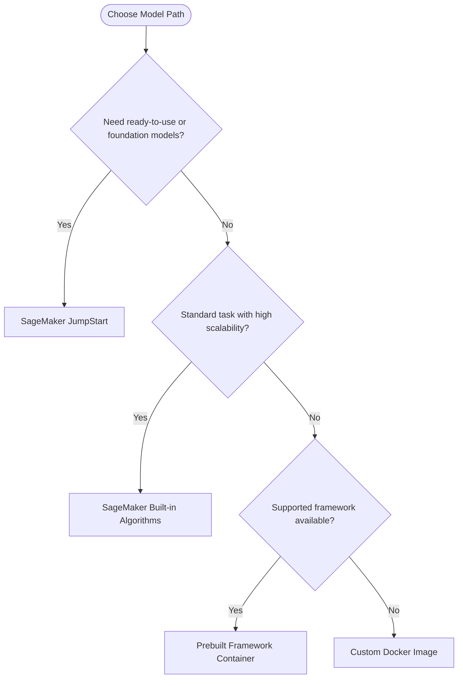

## SageMaker JumpStart Overview

- **Capabilities:** Deploy, fine-tune, and evaluate pretrained models from model hubs.
    
      
    
- **Model Selection:** Pretrained open source models across common problem domains.
    
      
    
- **Infrastructure:** Preconfigured solution templates for standard machine learning use cases.
    
      
    
- **Notebooks:** Runnable example notebooks for step-by-step training and deployment workflows.
    
      
    

## SageMaker Built-in Algorithms Taxonomy

### Supervised Learning

- **Classification & Regression:**
    
      
    - **Linear Learner:** Solves linear regression, binary classification, and multiclass classification.
        
          
        
    - **Factorisation Machines:** Handles high-dimensional sparse data, recommendations, and click-through prediction.
        
          
        
    - **XGBoost:** Gradient boosted tree algorithm for tabular regression and classification.
        
          
        
    - **K-Nearest Neighbors (KNN):** Non-parametric algorithm for distance-based classification and regression.
        
          
        


### Unsupervised Learning

- **Clustering:**
    
      
    - **K-Means:** Groups unlabelled data points into distinct clusters.
        
          
        
- **Topic Modelling:**
    
      
    - **Latent Dirichlet Allocation (LDA):** Discovers abstract topics across collections of documents.
        
          
        
- **Embeddings:**
    
      
    - **Object2Vec:** Maps pairs of objects into low-dimensional dense vectors.
        
          
        
- **Anomaly Detection:**
    
      
    - **Random Cut Forest:** Identifies anomalous data points within continuous data streams.
        
          
        
    - **IP Insights:** Detects suspicious behaviour or unusual patterns in IPv4 addresses.
        
          
        
- **Dimensionality Reduction:**
    
      
    - **Principal Component Analysis (PCA):** Reduces feature dimensionality while preserving variance.
        
          
        


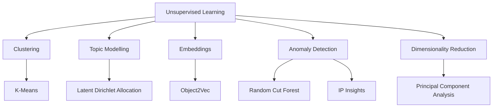

### Vision, Text, Speech, and Time Series

- **Images & Video:**
    
      
    - **Image Classification:** Categorises images using pretrained backbones (ResNet, ImageNet, MXNet, TensorFlow).
        
          
        
    - **Object Detection:** Identifies and locates bounding boxes around objects.
        
          
        
    - **Semantic Segmentation:** Pixel-level scene parsing using Fully Convolutional Networks (FCN), Pyramid Scene Parsing (PSP), and DeepLab V3 with ResNet.
        
          
        
- **Time Series:**
    
      
    - **DeepAR:** Supervised learning algorithm for forecasting scalar time series using autoregressive recurrent neural networks.
        
          
        
- **Text Analysis:**
    
      
    - **Text Classification & Word Embeddings:** BlazingText (supports text classification and Word2Vec).
        
          
        
    - **Machine Translation:** Sequence to Sequence (Seq2Seq).
        
          
        
    - **Topic Modelling:** Latent Dirichlet Allocation (LDA) and Neural Topic Modelling (NTM).
        
          
        
- **Speech:**
    
      
    - **Speech Processing:** Sequence to Sequence (Seq2Seq).
        
          
        


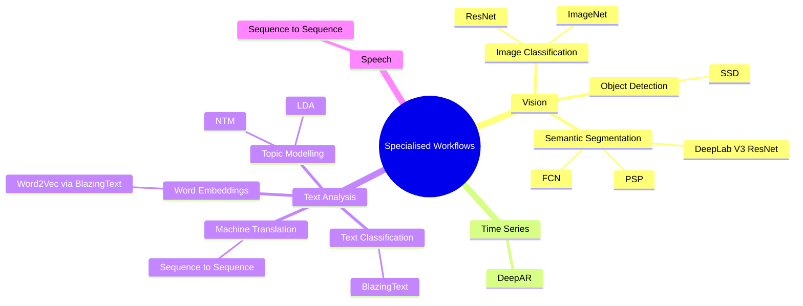

### Questions You Might Have Missed

**When should you select BlazingText over custom Hugging Face containers?**

Use BlazingText when you require highly scalable text classification or Word2Vec embeddings with minimal setup overhead. Select custom containers if you need transformer-based architectures like modern BERT variants.

  

**How does Factorization Machines differ from Linear Learner on sparse datasets?**

Linear Learner tracks linear relationships directly, whereas Factorization Machines captures pairwise feature interactions, making it far superior for high-dimensional sparse tasks like recommendation engines.

  

**What is the core structural difference between LDA and NTM for topic modelling?**

LDA relies on traditional statistical Bayesian inference, whereas NTM utilises a neural network framework to learn topic representations, often scaling better with large vocabularies.

  

# Machine Learning Models Performance Evaluation

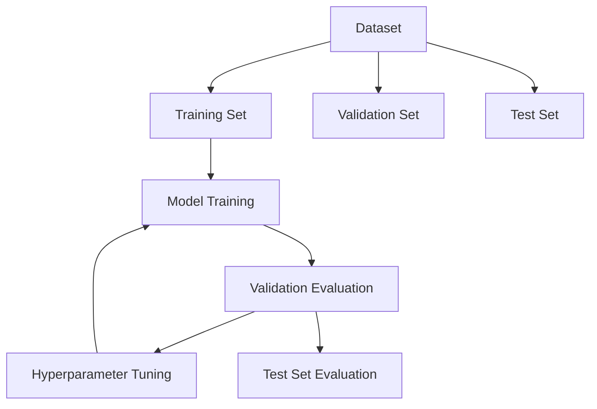

## Model Evaluation Datasets

Evaluation occurs after a model is trained. The data is partitioned into three distinct sets:

  

- **Training Set**: Used to train the algorithm and learn relationships within the features.
    
      
    
- **Validation Set**: Evaluates how the model responds in a non training environment. Ensures the model generalises to unseen data and guides iterative improvements before production readiness.
    
      
    
- **Test Set**: Assesses the final predictive quality of the improved model against baseline requirements.
    
      
    

## Model Fit and the Bias Variance Tradeoff

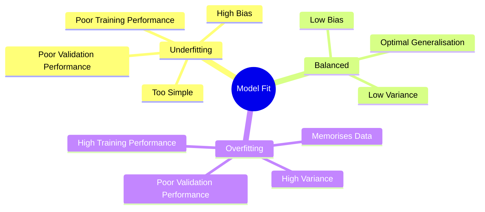

- **Underfitting**: Occurs when the model performs poorly on training data because it cannot capture the relationship between input features ($X$) and target values ($Y$). Typically caused by overly simple models where input features lack expressive power.
    
      
    
- **Overfitting**: Occurs when the model performs well on training data but poorly on evaluation data. The model memorises specific training examples instead of learning generalisable patterns.
    
      
    
- **Balanced**: Characterised by low bias and low variance, delivering consistent, accurate predictions across unseen datasets.
    
      
    

|**Fit Condition**|**Bias Level**|**Variance Level**|**Error Source**|
|---|---|---|---|
|**Underfitting**|High|Low|Gap between predicted and true value is large|
|**Overfitting**|Low|High|Dispersed predictions sensitive to data variations|
|**Balanced**|Low|Low|Model closely mirrors true underlying relationship|

## Classification Evaluation Metrics

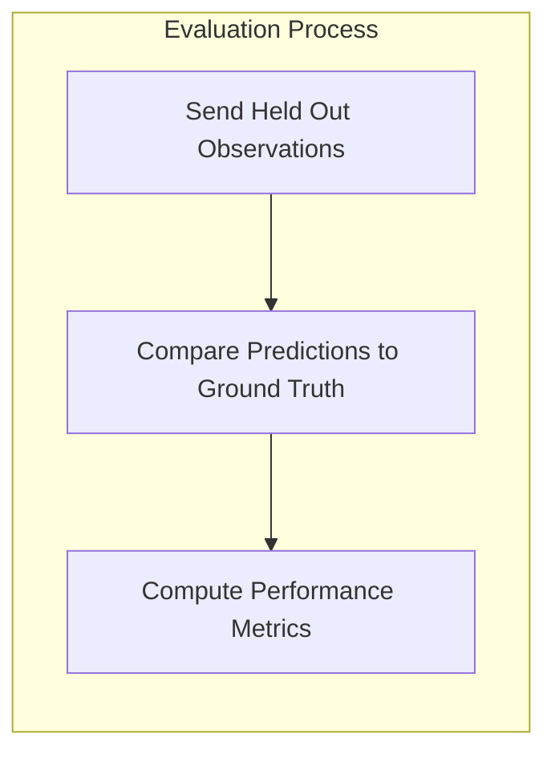

### Confusion Matrix

The confusion matrix serves as the fundamental structure for categorising model predictions against ground truth labels.

  

|**Actual \ Predicted**|**Predicted Positive (P)**|**Predicted Negative (N)**|
|---|---|---|
|**Actual Positive ($P$)**|True Positive ($TP$)|False Negative ($FN$)|
|**Actual Negative ($N$)**|False Positive ($FP$)|True Negative ($TN$)|

### Metric Formulations

- **Accuracy**: The proportion of correct predictions across all cases.
    
      
    
    $$\text{Accuracy} = \frac{TP + TN}{TP + TN + FP + FN}$$
    
    _Limitation_: Less informative when the dataset contains a high volume of true negative cases.
    
      
    
- **Precision**: The proportion of positive predictions that are correct.
    
      
    
    $$\text{Precision} = \frac{TP}{TP + FP}$$
    
    _Optimal Use_: Scenarios where the cost of false positives is severe (e.g. preventing legitimate messages from being marked as spam).
    
      
    
- **Recall (Sensitivity)**: The proportion of actual positive cases correctly identified.
    
      
    
    $$\text{Recall} = \frac{TP}{TP + FN}$$
    
    _Optimal Use_: Scenarios where missing a positive case carries critical risk (e.g. failing to detect a terminal medical condition).
    
      
    
- **F1 Score**: The harmonic mean of precision and recall.
    
      
    
    $$\text{F1} = 2 \times \frac{\text{Precision} \times \text{Recall}}{\text{Precision} + \text{Recall}}$$
    

### Receiver Operating Characteristic (ROC) and Area Under Curve (AUC)

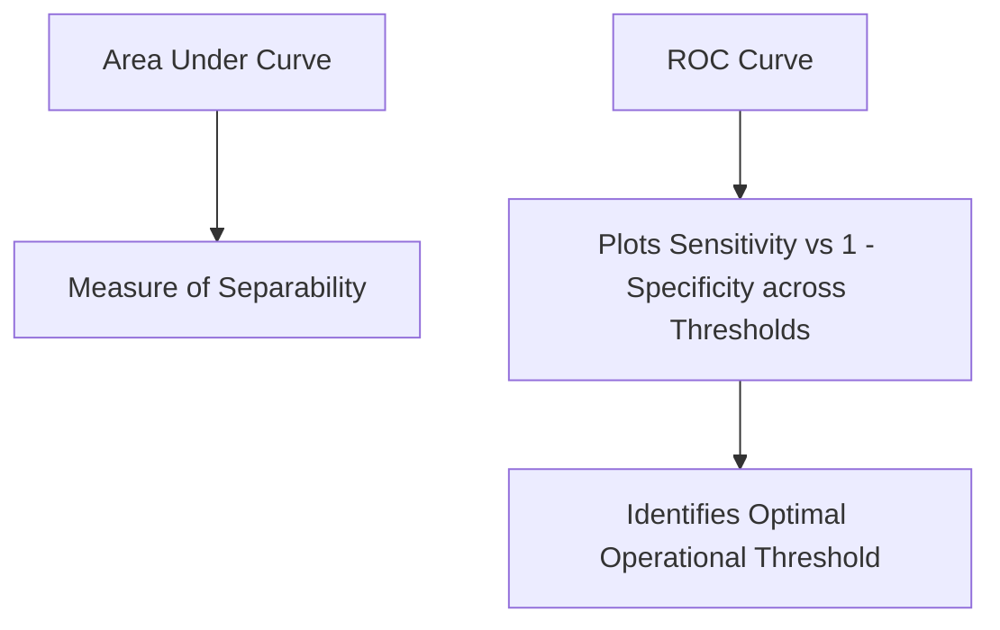

- **ROC Curve**: Plots the True Positive Rate (Sensitivity) against the False Positive Rate ($1 - \text{Specificity}$) across multiple classification thresholds.
    
      
    
- **AUC Metric**: Represents the degree of separability between classes.
    
      
    - $\text{AUC} = 1.0$: Perfect class discrimination.
        
          
        
    - $\text{AUC} = 0.5$: Random guessing (diagonal baseline).
        
          
        
    - Higher values (e.g. $0.893$ vs $0.687$) demonstrate superior separation capacity across varying cut off points.
        
          
        

## Regression Evaluation Metrics

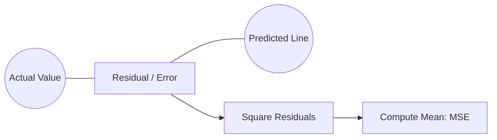

- **Mean Squared Error (MSE)**: Evaluates prediction accuracy by calculating the average squared difference between predictions ($\hat{Y}$) and actual values ($Y$). Lower values signify superior model accuracy.
    
      
    
    $$\text{MSE} = \frac{1}{n}\sum_{i=1}^{n}(Y_i - \hat{Y}_i)^2 = \frac{\text{error}_1^2 + \dots + \text{error}_n^2}{n}$$
    
- **R Squared ($R^2$)**: Quantifies the proportion of variance explained by the model on a scale from 0 to 1. Higher values near 1 denote strong goodness of fit to the observed data distribution.
    
      
    

## Business Alignment and Validation

- **Key Performance Indicators (KPIs)**: Tie numerical machine learning evaluation metrics directly to high level business targets, including revenue growth, cost minimisation, and customer churn reduction.
    
      
    
- **Custom Cost Functions**: Assign bespoke economic values and penalty weights to correct versus incorrect outputs, matching organisational error tolerance.
    
      
    
- **Live Deployment Testing**: Use split testing (A/B testing) and canary deployments to validate model performance against live production goals.
    
      
    

## Questions You Might Have Missed

**How does changing the classification threshold impact Precision and Recall?**

Raising the decision threshold decreases False Positives (increasing Precision) but increases False Negatives (decreasing Recall). Lowering the threshold produces the opposite outcome.

  

**Why does Mean Squared Error penalise outliers more than Mean Absolute Error?**

Because MSE squares each individual error term before averaging, large residual errors receive exponentially heavier penalties than small residual errors.

  

**When is R Squared less reliable as a sole regression metric?**

$R^2$ can artificially increase as more features are added to a model regardless of their actual predictive contribution, which is why Adjusted $R^2$ is frequently preferred for multi feature models.

# Model Deployment

Model deployment is the integration of a machine learning model and its operational resources into a production environment to generate predictions.

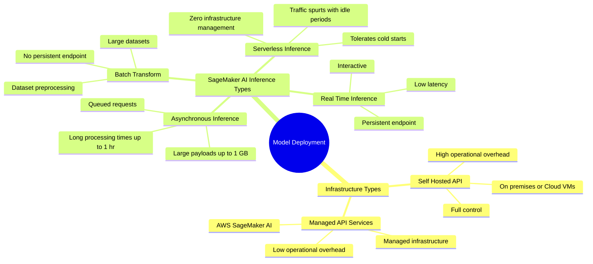

## Deployment Approaches

The choice between a managed API service and a self-hosted API depends on use case requirements, the level of customisation needed, internal operational expertise, and cost constraints.

  

|**Feature**|**Self-Hosted API**|**Managed API Service (e.g. AWS SageMaker AI)**|
|---|---|---|
|**Hosting Location**|On premises or cloud (VMs, containers)|Cloud fully managed environment|
|**Infrastructure Management**|Manual setup of web servers, load balancers, and databases|Abstracted away by cloud vendor|
|**Level of Control**|Full control over the runtime environment|Standardised managed configurations|
|**Operational Overhead**|High (maintenance, patching, scaling)|Low (vendor handles platform operations)|
|**Key Advantage**|Granular customisation and potential cost control|Rapid deployment to production environments|

## AWS SageMaker AI Deployment

SageMaker AI provides managed infrastructure with the following built-in capabilities:

  

- Deployment via one click or a single API call
    
      
    
- Automatic scaling
    
      
    
- Managed model hosting services
    
      
    
- HTTPS endpoints supporting multi-model hosting
    
      
    

## SageMaker AI Inference Options


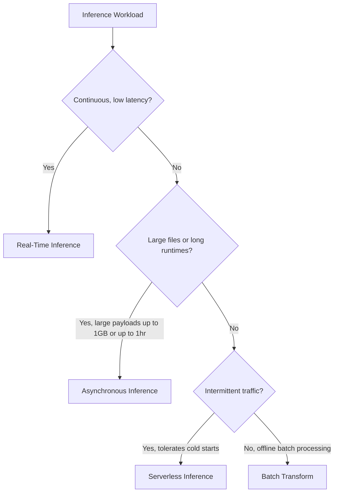

### Real-Time Inference

- **Use Case:** Interactive workloads with low latency requirements.
    
      
    
- **Architecture:** Persistent HTTPS endpoints serving real-time requests.
    
      
    

### Batch Transform

- **Use Case:** Inferences across large, offline datasets without requiring a persistent endpoint.
    
      
    
- **Additional Function:** Preprocessing datasets to remove noise or bias prior to downstream training or inference.
    
      
    

### Asynchronous Inference

- **Use Case:** Workloads with large payload sizes (up to 1 GB) and long processing durations (up to one hour).
    
      
    
- **Architecture:** Automatically queues incoming requests and processes them asynchronously with near real-time latency.
    
      
    

### Serverless Inference

- **Use Case:** Workloads with variable traffic patterns, intermittent idle periods, and tolerance for cold starts.
    
      
    
- **Architecture:** On-demand computing that deploys and scales without configuring underlying instances.
    
      
    

## Questions You Might Have Missed

**How does batch transform save costs compared to real-time endpoints?**

Batch transform provisions compute instances only for the duration of the processing job and terminates them immediately upon completion, avoiding idle endpoint hosting costs.

  

**What causes cold starts in serverless inference?**

A cold start occurs when the platform spins up a fresh container instance to process an incoming request after a period of idle inactivity.

  

**When should multi-model endpoints be selected over single-model endpoints?**

Multi-model endpoints allow hosting multiple models behind a single endpoint instance, sharing memory and compute resources to reduce hosting costs for models with similar latency profiles.

# Fundamental Concepts of MLOps

MLOps combines people, processes, and technology to operationalise and streamline the machine learning lifecycle from development and deployment through to continuous monitoring and retraining.

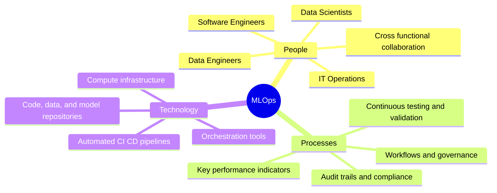

## Core Pillars of MLOps

MLOps adapts DevOps principles to the specific demands of machine learning workloads, where code, data, and model parameters evolve simultaneously.


```mermaid
flowchart TD
    subgraph Pillars [The Intersection of MLOps]
        P[People: Skills & Collaboration]
        T[Technology: Infrastructure & Orchestration]
        PR[Processes: Workflows & KPIs]
    end
    P --- MLOps((MLOps))
    T --- MLOps
    PR --- MLOps
```

|**Pillar**|**Key Elements**|**Role in Machine Learning Systems**|
|---|---|---|
|**People**|Data scientists, ML engineers, software engineers, DevOps, business stakeholders|Fosters shared responsibility across data curation, model authoring, and operations|
|**Process**|Standardised workflows, governance policies, review gates, KPI monitoring|Ensures rigorous testing, auditable model releases, and reproducible experiments|
|**Technology**|Automated pipelines, container registries, compute clusters, feature stores|Delivers compute platforms, tracking systems, and deployment infrastructure|

## Business and Technical Benefits

Implementing automated MLOps practices delivers measurable efficiency gains across five core areas:

  

- **Productivity:** Automates repetitive tasks across data preparation and experimentation, freeing engineering teams to focus on model design.
    
      
    
- **Reliability:** Standardises release procedures with automated testing to catch code, data, and schema issues before production.
    
      
    
- **Repeatability:** Ensures every training run, parameter set, and data split can be recreated identically at any point.
    
      
    
- **Auditability:** Maintains complete lineage records for data transformations, model weights, and approval sign offs for regulatory compliance.
    
      
    
- **Data and Model Quality:** Continuous evaluation identifies data drift and concept drift early to keep inference accuracy high.
    
      
    

## Key Principles of MLOps


```mermaid
flowchart LR
    VC[Version Control] --> AU[Automation]
    AU --> CICD[CI / CD / CT / CM]
    CICD --> MG[Model Governance]
```

### Version Control

Tracks changes across all three essential assets in machine learning pipelines:

  

- **Code:** Training scripts, pipeline definitions, and inference logic.
    
      
    
- **Data:** Training datasets, validation splits, and feature definitions.
    
      
    
- **Models:** Artefacts, weights, hyperparameters, and evaluation metrics.
    
      
    
- **Rollback Capability:** Enables immediate reversion to known stable versions if production metrics degrade.
    
      
    

### Automation

Removes manual steps from pipeline execution to guarantee consistency:

  

- Pipeline automation spans data ingestion, preprocessing, training, validation, and deployment.
    
      
    
- Automated testing catches regressions in data quality or code logic early in the cycle.
    
      
    

### Continuous Integration, Continuous Delivery, Continuous Training, Continuous Monitoring

- **Continuous Integration (CI):** Validates and tests code, pipeline components, and input data schemas.
    
      
    
- **Continuous Delivery (CD):** Automatically packages and deploys validated models or inference services to staging and production.
    
      
    
- **Continuous Training (CT):** Automatically triggers retraining runs when new data arrives or model decay is detected.
    
      
    
- **Continuous Monitoring (CM):** Tracks live prediction metrics, infrastructure utilisation, and business outcomes.
    
      
    

### Model Governance

- **Approval Gates:** Structured validation workflows to review fairness, bias, and ethics before deployment.
    
      
    
- **Security and Compliance:** Protects sensitive training data and restricts endpoint access through role based policies.
    
      
    
- **Explainability:** Generates documentation and transparency reports for audit teams and stakeholders.
    
      
    

## Machine Learning Lifecycle Flow

```mermaid
flowchart TD
    A[Business Problem] --> B[ML Problem Framing]
    B --> C[Data Collection and Preparation]
    C --> D[Feature Engineering]
    D --> E[Model Training and Parameter Tuning]
    E --> F[Model Evaluation]
    F --> G{Are business goals met?}
    
    G -- No: Feature Augmentation --> D
    G -- No: Data Augmentation --> C
    G -- Yes --> H[Model Testing and Deployment]
    
    H --> I[Monitoring and Debugging]
    I -- Add new data and retrain --> C
```

## Lifecycle Asset Management

Managing machine learning systems requires distinct repositories and pipeline stages to track artefacts across every phase.

```mermaid
flowchart LR
    subgraph Repositories [Foundational Repositories]
        DR[(Data Repository)]
        CR[(Code Repository)]
        MR[(Model Repository)]
    end

    subgraph Stages [Pipeline Stages]
        DP[Data Preparation] --> MB[Model Build]
        MB --> ME[Model Evaluation]
        ME --> MS[Model Selection]
        MS --> DEP[Deployment]
        DEP --> MON[Monitoring]
    end

    DR -.-> DP
    DR -.-> MB
    CR -.-> DP
    CR -.-> MB
    CR -.-> DEP
    MR -.-> MS
    MR -.-> DEP
    MON -.-> DP
```

|**Lifecycle Stage**|**Inputs and Activities**|**Primary Artefacts Managed**|
|---|---|---|
|**Data Preparation**|Data collection, cleaning, feature extraction|Processing code, raw data, processed datasets|
|**Model Build**|Algorithm selection, training runs, tuning|Training code, hyperparameters, training datasets|
|**Model Evaluation**|Metric scoring against baseline expectations|Candidate models, test splits, evaluation reports|
|**Model Selection**|Comparative analysis, compliance checks|Model metadata, selected champion models|
|**Deployment**|Endpoint provisioning, container packaging|Production code, inference logic, container images|
|**Monitoring**|Live inference tracking, drift detection|Production logs, drift metrics, ground truth data|

## AWS Architecture for MLOps

Amazon SageMaker AI provides modular cloud components to orchestrate every stage of the MLOps lifecycle.

```mermaid
flowchart TD
    subgraph DataPrep [Data Preparation]
        S3A[(Amazon S3 Raw Data)] --> SMPrep[SageMaker Data Wrangler / Processing]
        SMPrep --> SMFS[SageMaker Feature Store]
    end

    subgraph TrainTune [Train and Tune]
        SMFS --> SMTrain[SageMaker Training Jobs]
        SMTrain --> SMEval[SageMaker Model Evaluation]
        SMEval --> SMReg[SageMaker Model Registry]
    end

    subgraph DeployManage [Deploy and Manage]
        SMReg --> SMDeploy[SageMaker Real Time / Serverless Endpoints]
        SMDeploy --> SMMon[SageMaker Model Monitor]
        SMMon --> CW[Amazon CloudWatch]
    end

    SMMon -. Feedback Loop .-> S3A
```

- **Data Preparation:** Amazon S3 stores raw and structured data. SageMaker Data Wrangler and Processing clean inputs, while SageMaker Feature Store curates and serves reusable features.
    
      
    
- **Train and Tune:** SageMaker Training runs compute jobs, SageMaker Experiments tracks runs and metrics, SageMaker Clarify evaluates bias, and SageMaker Model Registry logs versioned artefacts.
    
      
    
- **Deploy and Manage:** SageMaker Endpoints host models with autoscaling, while SageMaker Model Monitor and Amazon CloudWatch track data drift, concept drift, and system health.
    
      
    
- **Orchestration:** SageMaker Pipelines coordinates steps as a direct acyclic graph to automate execution across all stages.
    
      
    

## Questions You Might Have Missed

**What is the difference between data drift and concept drift in model monitoring?**

Data drift occurs when the statistical distribution of input features changes over time. Concept drift occurs when the statistical relationship between input features and target labels changes, reducing model prediction accuracy even if input data shapes stay the same.

  

**Why does standard DevOps continuous integration fall short for machine learning?**

DevOps continuous integration verifies code syntax and build unit tests. Machine learning requires continuous integration that additionally validates input data schemas, data distributions, and model performance metrics against baseline thresholds.

  

**What function does the SageMaker Model Registry serve in deployment pipelines?**

SageMaker Model Registry stores versioned model packages, logs evaluation metadata, manages approval status flags, and triggers automated deployment pipelines once a model receives authorised approval.