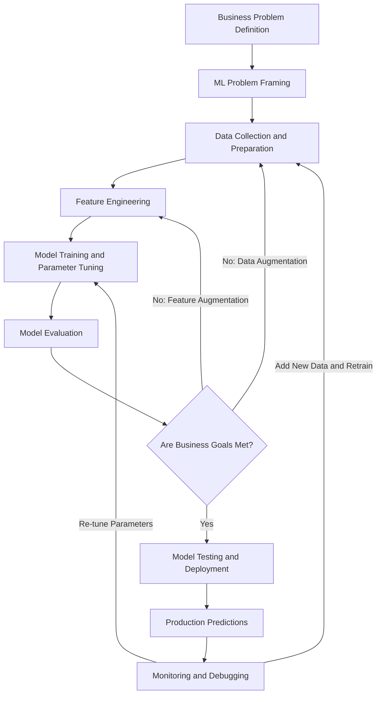
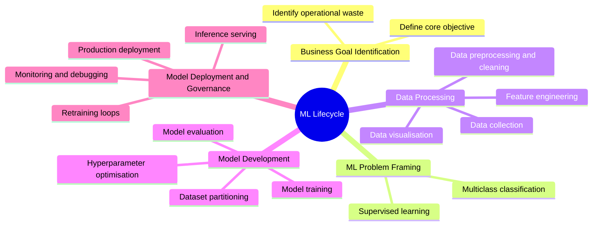
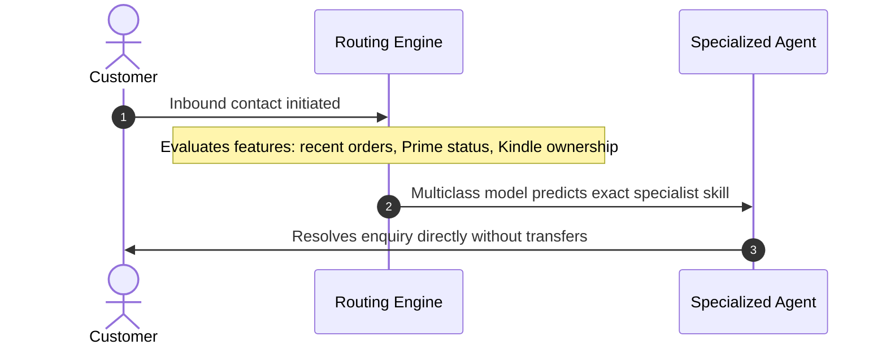
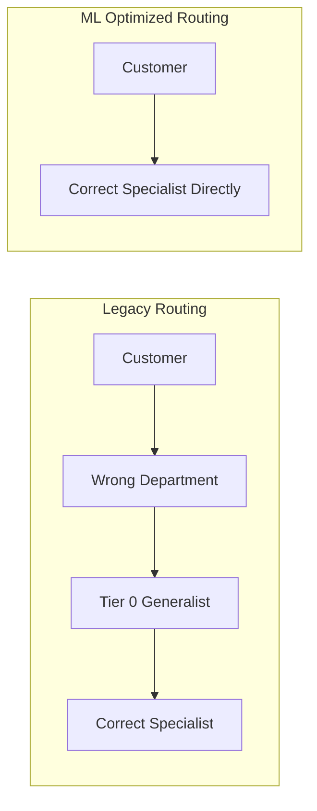
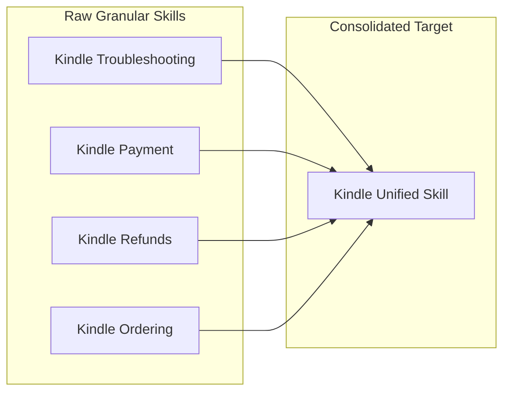
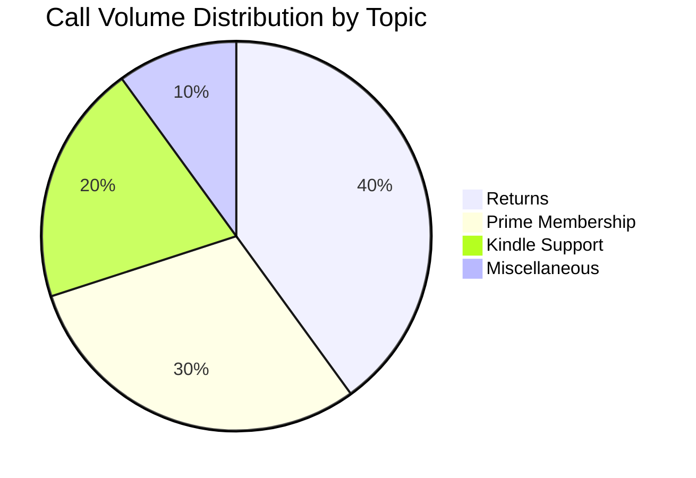

# Machine Learning Development Lifecycle

Machine learning lifecycle management represents the structured process of designing, building, serving, and governing machine learning solutions across production systems. Successful delivery requires structured cross functional collaboration among data scientists, machine learning engineers, cloud architects, and product owners.

  

## Core Phases Breakdown

|**Phase**|**Core Objective**|**Key Activities and Techniques**|
|---|---|---|
|**Business Problem Definition**|Identify domain constraints and targets|Pinpoint specific operational bottlenecks, estimate financial impact, and define measurable criteria for success|
|**ML Problem Framing**|Map business requirements to statistical methods|Determine learning paradigm such as supervised learning, select classification or regression, and define the prediction target|
|**Data Collection and Integration**|Aggregate raw training data|Gather historical inputs, unify database records, join disparate data sources, and establish ground truth labels|
|**Data Preprocessing and Visualisation**|Clean datasets and extract baseline insights|Exploratory data analysis, noise reduction, label consolidation, outlier handling, and class balance inspection|
|**Feature Engineering**|Transform raw signals into predictive inputs|Encode categorical variables, normalise continuous attributes, build aggregations, and select optimal feature subsets|
|**Model Training and Tuning**|Learn representations and fit parameters|Partition data splits, train selected algorithms, tune hyperparameters such as learning rate, and control overfitting|
|**Model Evaluation**|Validate accuracy against unseen benchmarks|Assess model performance against validation and test sets to guarantee generalization on future inputs|
|**Testing and Deployment**|Release model to production|Package container artefacts, expose inference endpoints, and run integration tests|
|**Monitoring and Retraining**|Maintain production reliability|Detect data drift, monitor inference latency, track business performance metrics, and trigger automated retraining pipelines|

## Dataset Partitioning and Validation Strategy

To guarantee that models generalise to unseen production traffic rather than memorising training examples, labeled datasets require strict partitioning.

```mermaid
gantt
    title Dataset Distribution
    dateFormat X
    axisFormat %s%%
    section Allocation
    Training Set (80%) :active, 0, 80
    Validation Set (10%) :crit, 80, 90
    Test Set (10%) :done, 90, 100
```

### Dataset Split Functions

- **Training Set (80%)**: Primary corpus used directly by the algorithm to update model weights and learn data representations.
    
      
    
- **Validation Set (10%)**: Isolated evaluation split utilised during iterative cycles to tune hyperparameters, prevent overfitting, and select optimal architectures.
    
      
    
- **Test Set (10%)**: Final blind dataset dedicated exclusively to verifying real world predictive accuracy and business viability before deployment.
    
      
    

### Key Evaluation Criteria

- **First Contact Accuracy**: Frequency of accurate routing on the initial inference pass.
    
      
    
- **Transfer Rate**: Average transfer count before reaching resolution.
    
      
    
- **Business Alignment**: Confirmation that quantitative metrics translate into target operational savings.
    
      
    

## Case Study: Customer Service Call Routing

Amazon replaced legacy Interactive Voice Response telephone menus with predictive routing based on supervised machine learning to resolve high call transfer volumes.

### Legacy Infrastructure Versus Predictive Architecture

|**Component**|**Legacy System**|**Predictive ML Architecture**|
|---|---|---|
|**Mechanism**|Static phone trees with manual menu selections|Machine learning predictive routing|
|**Model Framing**|Rule based decision trees|Supervised multiclass classification|
|**Input Signals**|Customer touch tone choices|Customer order history, Prime membership status, registered devices|
|**Label Structure**|Fragmented granular categories|Consolidated class labels covering broad functional domains|
|**Operational Impact**|Frequent reroutes, high support costs, customer friction|Direct specialist assignment, lower transfer counts, faster resolution|

### Data Preparation and Label Aggregation

During preprocessing, granular skill sets undergo consolidation to simplify model topology and improve classification performance.

### Hyperparameter Tuning Principles

- **High Learning Rate**: The optimisation algorithm updates weights too aggressively, overshooting loss minima and failing to converge.
    
      
    
- **Low Learning Rate**: Weight updates proceed too slowly, extending training duration unnecessarily and risking premature termination before reaching the optimal loss minimum.