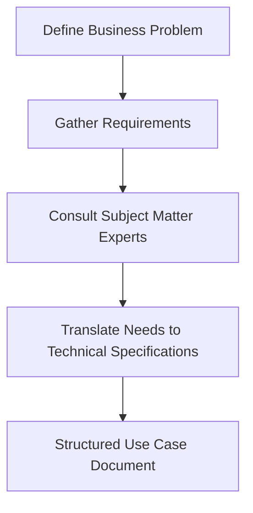
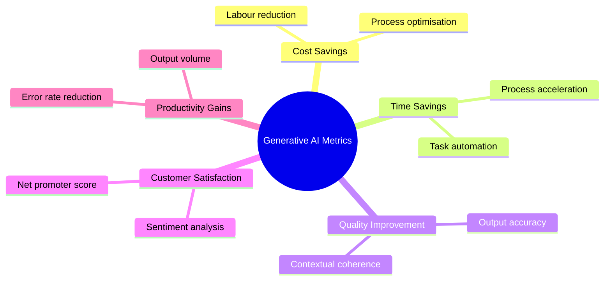

# Defining a Use Case for Generative AI

The initial stage in the generative AI application lifecycle is defining a use case. This foundational phase establishes the path for the entire project through three primary tasks:
  
- Defining the problem to resolve
    
      
    
- Gathering relevant requirements
    
      
    
- Setting stakeholder expectations
    
      
    

## Structure of a Business Use Case

A business use case provides a structured narrative describing system behaviour from an actor perspective to communicate functional requirements.

|**Component**|**Description**|**Example / Scope**|
|---|---|---|
|**Use case name**|Short, descriptive identifier|Document Summarisation Service|
|**Brief description**|High level summary of purpose and objective|Automates processing of customer queries|
|**Actors**|Entities interacting with the system|Customers, internal staff, external APIs|
|**Preconditions**|Required state before initiation|User authenticated, document uploaded|
|**Basic flow**|Main success scenario (happy path)|Sequential actions leading to success|
|**Alternative flows**|Extensions, error paths, and exceptions|Handling timeouts or invalid inputs|
|**Postconditions**|Required state after completion|Summary generated and stored in database|
|**Business rules**|Policies, constraints, and regulations|Data residency laws, compliance policies|
|**Nonfunctional requirements**|Operational criteria|Latency limits, throughput, security standards|
|**Assumptions**|Contextual dependencies|Stable internet access, API availability|
|**Notes**|Supplementary technical or business context|Implementation considerations|

## Addressing Business Problems with Generative AI

### Key Evaluation Metrics

### Core Implementation Approaches

- **Process automation:** Removing manual intervention for repetitive tasks.
    
      
    
- **Augmented decision making:** Assisting human experts with synthetic insights.
    
      
    
- **Personalisation and customisation:** Adapting outputs to specific user profiles.
    
      
    
- **Creative content generation:** Producing novel text, imagery, or code.
    
      
    
- **Exploratory analysis and innovation:** Discovering patterns across unstructured data sets.
    
      
    

## Questions You Might Have Missed

### What distinguishes a functional requirement from a nonfunctional requirement in AI use cases?

Functional requirements specify exact behaviours and operations the model must execute (e.g. summarising text), while nonfunctional requirements establish system boundaries such as inference speed, data protection controls, and uptime guarantees.

  

### Why must preconditions be strictly defined prior to foundation model selection?

Preconditions define data readiness and system states. If raw inputs lack structural validation or sanitisation before reaching the foundation model, the system risks execution errors or unpredictable inference outputs.