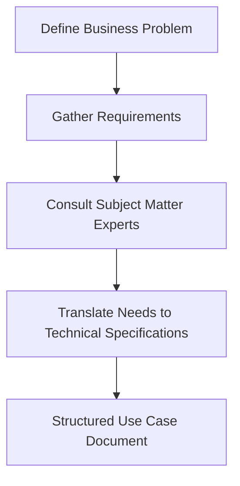
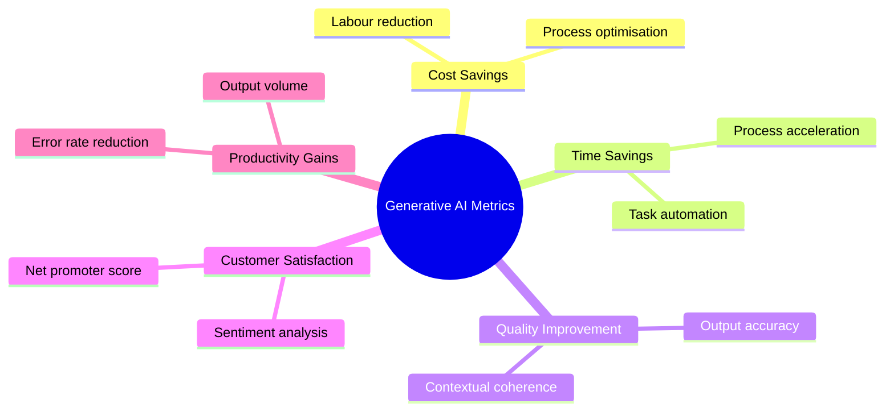
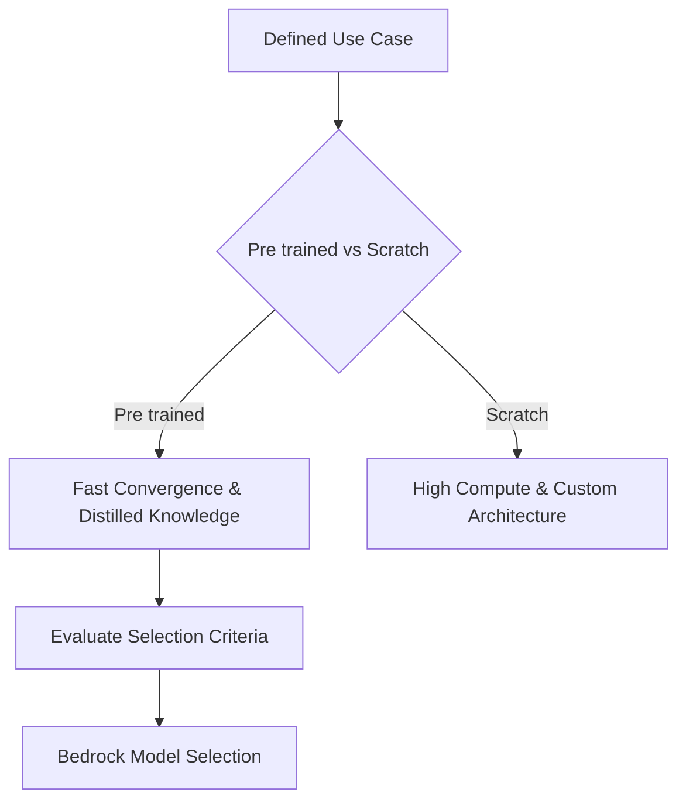
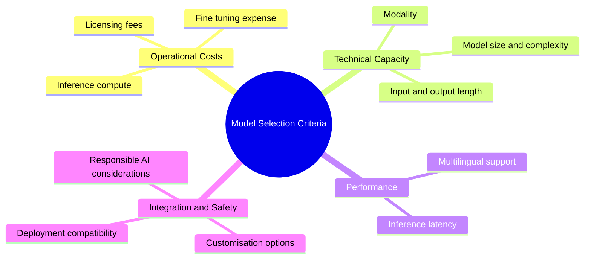
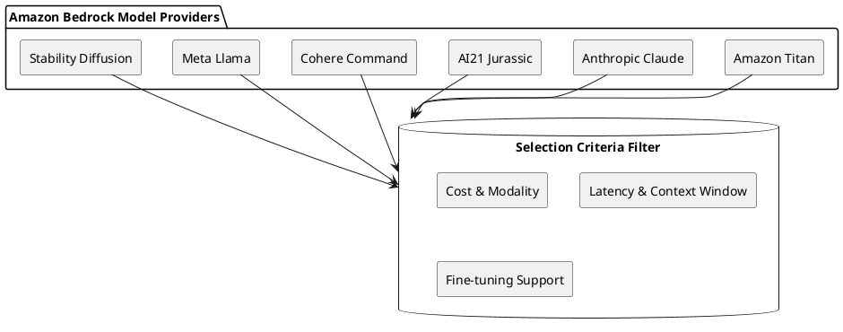
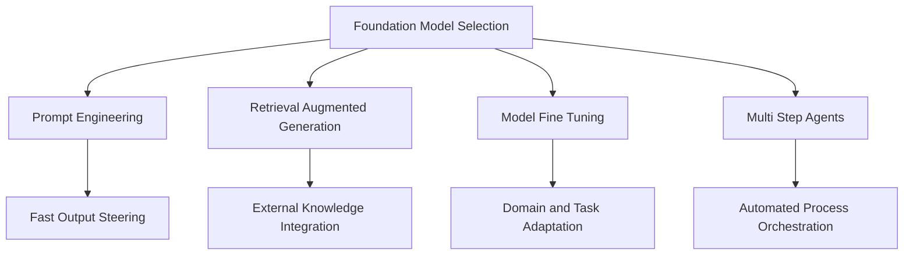
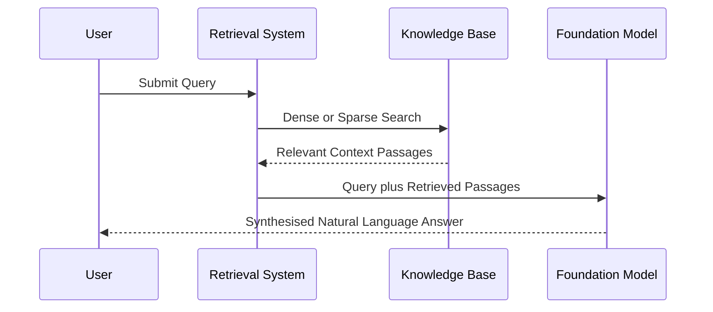
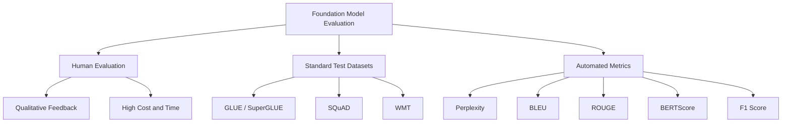

# Generative AI Application Lifecycle

# Defining a Use Case

The initial stage in the generative AI application lifecycle is defining a use case. This foundational phase establishes the path for the entire project through three primary tasks:

- Defining the problem to resolve
    
      
    
- Gathering relevant requirements
    
      
    
- Setting stakeholder expectations
    
      
    

## Structure of a Business Use Case

A business use case provides a structured narrative describing system behaviour from an actor perspective to communicate functional requirements.

|**Component**|**Description**|**Example / Scope**|
|---|---|---|
|**Use case name**|Short, descriptive identifier|Document Summarisation Service|
|**Brief description**|High level summary of purpose and objective|Automates processing of customer queries|
|**Actors**|Entities interacting with the system|Customers, internal staff, external APIs|
|**Preconditions**|Required state before initiation|User authenticated, document uploaded|
|**Basic flow**|Main success scenario (happy path)|Sequential actions leading to success|
|**Alternative flows**|Extensions, error paths, and exceptions|Handling timeouts or invalid inputs|
|**Postconditions**|Required state after completion|Summary generated and stored in database|
|**Business rules**|Policies, constraints, and regulations|Data residency laws, compliance policies|
|**Nonfunctional requirements**|Operational criteria|Latency limits, throughput, security standards|
|**Assumptions**|Contextual dependencies|Stable internet access, API availability|
|**Notes**|Supplementary technical or business context|Implementation considerations|

## Addressing Business Problems with Generative AI

### Key Evaluation Metrics

### Core Implementation Approaches

- **Process automation:** Removing manual intervention for repetitive tasks.
    
      
    
- **Augmented decision making:** Assisting human experts with synthetic insights.
    
      
    
- **Personalisation and customisation:** Adapting outputs to specific user profiles.
    
      
    
- **Creative content generation:** Producing novel text, imagery, or code.
    
      
    
- **Exploratory analysis and innovation:** Discovering patterns across unstructured data sets.
    
      
    

## Questions You Might Have Missed

### What distinguishes a functional requirement from a nonfunctional requirement in AI use cases?

Functional requirements specify exact behaviours and operations the model must execute (e.g. summarising text), while nonfunctional requirements establish system boundaries such as inference speed, data protection controls, and uptime guarantees.

  

### Why must preconditions be strictly defined prior to foundation model selection?

Preconditions define data readiness and system states. If raw inputs lack structural validation or sanitisation before reaching the foundation model, the system risks execution errors or unpredictable inference outputs.

# Select a Foundation Model

Once a use case is defined, selecting an appropriate foundation model sets the base for iterative training, deployment speed, and ongoing operational overheads. The core decision centres on using a pre-trained model versus training a model from scratch.

## Pre trained Model Selection Criteria

Pre trained models offer encapsulated knowledge distilled from massive datasets, enabling faster adaptation to target tasks. However, they can introduce biases or lack niche domain context.

| **Criterion**                  | **Technical Focus**                                           | **Practical Consideration**                                              |
| ------------------------------ | ------------------------------------------------------------- | ------------------------------------------------------------------------ |
| **Cost**                       | Licensing, compute resources for inference, customisation     | Balance token pricing and fine tuning costs against project budget       |
| **Modality**                   | Text, image, audio, or multimodal generation                  | Match model capabilities with the required input and output formats      |
| **Latency**                    | Inference execution speed                                     | Real time interactive applications require lower latency than batch runs |
| **Multilingual support**       | Multi language generation and comprehension                   | Native cross language support avoids extra translation layers            |
| **Model size**                 | Parameter count and resource footprint                        | Larger parameter counts improve quality but increase compute demands     |
| **Model complexity**           | Transformer architecture scale                                | Simpler architectures are easier to run on constrained infrastructure    |
| **Customisation**              | Fine tuning and domain adaptation hooks                       | Domain specific tasks may need labelled data for fine tuning             |
| **Input and output length**    | Maximum context window (token limit)                          | Long form generation requires models with large context windows          |
| **Responsibility**             | Misinformation risk, safety filters, training data provenance | Evaluate models for dataset bias and societal impacts                    |
| **Deployment and integration** | API availability, SDK support, infrastructure compatibility   | Check native ecosystem support (e.g. Amazon Bedrock integration)         |

## Questions You Might Have Missed

### When is building a custom model from scratch justified over choosing a pre trained model?

Building from scratch is suitable only when you possess proprietary data architectures, extreme security constraints that prohibit public weights, or domain vocabularies so specialised that pre trained weights fail entirely.

### How does context window length impact model selection on Amazon Bedrock?

Context window determines the maximum tokens a model can ingest and generate in a single call. Large documents or complex retrieval augmented generation workflows need models that support wide token buffers to avoid truncation.

# Improve Performance 

Pre trained foundation models offer strong general capabilities out of the box, yet specific business applications require targeted performance improvements. Four primary paths exist to adapt these models: prompt engineering, retrieval augmented generation, fine tuning, and autonomous agents.

## Prompt Engineering

Prompt engineering is the quickest method to control model behaviour. It focuses on structuring inputs to guide model output without altering underlying parameters.

  

- **Design**: Writing clear, direct instructions that define the exact output requirements.
    
      
    
- **Augmentation**: Supplying context, demonstrations, constraints, or examples alongside instructions.
    
      
    
- **Tuning**: Iteratively modifying prompt structures based on evaluation results.
    
      
    
- **Ensembling**: Combining multiple prompts or prompting paths to ensure robust answers.
    
      
    
- **Mining**: Sourcing and testing high performing prompts from prompt repositories.
    
      
    

### Key Prompt Strategies

- **Zero shot**: Issuing a direct instruction without sample demonstrations.
    
      
    
- **Few shot**: Providing input and output examples before requesting a response.
    
      
    
- **Chain of thought**: Prompting the model to output intermediate reasoning steps before the final answer.
    
      
    
- **Self consistency**: Generating multiple reasoning paths and selecting the most frequent answer.
    
      
    
- **Tree of thoughts**: Exploring and evaluating multiple branching problem solving steps.
    
      
    
- **Automatic Reasoning and Tool use**: Directing the model to select and run external tools for complex logic.
    
      
    
- **ReAct**: Combining reasoning steps with concrete actions and observation loops.
    
      
    

## Retrieval Augmented Generation

Retrieval augmented generation connects external data stores with generative models to produce factual, context rich text.

### Core Architecture Components

- **Retrieval System**: Searches enterprise repositories, indexes, or document stores using dense vector search or sparse methods to extract relevant text passages.
    
      
    
- **Generative Language Model**: Receives both the user query and the retrieved context to synthesise a coherent, fluent response.
    
      
    

### Enterprise Applications

- **Intelligent Query Resolution**: Customer service systems pulling real time data from internal help centres.
    
      
    
- **Knowledge Repository Enrichment**: Generating summaries, structured documentation, or updated entries for internal wikis.
    
      
    
- **Content Generation**: Drafting reports, regulatory summaries, or specialised research briefs.
    
      
    

### Amazon Bedrock Knowledge Bases

- **Customer Service**: Connecting product catalogues, manuals, and troubleshooting guides directly to conversational bots.
    
      
    
- **Legal Research**: Querying statutes, precedents, case law, and legal analysis to produce case summaries.
    
      
    
- **Healthcare Support**: Querying clinical guidance, medical journals, and treatment protocols for clinical queries.
    
      
    

## Model Fine Tuning and Training

Fine tuning adapts pre trained model weights to specialise in targeted domains or styles.

  

### Fine Tuning Approaches

- **Instruction Fine Tuning**: Training the model on paired examples of instructions and target responses. Prompt tuning is a lightweight variation of this method.
    
      
    
- **Reinforcement Learning from Human Feedback**: Adjusting weights using human preference scoring to reward quality and safety.
    
      
    

### Fine Tuning Process

1. **Select Base Model**: Start with a suitable pre trained foundation model.
    
      
    
2. **Curate Dataset**: Collect and clean task specific input and output pairs.
    
      
    
3. **Modify Architecture**: Add task specific layers, such as classification heads or decoders, if required.
    
      
    
4. **Train Parameters**: Update weights using target datasets and optimisation routines.
    
      
    
5. **Evaluate and Iterate**: Validate performance against testing sets and adjust hyperparameters.
    
      
    

### Training from Scratch

Building a foundation model from the ground up requires designing custom neural architectures, collecting massive datasets, and training across large compute clusters. It offers complete architectural control but incurs extreme compute costs, extensive timelines, and deep machine learning expertise.

  

## Multi Step Automation Agents

Agents break broad objectives down into sequential subtasks, orchestrating interactions between foundation models, APIs, and tools.

  

- **Task Coordination**: Managing execution order, handling prerequisites, and passing data between intermediate stages.
    
      
    
- **Logging and Audit**: Tracking execution progress, system performance, diagnostic traces, and operational metrics.
    
      
    
- **Concurrency**: Running multiple workflows in parallel to support higher operational volume.
    
      
    
- **System Integration**: Calling external endpoints, databases, cloud infrastructure, and message queues.
    
      
    
- **Infrastructure Automation**: Provisioning compute instances, configuring databases, executing backups, and managing deployments in platforms like Amazon Bedrock.
    
      
    

## Customisation Technique Comparison

|**Technique**|**Primary Purpose**|**Implementation Cost**|**Data Requirements**|**Parameter Updates**|
|---|---|---|---|---|
|**Prompt Engineering**|Steer output style and task framing|Minimal|None to few examples|None|
|**RAG**|Ground responses in dynamic external knowledge|Low to Moderate|Organised knowledge base|None|
|**Fine Tuning**|Adapt model behaviour to specialised tasks or domains|Moderate to High|Thousands of labelled pairs|Yes|
|**Training from Scratch**|Build bespoke models with complete architecture control|Very High|Massive web scale corpora|Yes (all weights)|

## Missed Questions and Answers

**How does one decide between RAG and fine tuning?**

Choose RAG when source facts change often or require strict citations. Choose fine tuning when the goal is to teach the model a specific format, linguistic tone, or task syntax rather than static factual retrieval.

  

**What happens if retrieved documents in RAG contain contradictory facts?**

The generative model may hallucinate, blend inconsistent statements, or pick whichever passage appears first in the prompt context. Reranking and passage deduplication help resolve this.

  

**Can prompt engineering and fine tuning be used together?**

Yes. A fine tuned model still requires structured prompts, input constraints, and few shot examples to deliver optimal output consistency in production systems.

# Foundation Model Evaluation

Evaluating foundation models ensures model capabilities match specific organizational requirements and business goals.

## Evaluation Methodologies

| **Method**                 | **Core Mechanism**                                                                                                     | **Key Advantages**                                                                                  | **Limitations**                                                                             |
| -------------------------- | ---------------------------------------------------------------------------------------------------------------------- | --------------------------------------------------------------------------------------------------- | ------------------------------------------------------------------------------------------- |
| **Human Evaluation**       | Human assessors interact directly with the model on open ended conversations, text generation, and question answering. | Gold standard for assessing coherence, relevance, factual accuracy, and overall output quality.     | Time consuming, expensive, and difficult to manage at large scale.                          |
| **Standard Test Datasets** | Curated data collections designed to evaluate performance across specific linguistic tasks.                            | Provides standardized comparisons across different foundation models and tracks progress over time. | Static collections may fail to capture emerging capabilities or unique domain requirements. |
| **Automated Metrics**      | Algorithmic scoring measuring token predictions, overlap, or semantic distance against reference data.                 | Fast, repeatable, and cost effective for rapid iterations and fine tuning during development.       | Lacks sensitivity to linguistic nuance; often diverges from human judgment.                 |

## Standard Evaluation Datasets

- **GLUE:** Collection of datasets evaluating language understanding tasks such as text classification, question answering, and natural language inference.
    
      
    
- **SuperGLUE:** Extension of GLUE containing more challenging tasks with an emphasis on compositional language understanding.
    
      
    
- **SQuAD:** Stanford Question Answering Dataset, used specifically for measuring question answering performance.
    
      
    
- **WMT:** Workshop on Machine Translation, providing datasets and evaluation tasks for translation systems.
    
      
    

## Automated Metrics Overview

### Token and Classification Metrics

- **Perplexity:** Measures how effectively a language model predicts the next token in a sequence.
    
      
    
- **F1 Score:** Harmonic mean of precision and recall, applied to classification and named entity recognition tasks.
    
      
    

### Text Generation and Translation Metrics

|**Metric**|**Full Name**|**Primary Use Case**|**Assessment Mechanism**|
|---|---|---|---|
|**ROUGE**|Recall Oriented Understudy for Gisting Evaluation|Summarisation and translation|Measures recall and overlap by comparing generated text against reference summaries.|
|**BLEU**|Bilingual Evaluation Understudy|Machine translation|Evaluates precision and brevity by comparing n gram overlap with reference translations.|
|**BERTScore**|BERT Score|Semantic similarity across generative tasks|Uses pre trained BERT models to calculate contextual embeddings, determining cosine similarity between generated text and reference text.|

## Questions You Might Have Missed

**How does ROUGE differ fundamentally from BLEU?**

BLEU is precision oriented and penalizes excessive length, making it ideal for translation. ROUGE is recall oriented, measuring whether the generated text captures all essential information present in reference summaries.

  

**Why is BERTScore preferred over BLEU or ROUGE for creative text generation?**

BLEU and ROUGE rely on exact word matching (n grams). BERTScore uses contextual embeddings to measure semantic meaning, recognizing valid synonyms and paraphrased sentences even when exact words differ.

  

**Why should automated metrics be paired with human evaluation?**

Automated metrics provide fast quantitative feedback during training, but they cannot reliably evaluate context, subtle factual errors, or tone. Combining both methods ensures technical precision alongside real world usability.
