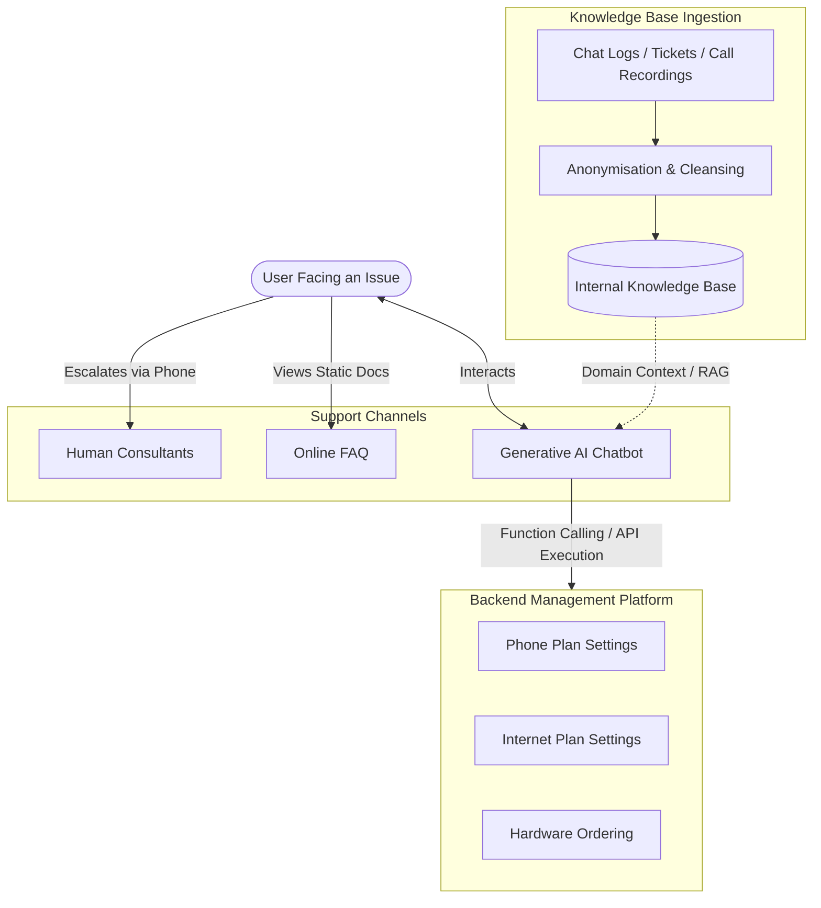
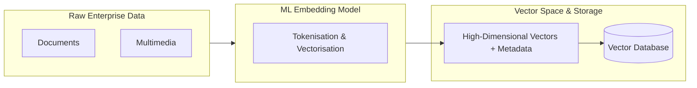
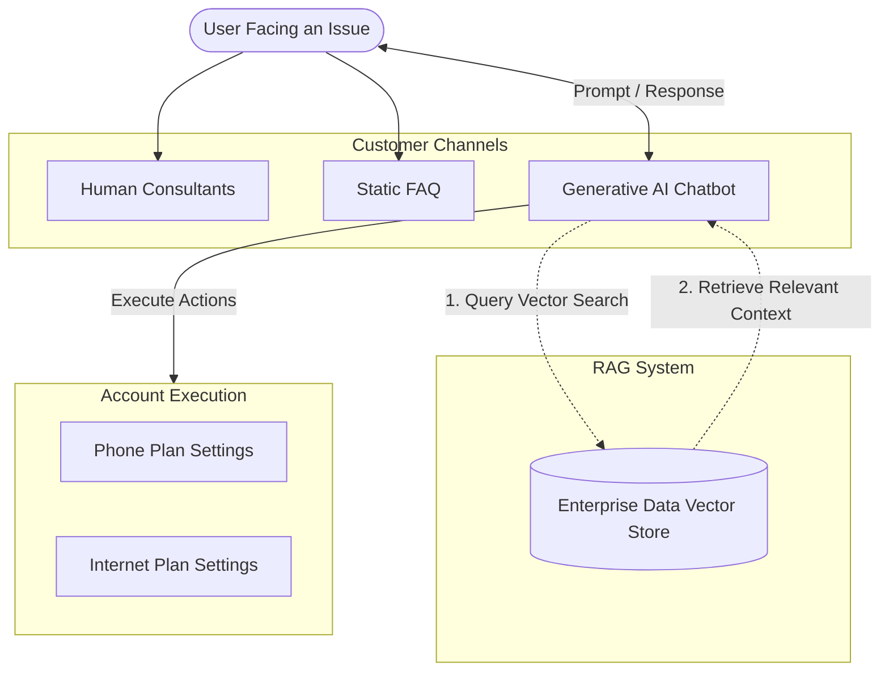
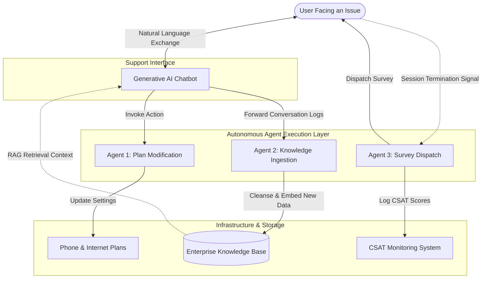
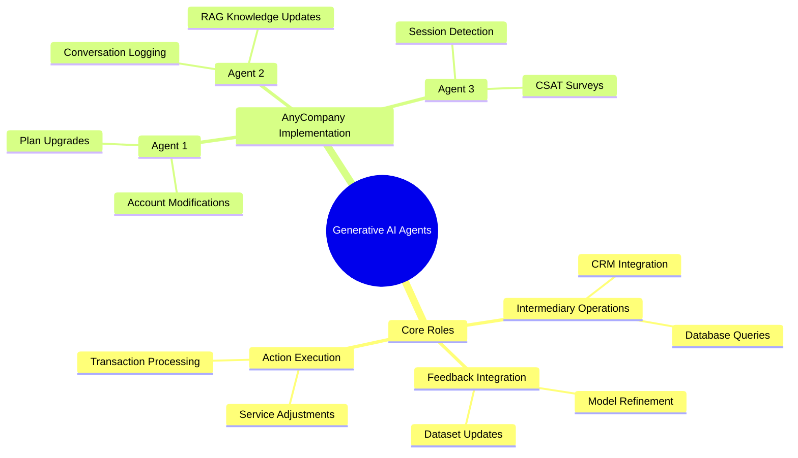

# Optimising a Foundation model with retrieval augmented generation

## AnyCompany Generative AI Support Architecture

### Business Context and Problem Statement

AnyCompany is a telecommunications organisation supplying broadband and mobile services. Customer support currently relies heavily on telephone assistance, which creates high operational expenses and inefficiencies. A static website FAQ was introduced, but support ticket volume remains unsustainably high.

  

```
+-------------------------------------------------------------+
|                     Target Metrics                          |
+-------------------------------------------------------------+
| Online ticket volume reduction: >= 70%                      |
| Customer satisfaction (CSAT) rating: >= 4 / 5               |
+-------------------------------------------------------------+
```

### Architecture Overview




### Technical Solution Requirements

### Foundation Model Selection

- AnyCompany requires a Large Language Model (LLM) offering strong natural language processing (NLP) and natural language understanding (NLU).
    
      
    
- Base LLMs excel at general language comprehension because they are trained on public datasets, but they lack company internal domain context.
    
      
    

### Context Enrichment via Internal Knowledge Base

- Data sources: historic chat transcripts, resolved helpdesk tickets, and audio call recordings.
    
      
    
- Data pipeline: raw records must be collected, scrubbed of personal identifiable information (PII), anonymised, and formatted into an indexed knowledge base to support contextual retrieval.
    
      
    

### Autonomous Action Execution

- The chatbot cannot remain read only.
    
      
    
- It must trigger backend function calls to execute account alterations directly (such as provisioning 5G data additions, changing broadband tiers, or ordering new hardware).
    
      
    

### Component Comparison

|**Component**|**Primary Function**|**Limitations**|**Target State**|
|---|---|---|---|
|**Human Consultants**|Direct high touch resolution|High operational cost and slow resolution times|Reserved strictly for complex escalations|
|**Static FAQ**|Self service reference documentation|Static data with zero personalisation or account actions|Serves as reference material for ingestion|
|**GenAI Chatbot**|Dynamic resolution and automated execution|Requires domain specific RAG and backend API write access|Primary frontline support tier handling autonomous workflows|

### Questions You Might Have Missed

**How does the system ensure customer privacy when ingesting call recordings and chat logs?**

  

Data cleansing pipelines run text recognition and automated redaction tools to strip out names, phone numbers, and payment details before the text enters the indexing database.

  

**What mechanism allows the chatbot to modify customer accounts safely?**

  

The model uses tool calling (function calling) to trigger authenticated backend REST APIs, requiring confirmed customer permissions before executing database updates.

## Retrieval Augmented Generation

### Enterprise Datasets and Context Provision

Foundation Models (FMs) and Large Language Models (LLMs) generate human like text, images, and audio from prompts based on broad public training data. Enterprises require customised outputs aligned with proprietary information.

  

#### Internal Data Sources

Enterprises collect vast stores of internal information unfamiliar to base models:

  

- Documents
    
      
    
- Presentations
    
      
    
- User manuals
    
      
    
- Reports
    
      
    
- Transaction summaries
    
      
    

Providing relevant enterprise records as prompt context gives the model domain specific knowledge to generate accurate, tailored responses.

  

### Vector Embeddings

Embedding is the mathematical process of converting unstructured items (text, images, audio) into numerical representations within a high dimensional vector space.

  

#### Embedding Pipeline




#### Semantic Proximity in Vector Space

- Words or entities with semantic relationships map closer together in vector space.
    
      
    
- Training refines arbitrary initial vector states into clustered groupings based on context.
    
      
    
- Example: "Sea" and "Ocean" converge to similar vector coordinates and colour clusters, whereas an unrelated term such as "Stapler" remains distinct.
    
      
    

|**Entity Pair**|**Spatial Distance**|**Semantic Relation**|
|---|---|---|
|**Sea + Ocean**|Low (Clustered)|Highly Related Context|
|**Sea + Stapler**|High (Divergent)|Unrelated Context|

### Vector Databases and Similarity Search

Vector databases compactly store billions of high dimensional vectors alongside metadata, enabling ultra fast similarity searches in real time.

  

#### Similarity Algorithms

- $k$-Nearest Neighbours ($k$-NN)
    
      
    
- Cosine Similarity
    
      
    

#### AWS Vector Database Services

- Amazon OpenSearch Service (provisioned)
    
      
    
- Amazon OpenSearch Serverless
    
      
    
- `pgvector` extension in Amazon RDS for PostgreSQL
    
      
    
- `pgvector` extension in Amazon Aurora PostgreSQL Compatible Edition
    
      
    
- Amazon Kendra
    
      
    

### Retrieval Augmented Generation Architecture

RAG integrates vector search into the customer interaction flow, retrieving relevant internal data to enrich the prompt before the model responds.




### Questions You Might Have Missed

**How does vector indexing differ between Amazon OpenSearch Service and Amazon Kendra?**

  

Amazon OpenSearch Service requires configuring vector engines directly (such as FAISS or NMSLIB using $k$-NN), whereas Amazon Kendra provides a fully managed semantic search service with built in document connectors and natural language parsing.

  

**What is the role of chunking before generating embeddings?**

  

Long enterprise documents must be split into smaller text passages (chunks) prior to vectorisation to ensure the embedding captures specific context without exceeding token limits or diluting semantic relevance during similarity search.

## Autonomous Agents in Generative AI Architectures

### Core Functions of AI Agents

Agents extend foundation models from passive conversational engines into active systems capable of reasoning, calling external tools, and orchestrating logic.

  

#### 1. Intermediary Operations

- Bridge the generative model and backend systems such as CRM platforms, SQL databases, and IT service management tools.
    
      
    
- The foundation model translates intent, whilst the agent manages protocols, authentication, and state transfer between endpoints.
    
      
    

#### 2. Action Execution

- Trigger external functions to alter real world states rather than simply emitting text.
    
      
    
- Core capabilities include modifying subscription parameters, processing financial transactions, provisioning infrastructure, and running document search pipelines.
    
      
    

#### 3. Feedback Integration and Continuous Learning

- Collect telemetry and operational outcomes from user interactions.
    
      
    
- Feed performance data back into storage pipelines to refine model prompts, update vector indexes, and improve future response quality.
    
      
    

### Agent System Architecture




### AnyCompany Multi Agent Specialisation

|**Agent Entity**|**Trigger Condition**|**Target System**|**Functional Output**|
|---|---|---|---|
|**Agent 1 (Service Automation)**|Customer requests plan modifications, data add ons, or hardware|Core billing and provisioning APIs|Modifies account attributes and provisions network services|
|**Agent 2 (Continuous Feedback)**|Active conversation logs between customer and chatbot|Enterprise Vector Database (RAG store)|Anonymises dialogue records to update domain context dynamically|
|**Agent 3 (Satisfaction Tracking)**|Session termination or intent completion detected|CSAT analytics platform|Transmits automated satisfaction surveys to calculate the target score|

### Mind Map Overview



### Questions You Might Have Missed

**How does an agent determine the boundary between generating a textual answer and triggering a function call?**

  

The underlying model receives tool definitions (schemas) in its prompt. When user intent matches a declared tool signature, the model emits a structured function call payload (such as JSON) rather than plain conversational text.

  

**Why is an independent agent used for RAG updates rather than updating the database directly during inference?**

  

Separating inference from knowledge updates prevents latency spikes during live customer chat. Agent 2 processes logs asynchronously, sanitising sensitive personal data before indexing records into the vector database.
# Optimising a foundational model with fine-tuning