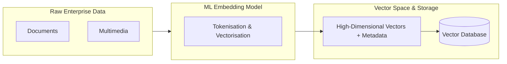
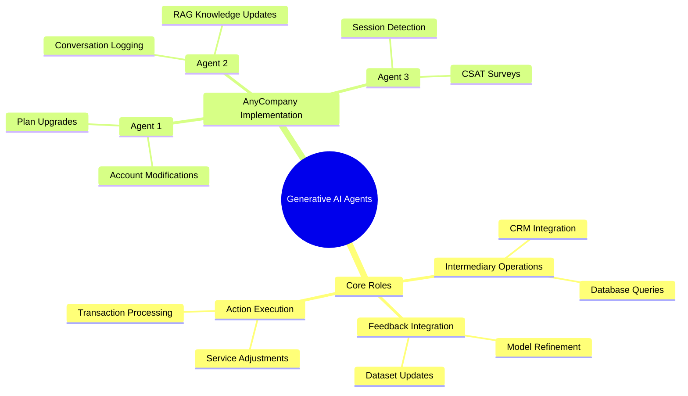
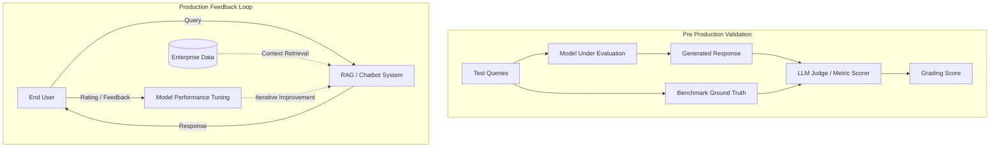
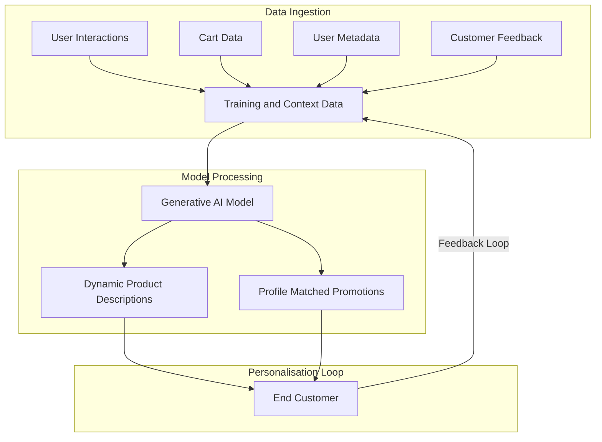
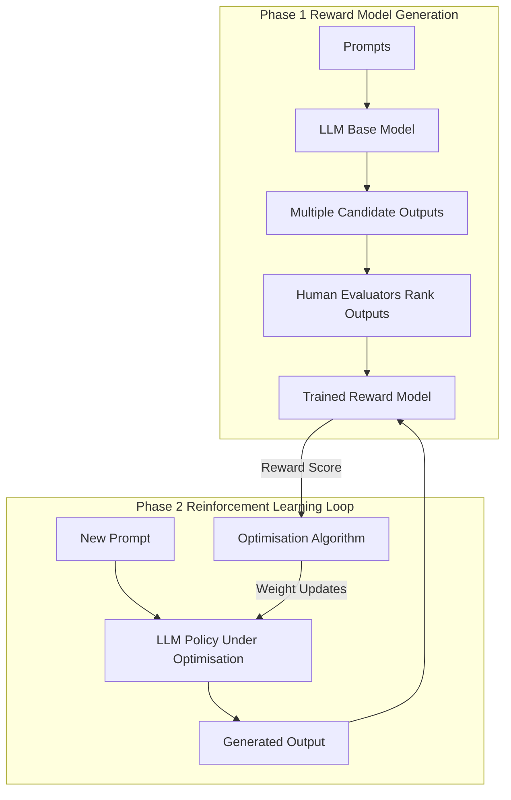
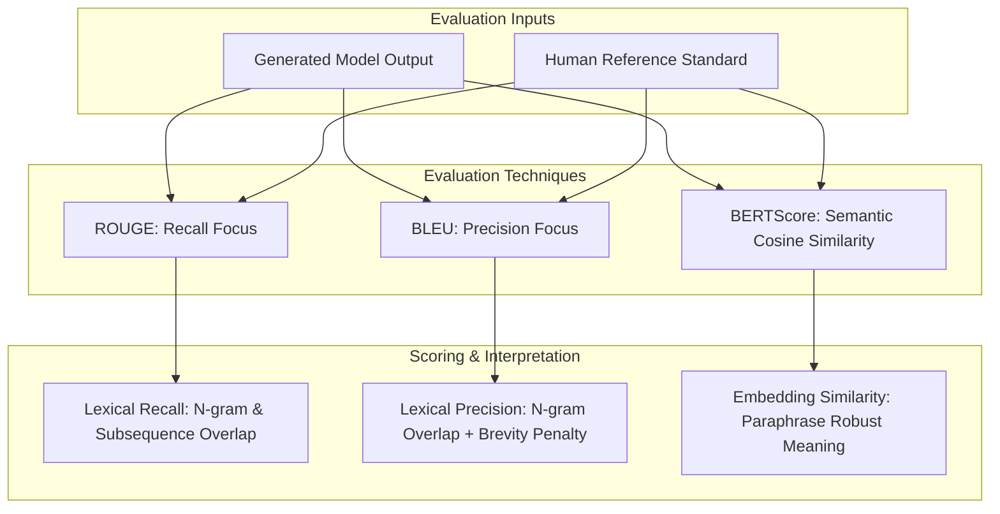
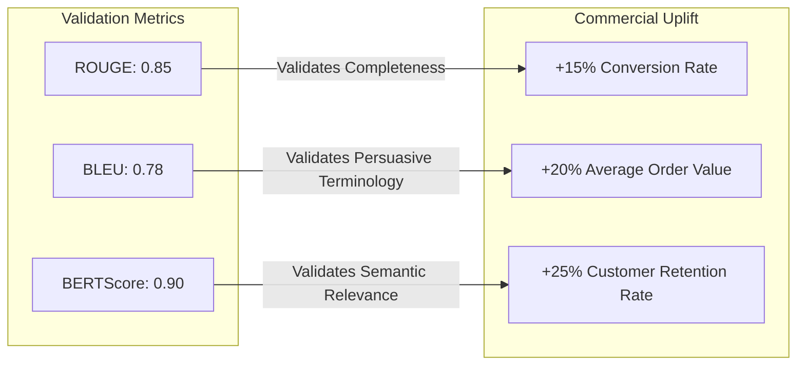

# Optimising a Foundation model with retrieval augmented generation

## AnyCompany Generative AI Support Architecture

### Business Context and Problem Statement

AnyCompany is a telecommunications organisation supplying broadband and mobile services. Customer support currently relies heavily on telephone assistance, which creates high operational expenses and inefficiencies. A static website FAQ was introduced, but support ticket volume remains unsustainably high.

  

```
+-------------------------------------------------------------+
|                     Target Metrics                          |
+-------------------------------------------------------------+
| Online ticket volume reduction: >= 70%                      |
| Customer satisfaction (CSAT) rating: >= 4 / 5               |
+-------------------------------------------------------------+
```

### Architecture Overview


### Technical Solution Requirements

### Foundation Model Selection

- AnyCompany requires a Large Language Model (LLM) offering strong natural language processing (NLP) and natural language understanding (NLU).
    
      
    
- Base LLMs excel at general language comprehension because they are trained on public datasets, but they lack company internal domain context.
    
      
    

### Context Enrichment via Internal Knowledge Base

- Data sources: historic chat transcripts, resolved helpdesk tickets, and audio call recordings.
    
      
    
- Data pipeline: raw records must be collected, scrubbed of personal identifiable information (PII), anonymised, and formatted into an indexed knowledge base to support contextual retrieval.
    
      
    

### Autonomous Action Execution

- The chatbot cannot remain read only.
    
      
    
- It must trigger backend function calls to execute account alterations directly (such as provisioning 5G data additions, changing broadband tiers, or ordering new hardware).
    
      
    

### Component Comparison

|**Component**|**Primary Function**|**Limitations**|**Target State**|
|---|---|---|---|
|**Human Consultants**|Direct high touch resolution|High operational cost and slow resolution times|Reserved strictly for complex escalations|
|**Static FAQ**|Self service reference documentation|Static data with zero personalisation or account actions|Serves as reference material for ingestion|
|**GenAI Chatbot**|Dynamic resolution and automated execution|Requires domain specific RAG and backend API write access|Primary frontline support tier handling autonomous workflows|

### Questions You Might Have Missed

**How does the system ensure customer privacy when ingesting call recordings and chat logs?**

  

Data cleansing pipelines run text recognition and automated redaction tools to strip out names, phone numbers, and payment details before the text enters the indexing database.

  

**What mechanism allows the chatbot to modify customer accounts safely?**

  

The model uses tool calling (function calling) to trigger authenticated backend REST APIs, requiring confirmed customer permissions before executing database updates.

## Retrieval Augmented Generation

### Enterprise Datasets and Context Provision

Foundation Models (FMs) and Large Language Models (LLMs) generate human like text, images, and audio from prompts based on broad public training data. Enterprises require customised outputs aligned with proprietary information.

  

#### Internal Data Sources

Enterprises collect vast stores of internal information unfamiliar to base models:

  

- Documents
    
      
    
- Presentations
    
      
    
- User manuals
    
      
    
- Reports
    
      
    
- Transaction summaries
    
      
    

Providing relevant enterprise records as prompt context gives the model domain specific knowledge to generate accurate, tailored responses.

  

### Vector Embeddings

Embedding is the mathematical process of converting unstructured items (text, images, audio) into numerical representations within a high dimensional vector space.

  

#### Embedding Pipeline




#### Semantic Proximity in Vector Space

- Words or entities with semantic relationships map closer together in vector space.
    
      
    
- Training refines arbitrary initial vector states into clustered groupings based on context.
    
      
    
- Example: "Sea" and "Ocean" converge to similar vector coordinates and colour clusters, whereas an unrelated term such as "Stapler" remains distinct.
    
      
    

|**Entity Pair**|**Spatial Distance**|**Semantic Relation**|
|---|---|---|
|**Sea + Ocean**|Low (Clustered)|Highly Related Context|
|**Sea + Stapler**|High (Divergent)|Unrelated Context|

### Vector Databases and Similarity Search

Vector databases compactly store billions of high dimensional vectors alongside metadata, enabling ultra fast similarity searches in real time.

  

#### Similarity Algorithms

- $k$-Nearest Neighbours ($k$-NN)
    
      
    
- Cosine Similarity
    
      
    

#### AWS Vector Database Services

- Amazon OpenSearch Service (provisioned)
    
      
    
- Amazon OpenSearch Serverless
    
      
    
- `pgvector` extension in Amazon RDS for PostgreSQL
    
      
    
- `pgvector` extension in Amazon Aurora PostgreSQL Compatible Edition
    
      
    
- Amazon Kendra
    
      
    

### Retrieval Augmented Generation Architecture

RAG integrates vector search into the customer interaction flow, retrieving relevant internal data to enrich the prompt before the model responds.


### Questions You Might Have Missed

**How does vector indexing differ between Amazon OpenSearch Service and Amazon Kendra?**

  

Amazon OpenSearch Service requires configuring vector engines directly (such as FAISS or NMSLIB using $k$-NN), whereas Amazon Kendra provides a fully managed semantic search service with built in document connectors and natural language parsing.

  

**What is the role of chunking before generating embeddings?**

  

Long enterprise documents must be split into smaller text passages (chunks) prior to vectorisation to ensure the embedding captures specific context without exceeding token limits or diluting semantic relevance during similarity search.

## Autonomous Agents in Generative AI Architectures

### Core Functions of AI Agents

Agents extend foundation models from passive conversational engines into active systems capable of reasoning, calling external tools, and orchestrating logic.

  

#### 1. Intermediary Operations

- Bridge the generative model and backend systems such as CRM platforms, SQL databases, and IT service management tools.
    
      
    
- The foundation model translates intent, whilst the agent manages protocols, authentication, and state transfer between endpoints.
    
      
    

#### 2. Action Execution

- Trigger external functions to alter real world states rather than simply emitting text.
    
      
    
- Core capabilities include modifying subscription parameters, processing financial transactions, provisioning infrastructure, and running document search pipelines.
    
      
    

#### 3. Feedback Integration and Continuous Learning

- Collect telemetry and operational outcomes from user interactions.
    
      
    
- Feed performance data back into storage pipelines to refine model prompts, update vector indexes, and improve future response quality.
    
      
    

### Agent System Architecture


### AnyCompany Multi Agent Specialisation

|**Agent Entity**|**Trigger Condition**|**Target System**|**Functional Output**|
|---|---|---|---|
|**Agent 1 (Service Automation)**|Customer requests plan modifications, data add ons, or hardware|Core billing and provisioning APIs|Modifies account attributes and provisions network services|
|**Agent 2 (Continuous Feedback)**|Active conversation logs between customer and chatbot|Enterprise Vector Database (RAG store)|Anonymises dialogue records to update domain context dynamically|
|**Agent 3 (Satisfaction Tracking)**|Session termination or intent completion detected|CSAT analytics platform|Transmits automated satisfaction surveys to calculate the target score|

### Mind Map Overview



### Questions You Might Have Missed

**How does an agent determine the boundary between generating a textual answer and triggering a function call?**

  

The underlying model receives tool definitions (schemas) in its prompt. When user intent matches a declared tool signature, the model emits a structured function call payload (such as JSON) rather than plain conversational text.

  

**Why is an independent agent used for RAG updates rather than updating the database directly during inference?**

  

Separating inference from knowledge updates prevents latency spikes during live customer chat. Agent 2 processes logs asynchronously, sanitising sensitive personal data before indexing records into the vector database.

## Evaluating Generative AI Results

Evaluating generative AI models is essential to verify performance and confirm that system objectives are met. Two primary approaches exist: qualitative human evaluation and quantitative benchmark datasets.

| **Dimension**     | **Human Evaluation**                                                 | **Benchmark Datasets**                                                |
| ----------------- | -------------------------------------------------------------------- | --------------------------------------------------------------------- |
| **Primary Focus** | Qualitative assessment                                               | Quantitative assessment                                               |
| **Key Metrics**   | User experience, contextual appropriateness, creativity, flexibility | Task accuracy, generation speed, operational efficiency, scalability  |
| **Best Phase**    | Post deployment, iterative fine tuning                               | Pre deployment testing, baseline verification, cross model comparison |
| **Data Source**   | Real end user interactions and ratings                               | Predefined test queries and ground truth answers                      |
| **Automation**    | Manual feedback collection                                           | Automated pipelines (e.g. LLM as a judge)                             |




## Creating RAG Benchmark Datasets

Building a benchmark dataset for Retrieval Augmented Generation (RAG) involves subject matter experts (SMEs) defining baseline truths:

  

- **Context Identification:** SMEs extract precise source passages containing the essential facts needed to answer specific queries.
    
      
    
- **Answer Drafting:** SMEs write gold standard reference responses based strictly on the identified context to evaluate future RAG outputs.
    
      
    

## Combined Evaluation Pipeline

A robust deployment combines both strategies:

  

1. **Pre deployment:** Benchmark datasets validate baseline accuracy, throughput, and guardrails via automated judge models before release.
    
      
    
2. **Post deployment:** Real world user ratings provide continuous feedback, enabling teams to detect edge cases and guide long term model tuning.
    
      
    

### Questions You Might Have Missed

**How does an LLM as a judge architecture work?**

  

An evaluation prompt containing the input query, generated answer, and benchmark ground truth is sent to a separate evaluator LLM, which scores the output against predefined criteria like factual correctness and relevance.

  

**Why are benchmarks alone insufficient for production readiness?**

  

Static benchmarks cannot predict open ended user behaviour, novel edge cases, or subtle nuances in conversational tone that direct human feedback reveals.
# Optimising a foundational model with fine-tuning

## AnyCompany Personalised Retail Case Study

### Business Challenges and Objectives

AnyCompany is an online fashion retailer experiencing high cart abandonment rates and low repeat purchases because customers struggle to choose items that suit their personal taste.

  

|**Metric**|**Definition**|**Business Target**|
|---|---|---|
|**Conversion rate**|Increase in completed purchases per website visit|Reduce abandoned baskets|
|**Average order value**|Increase in total monetary amount spent per checkout transaction|Boost basket size with relevant additions|
|**Customer retention rate**|Increase in the percentage of returning buyers over time|Enhance brand loyalty|




#### Solution Architecture Components

#### Data Ingestion and Model Tuning

The system uses specialised customer data sets rather than generic public data:

  

- **Transactional Data:** Historical cart records, purchase frequency, and basket sizes.
    
      
    
- **Customer Feedback:** Product reviews, fit ratings, and return remarks.
    
      
    
- **User Interaction Signals:** Live clicks, page dwell time, category browsing, and saved favourites.
    
      
    

#### Recommendation Engine Integration

The generative model integrates directly with the catalogue database to adapt product displays and promotions in real time according to individual style profiles and budget preferences.

  

#### Continuous Learning Pipeline

The pipeline updates the model periodically without manual intervention. New interaction data and shifting fashion trends feed into ongoing model refinement to keep item recommendations accurate.

  

#### Questions You Might Have Missed

**Why use fine tuning instead of standard retrieval techniques here?**

  

Fine tuning trains the generative model directly on brand specific tone, terminology, and historical buying habits, whereas retrieval alone only inserts factual context into standard prompt templates.

  

**How does real time adaptation differ from batch recommendations?**

  

Real time adaptation modifies the live interface during an active session based on immediate browsing signals, whilst batch systems compute static suggestions offline at set intervals.


## Fine Tuning Foundation Models

Foundation models provide broad baseline intelligence, but production applications demand targeted adaptation to achieve operational reliability.

  

### Core Motivations

- **Increase Specificity:** Tailors model outputs to sector nuances omitted during general training.
    
      
    
- **Improve Accuracy:** Trains weights on specialised corpora to eliminate generalist hallucinations and errors.
    
      
    
- **Reduce Biases:** Identifies and corrects skewed representations present in open web crawls.
    
      
    
- **Boost Efficiency:** Reduces computational overhead and latency by narrowing operational scope.
    
      
    

### Fine Tuning Approaches

|**Approach**|**Primary Mechanism**|**Primary Use Case**|
|---|---|---|
|**Instruction Tuning**|Supervised training on prompt and desired response pairs|Virtual assistants, customer support chatbots|
|**RLHF**|Preference scoring through reward models built on human rankings|Value steering, toxicity mitigation, safety guardrails|
|**Domain Adaptation**|Training on dedicated industry corpora such as legal or medical records|Specialised analytical tools, technical copilots|
|**Transfer Learning**|Reusing general model weights as the base for smaller niche tasks|High accuracy classification with limited training data|
|**Continuous Pretraining**|Streaming emerging domain data into the model weights over time|Maintaining topical relevance with shifting vocabulary|

### Reinforcement Learning from Human Feedback Workflow




### Data Preparation Comparison

|**Parameter**|**Initial Foundational Training**|**Fine Tuning Preparation**|
|---|---|---|
|**Data Scope**|Broad web scale datasets across diverse domains|Focused task specific records and examples|
|**Data Volume**|Massive scale measured in terabytes or petabytes|Smaller, curated collections prioritizing quality|
|**Primary Goal**|Generalisation across unseen problem spaces|Deep domain competence on targeted tasks|
|**Data Cleaning**|Heavy deduplication, mass filtering, anonymisation|Exacting verification, formatting, metadata tagging|

### Key Steps in Fine Tuning Data Preparation

- **Data Curation:** Filtering candidate records rigorously to ensure every sample advances the target capability.
    
      
    
- **Labelling:** Constructing high quality, consistent ground truth labels to guide parameter convergence.
    
      
    
- **Governance and Compliance:** Auditing source data against legal, healthcare, or corporate regulatory standards.
    
      
    
- **Representativeness and Bias Audits:** Inspecting curated samples to prevent unintended skew or historical prejudices.
    
      
    
- **Feedback Integration:** Capturing human preference ratings directly into dataset structures for reinforcement cycles.
    
      
    

#### Questions You Might Have Missed

**How does instruction tuning differ from domain adaptation?**

  

Instruction tuning trains a model to follow task structures and direct commands using prompt and response pairs, whereas domain adaptation feeds raw industry text to expand the underlying vocabulary and factual knowledge.

  

**When is continuous pretraining preferred over standard retrieval?**

  

Continuous pretraining permanently alters base weights when fundamental sector vocabulary or underlying syntax changes drastically, whereas retrieval queries an external index for volatile facts without changing model weights.

## Language Model Evaluation Metrics

Evaluation metrics provide quantitative methods to measure the quality, precision, and semantic validity of text generated by foundation models against human curated reference standards.




### Core Quantitative Metrics

|**Metric**|**Primary Focus**|**Core Mechanism**|**Strengths**|**Key Limitations**|**Typical Use Cases**|
|---|---|---|---|---|---|
|**ROUGE**|Recall|Counts overlapping units (words, n-grams, common subsequences) between candidate and reference texts|Highly interpretable; aligns well with human assessment for information completeness|Penalises valid lexical variations and synonyms|Automatic summarisation, RAG ground truth verification|
|**BLEU**|Precision|Measures n-gram precision in candidate output against references; applies brevity penalty for short responses|Efficient to compute; scalable standard across industry benchmarks|Weak at measuring overall grammatical fluency; penalises creative phrasing|Machine translation, structured text transformation|
|**BERTScore**|Semantic Similarity|Calculates cosine similarity between contextual embeddings derived from pretrained models (e.g. BERT)|Captures deep meaning; robust against synonym substitution and paraphrasing|Computationally intensive; lower direct interpretability than token matching|Conversational AI, open-ended instruction evaluation|

### Specific Metric Variations

#### ROUGE Variations

- **ROUGE-N:** Calculates overlap of n-grams (ROUGE-1 for unigrams, ROUGE-2 for bigrams). Measures text fluency and the retention of primary reference facts.
    
      
    
- **ROUGE-L:** Evaluates the Longest Common Subsequence (LCS) between candidate and reference texts. Captures natural sentence structure and narrative sequence without requiring consecutive matches.
    
      
    

#### BLEU Mechanics

- Assesses precision across unigrams, bigrams, trigrams, and quadrigrams.
    
      
    
- Incorporates a **brevity penalty** to prevent models from generating truncated phrases solely to artificially inflate precision scores.
    
      
    

### Production Case Study: AnyCompany Retail

AnyCompany deployed a foundation model to generate dynamic product descriptions and personalised style recommendations, tracking model performance alongside business impact.




### Business Metric Realisation

- **Conversion Rate (+15%):** Supported by a **0.85 ROUGE** average. The high recall confirmed product summaries contained all critical item specifications needed for customer purchase decisions.
    
      
    
- **Average Order Value (+20%):** Validated by a **0.78 BLEU** score. High precision ensured promotional and technical language closely matched proven high converting marketing copy.
    
      
    
- **Customer Retention Rate (+25%):** Backed by a **0.90 BERTScore** average. The high semantic alignment proved recommendations and stylistic guidance matched individual user profiles accurately.
    
      
    

### Questions You Might Have Missed

**Why does BLEU score precision while ROUGE measures recall?**

  

BLEU ensures the model does not hallucinate superfluous or irrelevant words not in the source text, whereas ROUGE verifies that the model did not omit critical source information.

  

**When should BERTScore replace BLEU and ROUGE entirely?**

  

BERTScore is preferred when evaluating creative generation, diverse customer support dialogues, or domain adaptations where many different valid phrasings convey the identical underlying technical fact.