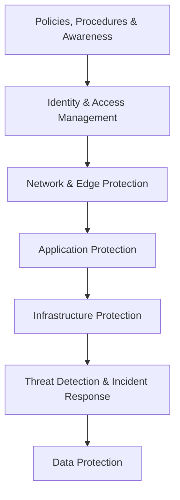
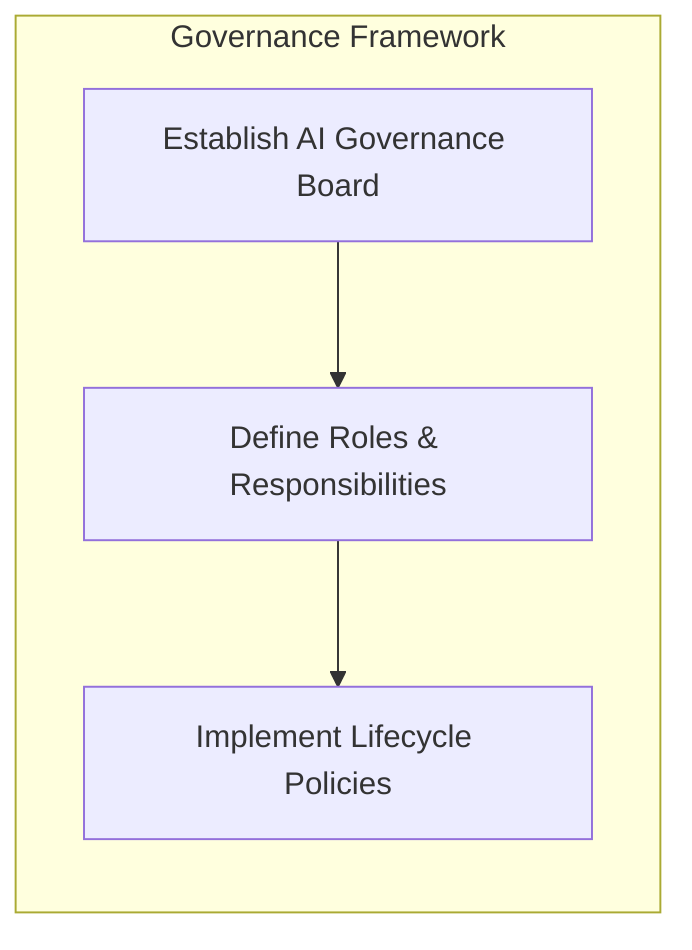
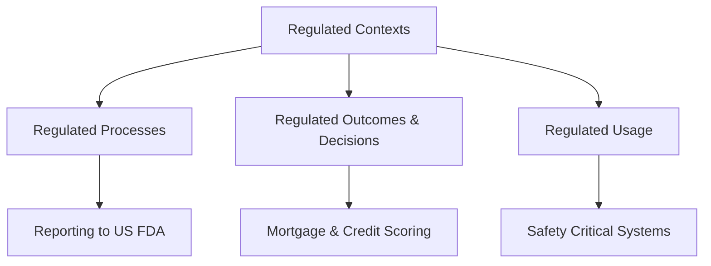
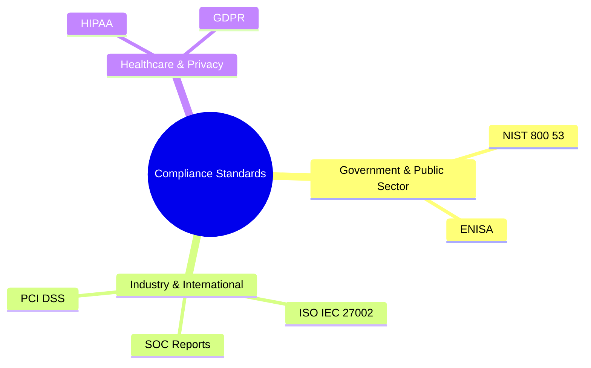
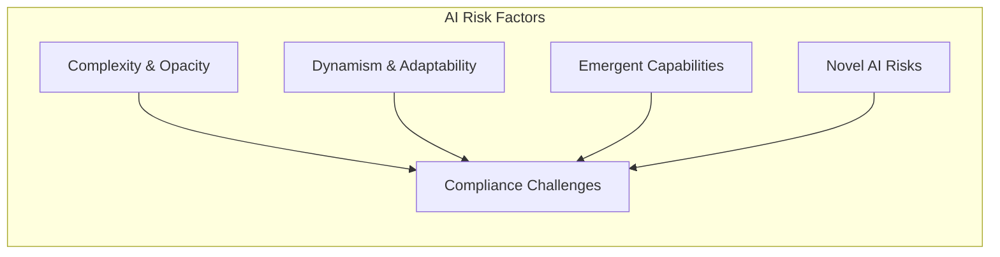
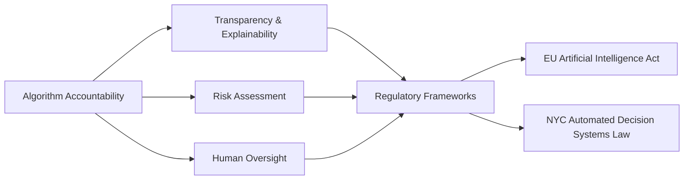
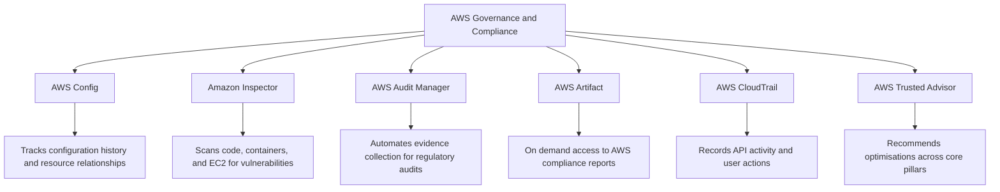
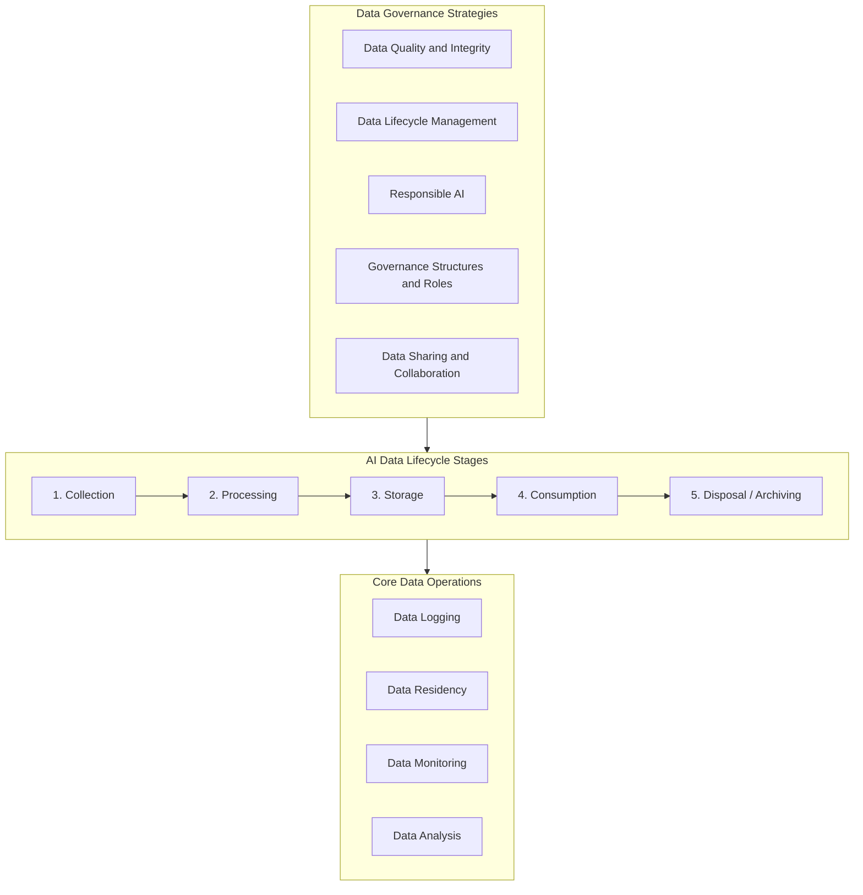
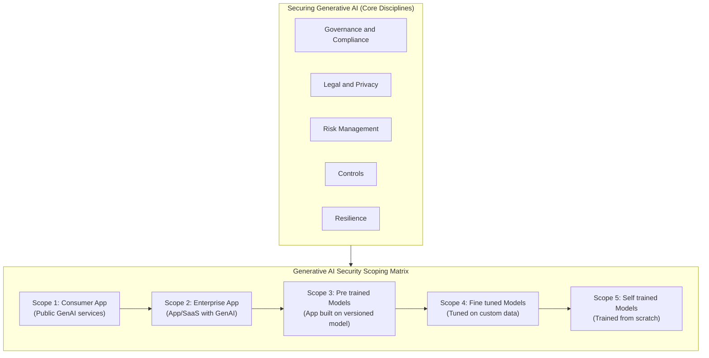
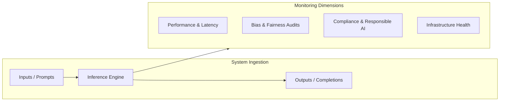

# AWS Security, Governance, and Compliance Architecture

## Core Definitions

|**Pillar**|**Primary Objective**|**Key Focus**|
|---|---|---|
|**Security**|Maintain confidentiality, integrity, and availability for assets and infrastructure.|Cyber security and information protection.|
|**Governance**|Enable the organisation to add value and manage operational risk.|Policy setting, oversight, and operational guardrails.|
|**Compliance**|Ensure normative adherence to internal and external requirements.|Regulatory, legal, and standard compliance frameworks.|

## Defense in Depth for Workloads and Generative AI

Defense in depth applies layered security controls so that the failure of any single mechanism does not compromise the entire environment.

### Security Layers and AWS Services

- **Policies, Procedures, and Awareness**
    
      
    - Use AWS IAM Access Analyzer to inspect accounts, roles, and resources for overly permissive access.
        
          
        
    - Enforce least privilege by issuing short term credentials.
        
          
        
- **Identity and Access Management (IAM)**
    
      
    - Ensure only authorised users, applications, or services access resources.
        
          
        
    - Core service: AWS Identity and Access Management (IAM).
        
          
        
- **Network and Edge Protection**
    
      
    - Safeguard boundaries to prevent unauthorised ingress and network level attacks.
        
          
        
    - Core services: Amazon Virtual Private Cloud (Amazon VPC), AWS WAF.
        
          
        
- **Application Protection**
    
      
    - Protect applications against denial of service (DoS) attacks, unauthorised access, and code level vulnerabilities.
        
          
        
    - Core services: AWS Shield, Amazon Cognito.
        
          
        
- **Infrastructure Protection**
    
      
    - Defend against data breaches, system failures, and physical or environmental disruption.
        
          
        
    - Features: AWS IAM user groups, Network Access Control Lists (Network ACLs).
        
          
        
- **Threat Detection and Incident Response**
    
      
    - Rapidly detect anomalies and automate containment workflows.
        
          
        
    - Threat detection: Amazon GuardDuty, AWS Security Hub.
        
          
        
    - Incident response: AWS Lambda, Amazon EventBridge.
        
          
        
- **Data Protection**
    
      
    - **Data at Rest:** Encrypt data and model artefacts using AWS Key Management Service (AWS KMS) or customer managed keys. Implement versioning and backups with Amazon S3 versioning.
        
          
        
    - **Data in Transit:** Enforce cryptographic protocols via AWS Certificate Manager (ACM) and AWS Private Certificate Authority (AWS Private CA). Keep traffic internal to VPC architectures with AWS PrivateLink.
        
          
        

## Strategy for AI Governance and Compliance

- **Establish an AI Governance Board:** Create a cross functional committee comprising legal, compliance, data privacy, and AI technical subject matter experts.
    
      
    
- **Define Roles and Responsibilities:** Set clear mandates for oversight, policy creation, risk evaluation, and decision making authority.
    
      
    
- **Implement Policies and Procedures:** Build standard operating procedures covering data ingestion, training pipelines, model deployment, and continuous monitoring.
    
      
    

## Related Questions and Short Answers

- **How does AWS IAM Access Analyser verify external or unused access?**
    
      
    - It uses automated reasoning to evaluate resource based policies and CloudTrail activity, alerting you to public access or unused permissions across accounts.
        
          
        
- **Why pair Amazon EventBridge with AWS Lambda in incident response?**
    
      
    - EventBridge routes security findings (from GuardDuty or Security Hub) directly to Lambda functions to trigger remediation actions, such as isolating an EC2 instance or revoking temporary credentials.
        
          
        
- **What is the difference between AWS WAF and AWS Shield?**
    
      
    - AWS WAF inspects and filters Application Layer (Layer 7) HTTP/HTTPS traffic, whereas AWS Shield protects against Infrastructure and Transport Layer (Layers 3 and 4) DDoS attacks.

# AWS Governance, Compliance, and Regulated Workloads

## Regulated Contexts

A workload operates in a regulated context when it must satisfy external regulatory mandates or high industrial operating demands.

### Regulated Workload Types

|**Classification**|**Definition**|**Example Scenario**|
|---|---|---|
|**Regulated Processes**|Operations tied to formal government or agency reporting rules.|Submitting trial data to the US FDA.|
|**Regulated Outcomes**|Automated decisions with direct legal or financial impact on people.|Assessing mortgage and credit applications.|
|**Regulated Usage**|High integrity systems where operational failure causes severe harm.|Running safety critical equipment.|

### High Demand Sectors and Workload Categories

- **Primary Industries:** Financial services, Healthcare, Aerospace.
    
      
    
- **Workload Categories:** HR workloads, Safety workloads, Inspection and compliance monitoring workloads.
    
      
    

## Security and Compliance Standards for Cloud and AI

AWS maintains controls across 143 security standards and compliance certifications.

|**Standard**|**Scope**|**Key Focus**|
|---|---|---|
|**NIST 800 53**|US Federal information systems.|Mandatory security controls to protect system confidentiality, integrity, and availability.|
|**ENISA**|European Union cyber policy.|Cybersecurity certification schemes for digital products, services, and processes.|
|**ISO / IEC 27002**|International security code of practice.|Recommended security management practices and controls.|
|**AWS SOC Reports**|Independent third party audit reports.|Validation of AWS operational controls and compliance objectives.|
|**HIPAA**|US healthcare regulation.|Processing, maintaining, and storing Protected Health Information (PHI).|
|**GDPR**|European Union data privacy law.|Unifies privacy rights and personal data protection for EU citizens.|
|**PCI DSS**|Private payment card council standard.|Safeguards cardholder data during processing, storage, and transmission.|

## AI Specific Compliance Challenges

AI and Large Language Models introduce operational behaviours that differ from traditional software architectures.

### Core Differences

- **Complexity and Opacity:** Deep neural networks and Large Language Models make auditable decision paths difficult to trace.
    
      
    
- **Dynamism and Adaptability:** Post deployment updates and continuous learning undermine static policy controls.
    
      
    
- **Emergent Capabilities:** Systems develop untracked abilities through unexpected internal interactions rather than explicit code paths.
    
      
    
- **Unique Risks and Algorithmic Bias:**
    
      
    - _Biased training data:_ Flawed or unrepresentative datasets cause models to reproduce historical prejudices.
        
          
        
    - _Human bias:_ Developer preconceptions carry over directly into model weights and evaluation rules.
        
          
        

## Algorithm Accountability

Algorithm accountability mandates that AI systems remain transparent, explainable, and subject to human oversight.

- **Purpose:** Prevents automated systems from violating human rights, perpetuating bias, or taking unchecked actions.
    
      
    
- **Key Regulations:**
    
      
    - **EU Artificial Intelligence Act:** Imposes transparency, risk classification, and oversight requirements on AI models.
        
          
        
    - **NYC Automated Decision Systems Law:** Regulates automated employment and scoring mechanisms within municipal scope.
        
          
        

## Questions You Might Have Missed

- **What questions determine if a workload needs regulatory controls?**
    
      
    - Does the workload process personal, financial, or healthcare data? Does failure create legal liability or safety hazards? Are outputs used in legal, medical, or financial judgements?
        
          
        
- **How does AWS help customers prove compliance for regulated workloads?**
    
      
    - AWS Artifact gives on demand access to AWS SOC reports, ISO certifications, and PCI DSS assessment documents.
        
          
        
- **What is the difference between legal compliance frameworks and industry standards?**
    
      
    - Legal frameworks (GDPR, HIPAA) carry statutory penalties for non compliance, whereas industry standards (PCI DSS, ISO) represent technical baselines required by industry groups or commercial contracts.

# AWS Services for Governance and Compliance

Governance and compliance in AWS ensure that cloud infrastructure adheres to regulatory frameworks, security standards, and organizational policies, particularly within machine learning and generative computing pipelines.

## Core Service Breakdown

### AWS Config

AWS Config tracks, evaluates, and documents the configuration history of your AWS resources over time.

  

- **Resource Administration**: Oversees resource states and detects misconfigurations against desired baselines.
    
      
    
- **Auditing and Compliance**: Stores historical configuration data to prove compliance during regulatory reviews.
    
      
    
- **Change Management**: Maps resource relationships so you can evaluate the blast radius before modifying infrastructure.
    
      
    

### Amazon Inspector

Amazon Inspector is an automated vulnerability management service that scans workloads for security flaws and unintended network paths.

  

- **Scan Coverage**: Evaluates Amazon EC2 instances, container images in Amazon ECR, and AWS Lambda functions.
    
      
    
- **Vulnerability Types**:
    
      
    - _Package Vulnerabilities_: Software libraries with known Common Vulnerabilities and Exposures (CVEs).
        
          
        
    - _Code Vulnerabilities_: Flaws in application code, such as unencrypted data or weak cryptographic algorithms.
        
          
        
    - _Network Reachability_: Open access routes that expose compute resources to external traffic.
        
          
        
- **Risk Scoring**: Produces contextual risk scores based on National Vulnerability Database metrics adjusted for your specific environment.
    
      
    

### AWS Audit Manager

AWS Audit Manager continually audits your cloud environments to assess control effectiveness and simplify risk management.

  

- **Evidence Collection**: Automatically gathers evidence from services such as AWS CloudTrail, AWS Config, and AWS Security Hub.
    
      
    
- **Multicloud Support**: Allows manual and automated evidence ingestion across hybrid and multicloud setups.
    
      
    
- **Integrity Control**: Verifies that collected audit evidence remains unaltered and tamper evident.
    
      
    

### AWS Artifact

AWS Artifact is a self service portal providing direct downloads of AWS compliance and security documentation.

  

- **Compliance Reports**: Download SOC, PCI DSS, and ISO certifications covering AWS infrastructure.
    
      
    
- **Agreements**: Review, accept, and manage agreements with AWS (such as the Business Associate Addendum for HIPAA compliance).
    
      
    

### AWS CloudTrail

AWS CloudTrail records account activity by logging API calls made via the Management Console, AWS CLI, SDKs, and internal service actions.

  

- **Audit Trail**: Answers who requested which action, on what resource, and at what timestamp.
    
      
    
- **Operational Analysis**: Enables tracking of unauthorized access attempts and operational troubleshooting across all regions.
    
      
    

### AWS Trusted Advisor

AWS Trusted Advisor scans your AWS environment against established architecture guidance to improve efficiency and security.

  

- **Core Evaluation Pillars**: Evaluates cost optimisation, performance, security, resilience, operational excellence, and service quotas.
    
      
    
- **Remediation**: Delivers clear recommendations to resolve configuration deviations from recommended practices.
    
      
    

## Service Comparison

|**Service**|**Primary Purpose**|**Key Output**|**Target Scope**|
|---|---|---|---|
|**AWS Config**|Resource configuration tracking and drift detection|Configuration timelines and compliance state|AWS Resource configurations|
|**Amazon Inspector**|Vulnerability scanning and network exposure analysis|Severity findings and contextual risk scores|EC2, Lambda, ECR containers|
|**AWS Audit Manager**|Continuous evidence collection for regulatory audits|Audit assessment reports|Internal controls and compliance frameworks|
|**AWS Artifact**|Portal for official AWS compliance documents|AWS SOC, ISO, and PCI reports|AWS global infrastructure|
|**AWS CloudTrail**|API and user activity logging|Event history and JSON log files|AWS API requests and account actions|
|**AWS Trusted Advisor**|Guidance on architectural efficiency|Actionable recommendations and status alerts|Overall AWS environment posture|

## Questions You Might Have Missed

### What is the distinction between AWS CloudTrail and AWS Config?

CloudTrail tracks **actions** (who made an API call, when, and from where), whereas Config tracks **state** (what the resource looked like before and after that call).

  

### How does AWS Artifact differ from AWS Audit Manager in terms of audit evidence?

AWS Artifact supplies evidence that AWS itself is compliant (audits of AWS data centres and systems), whilst AWS Audit Manager collects evidence showing that your workloads and configurations are compliant.

  

### Can AWS Config automatically remediate non compliant resources?

Yes. AWS Config can trigger automated remediation actions through AWS Systems Manager Automation documents when a resource fails an evaluation rule.

# AI Data Governance Strategies and Management

## Key Governance Strategies

|**Strategy**|**Core Focus**|**Implementation Actions**|
|---|---|---|
|**Data Quality and Integrity**|Accuracy and trust in model inputs|Establish quality standards for completeness and consistencyApply validation and cleansing to remove anomaliesMaintain data lineage and provenance tracking|
|**Data Lifecycle Management**|Asset tracking from creation to deletion|Classify and catalogue assets by sensitivity and valueEnforce retention and disposition rulesBuild backup and disaster recovery plans|
|**Responsible AI**|Ethical and unbiased outcomes|Set guidelines for bias, fairness, transparency, and accountabilityAudit models regularly for unintended consequencesDeliver team training on ethical AI standards|
|**Governance Structures**|Accountability and leadership|Form a central data governance councilAssign data stewards, data owners, and data custodiansTrain technical teams on compliance requirements|
|**Data Sharing and Collaboration**|Controlled access across domains|Draft data sharing agreements and security protocolsUse data virtualisation or federation to query distributed sourcesEncourage collaborative data usage across teams|

## AI Data Management Concepts

### Data Lifecycles

The data lifecycle covers five sequential phases critical to artificial intelligence and machine learning pipelines:

  

1. **Collection**: Gathering raw data from source systems.
    
      
    
2. **Processing**: Cleaning, transforming, and preparing data for training or inference.
    
      
    
3. **Storage**: Securing data in appropriate repositories (e.g. object stores, data lakes, or databases).
    
      
    
4. **Consumption**: Feeding processed data into models for training, validation, or inference.
    
      
    
5. **Disposal or Archiving**: Retaining historical records or purging data in accordance with regulatory requirements.
    
      
    

### Core Operational Principles

- **Data Logging**: Systematic recording of system telemetry, including model inputs, inference outputs, performance metrics, and system events. Essential for troubleshooting and auditing.
    
      
    
- **Data Residency**: The geographic and physical location of data storage and processing. Influenced by sovereignty legislation, compliance mandates, and network proximity to compute clusters.
    
      
    
- **Data Monitoring**: Continuous assessment of production data streams:
    
      
    - _Quality Assessment_: Verifying ongoing schema and value integrity.
        
          
        
    - _Anomaly Detection_: Identifying isolated data points that deviate from expected ranges.
        
          
        
    - _Drift Tracking_: Spotting shifts in input distributions over time that degrade model performance.
        
          
        
- **Data Analysis**: Techniques applied to understand underlying patterns:
    
      
    - _Statistical Analysis_: Calculating distributions, variance, and summary statistics.
        
          
        
    - _Data Visualisation_: Plotting features to identify correlations.
        
          
        
    - _Exploratory Data Analysis (EDA)_: Systematic discovery of trends, assumption validation, and outlier identification.

# Generative AI Security, Governance, and Scoping Matrix

## Security Disciplines

### Governance and Compliance

- Deals with policies, procedures, and reporting required to empower business operations whilst minimising operational risk.
    
      
    
- **Examples**:
    
      
    - Establishing a formal governance framework for developing and deploying AI services.
        
          
        
    - Setting up compliance monitoring and reporting processes.
        
          
        

### Legal and Privacy

- Addresses specific regulatory, legal, and privacy constraints when building or consuming solutions.
    
      
    
- **Key Considerations**:
    
      
    - Assessing whether organizational data is shared with external third parties.
        
          
        
    - Verifying the origin and licensing of the training datasets utilised by the base model.
        
          
        

### Risk Management

- Identifies potential threats unique to generative workloads and enforces practical mitigations.
    
      
    
- **Key Risk Vectors**:
    
      
    - Insecure output handling (unvalidated model output passed to downstream components).
        
          
        
    - Sensitive information disclosure (unintentional data leaks in prompts or completions).
        
          
        

### Controls

- Implementation of technical and administrative guardrails designed to mitigate operational risks.
    
      
    
- **Examples**:
    
      
    - Restricting model access via identity policies to authorise only specific foundation models.
        
          
        
    - Implementing identity and network controls across inference endpoints.
        
          
        

### Resilience

- Architectural strategies ensuring generative AI solutions maintain high availability and satisfy Service Level Agreements (SLAs).
    
      
    
- **Example**:
    
      
    - Deploying infrastructure across multiple Availability Zones or Regions to guarantee AWS service availability.
        
          
        

## Generative AI Security Scoping Matrix

|**Scope**|**Description**|**Implementation Details**|**Common Examples**|
|---|---|---|---|
|**Scope 1: Consumer App**|Public generative AI services|Third party tools consumed directly without enterprise data tenancy agreements.|PartyRock, ChatGPT, Midjourney|
|**Scope 2: Enterprise App**|Enterprise SaaS with GenAI features|Commercial enterprise applications with embedded generative functionality.|Salesforce Einstein GPT, Amazon CodeWhisperer|
|**Scope 3: Pre trained Models**|Custom application on a versioned model|Base foundation models consumed via standard API calls without weight modifications.|Amazon Bedrock base models|
|**Scope 4: Fine tuned Models**|Adapting existing models with custom data|Taking an existing foundation model and adjusting parameters using internal datasets.|Amazon Bedrock customised models, Amazon SageMaker JumpStart|
|**Scope 5: Self trained Models**|Training from scratch on proprietary data|Complete model architecture creation and pre training using custom compute clusters.|Amazon SageMaker|

## Governance Strategies and Lifecycle Monitoring

### Implementation Pillars

- **Policies and Cadence**: Define concrete operational guardrails and enforce a recurring review cadence.
    
      
    
- **Transparency Standards**: Ensure clear traceability for model inputs, algorithmic logic, and source data provenance.
    
      
    
- **Team Training Requirements**:
    
      
    - Deliver role specific training on bias mitigation and responsible development practices.
        
          
        
    - Foster cross functional collaboration to maintain shared compliance awareness.
        
          
        
    - Mandate continual training and certification programmes to stay aligned with evolving regulatory updates.
        
          
        

### AI Monitoring Architecture

- **Performance Metrics**:
    
      
    - **Model Accuracy**: Ratio of total correct predictions relative to all predictions.
        
          
        
    - **Precision**: True positive predictions relative to total positive predictions ($Precision = \frac{TP}{TP + FP}$).
        
          
        
    - **Recall**: True positive predictions relative to total actual positive instances ($Recall = \frac{TP}{TP + FN}$).
        
          
        
    - **F1 Score**: Harmonic mean balancing precision and recall ($F1 = 2 \cdot \frac{Precision \cdot Recall}{Precision + Recall}$).
        
          
        
    - **Latency**: End to end response duration per inference call.
        
          
        
- **Infrastructure Monitoring**: Tracking compute utilisation, memory overhead, and network throughput of hosting endpoints.
    
      
    
- **Fairness and Compliance Tracking**: Continual auditing to identify algorithmic bias, data drift, and regulatory non compliance.
    
      
    

## Missed Questions

**What is the core difference between Scope 3 and Scope 4 in the AWS Scoping Matrix?**

  

Scope 3 uses pre trained base models as they are via API calls without altering weights, whereas Scope 4 updates model parameters by fine tuning on custom proprietary datasets.

  

**How does data responsibility change as an organisation shifts from Scope 1 to Scope 5?**

  

Responsibility shifts from a pure consumer model with zero data pipeline control (Scope 1) to full ownership of raw data collection, sanitisation, training infrastructure, and intellectual property protection (Scope 5).

  

**Why is latency evaluated alongside accuracy in production AI workloads?**

  

A highly accurate model is commercially impractical if its inference processing time breaches application SLAs or degrades user experience.

  

This [AWS Generative AI Security Scoping Matrix Guide](https://www.youtube.com/watch?v=Z3dnN4Uy5yM) breaks down each scope from consumer applications to custom-trained models for cloud certification preparation.