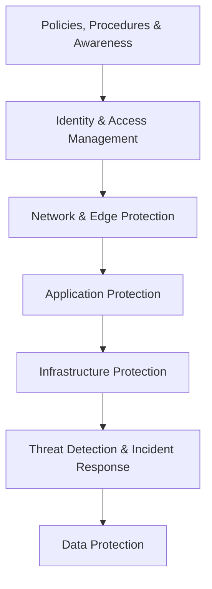
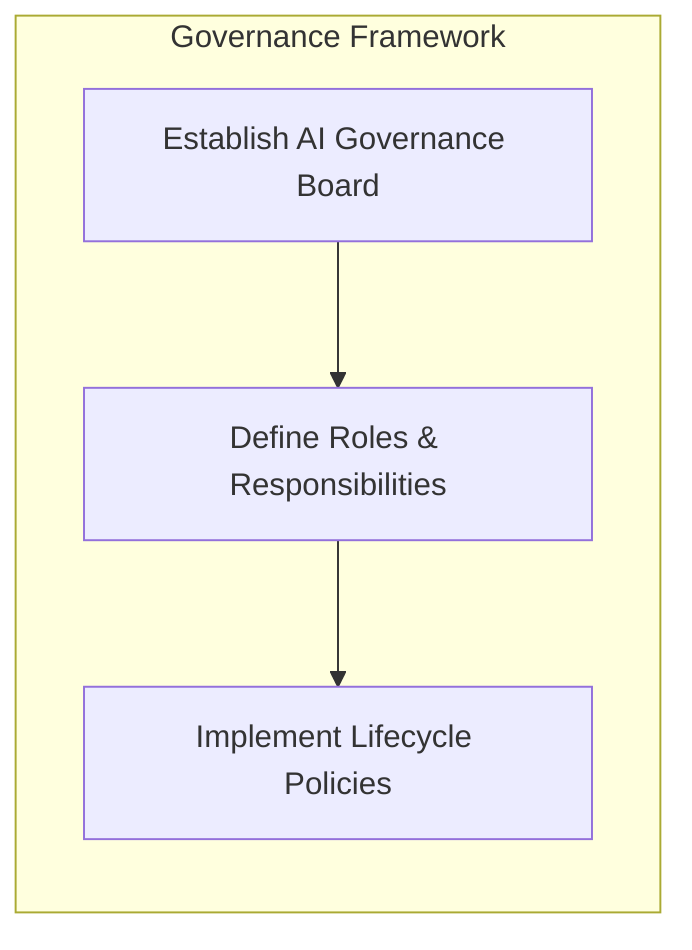
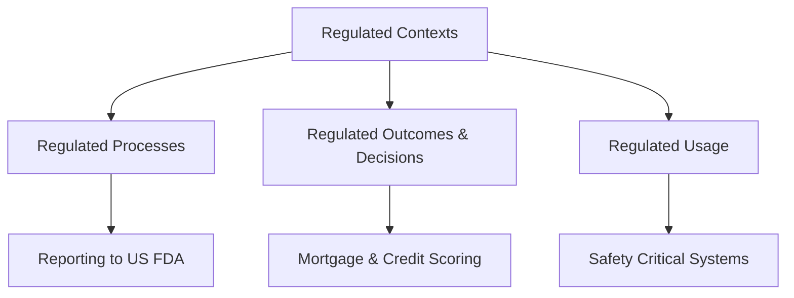
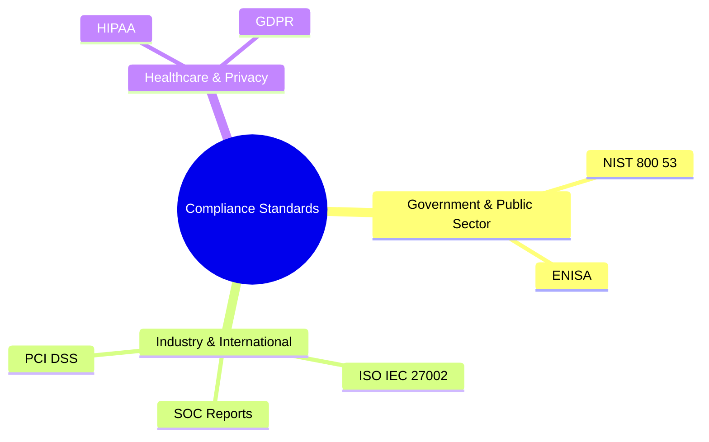
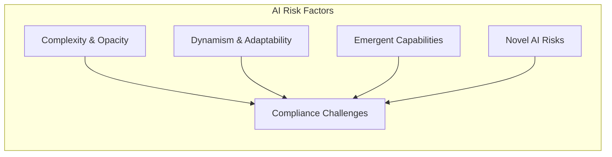
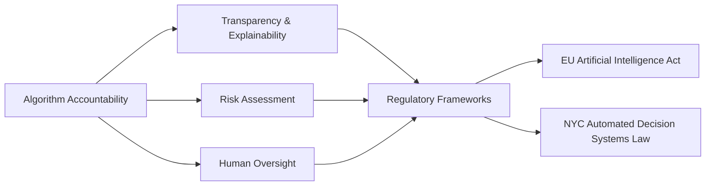

# AWS Security, Governance, and Compliance Architecture

## Core Definitions

|**Pillar**|**Primary Objective**|**Key Focus**|
|---|---|---|
|**Security**|Maintain confidentiality, integrity, and availability for assets and infrastructure.|Cyber security and information protection.|
|**Governance**|Enable the organisation to add value and manage operational risk.|Policy setting, oversight, and operational guardrails.|
|**Compliance**|Ensure normative adherence to internal and external requirements.|Regulatory, legal, and standard compliance frameworks.|

## Defense in Depth for Workloads and Generative AI

Defense in depth applies layered security controls so that the failure of any single mechanism does not compromise the entire environment.

### Security Layers and AWS Services

- **Policies, Procedures, and Awareness**
    
      
    - Use AWS IAM Access Analyzer to inspect accounts, roles, and resources for overly permissive access.
        
          
        
    - Enforce least privilege by issuing short term credentials.
        
          
        
- **Identity and Access Management (IAM)**
    
      
    - Ensure only authorised users, applications, or services access resources.
        
          
        
    - Core service: AWS Identity and Access Management (IAM).
        
          
        
- **Network and Edge Protection**
    
      
    - Safeguard boundaries to prevent unauthorised ingress and network level attacks.
        
          
        
    - Core services: Amazon Virtual Private Cloud (Amazon VPC), AWS WAF.
        
          
        
- **Application Protection**
    
      
    - Protect applications against denial of service (DoS) attacks, unauthorised access, and code level vulnerabilities.
        
          
        
    - Core services: AWS Shield, Amazon Cognito.
        
          
        
- **Infrastructure Protection**
    
      
    - Defend against data breaches, system failures, and physical or environmental disruption.
        
          
        
    - Features: AWS IAM user groups, Network Access Control Lists (Network ACLs).
        
          
        
- **Threat Detection and Incident Response**
    
      
    - Rapidly detect anomalies and automate containment workflows.
        
          
        
    - Threat detection: Amazon GuardDuty, AWS Security Hub.
        
          
        
    - Incident response: AWS Lambda, Amazon EventBridge.
        
          
        
- **Data Protection**
    
      
    - **Data at Rest:** Encrypt data and model artefacts using AWS Key Management Service (AWS KMS) or customer managed keys. Implement versioning and backups with Amazon S3 versioning.
        
          
        
    - **Data in Transit:** Enforce cryptographic protocols via AWS Certificate Manager (ACM) and AWS Private Certificate Authority (AWS Private CA). Keep traffic internal to VPC architectures with AWS PrivateLink.
        
          
        

## Strategy for AI Governance and Compliance

- **Establish an AI Governance Board:** Create a cross functional committee comprising legal, compliance, data privacy, and AI technical subject matter experts.
    
      
    
- **Define Roles and Responsibilities:** Set clear mandates for oversight, policy creation, risk evaluation, and decision making authority.
    
      
    
- **Implement Policies and Procedures:** Build standard operating procedures covering data ingestion, training pipelines, model deployment, and continuous monitoring.
    
      
    

## Related Questions and Short Answers

- **How does AWS IAM Access Analyser verify external or unused access?**
    
      
    - It uses automated reasoning to evaluate resource based policies and CloudTrail activity, alerting you to public access or unused permissions across accounts.
        
          
        
- **Why pair Amazon EventBridge with AWS Lambda in incident response?**
    
      
    - EventBridge routes security findings (from GuardDuty or Security Hub) directly to Lambda functions to trigger remediation actions, such as isolating an EC2 instance or revoking temporary credentials.
        
          
        
- **What is the difference between AWS WAF and AWS Shield?**
    
      
    - AWS WAF inspects and filters Application Layer (Layer 7) HTTP/HTTPS traffic, whereas AWS Shield protects against Infrastructure and Transport Layer (Layers 3 and 4) DDoS attacks.

# AWS Governance, Compliance, and Regulated Workloads

## Regulated Contexts

A workload operates in a regulated context when it must satisfy external regulatory mandates or high industrial operating demands.

### Regulated Workload Types

|**Classification**|**Definition**|**Example Scenario**|
|---|---|---|
|**Regulated Processes**|Operations tied to formal government or agency reporting rules.|Submitting trial data to the US FDA.|
|**Regulated Outcomes**|Automated decisions with direct legal or financial impact on people.|Assessing mortgage and credit applications.|
|**Regulated Usage**|High integrity systems where operational failure causes severe harm.|Running safety critical equipment.|

### High Demand Sectors and Workload Categories

- **Primary Industries:** Financial services, Healthcare, Aerospace.
    
      
    
- **Workload Categories:** HR workloads, Safety workloads, Inspection and compliance monitoring workloads.
    
      
    

## Security and Compliance Standards for Cloud and AI

AWS maintains controls across 143 security standards and compliance certifications.

|**Standard**|**Scope**|**Key Focus**|
|---|---|---|
|**NIST 800 53**|US Federal information systems.|Mandatory security controls to protect system confidentiality, integrity, and availability.|
|**ENISA**|European Union cyber policy.|Cybersecurity certification schemes for digital products, services, and processes.|
|**ISO / IEC 27002**|International security code of practice.|Recommended security management practices and controls.|
|**AWS SOC Reports**|Independent third party audit reports.|Validation of AWS operational controls and compliance objectives.|
|**HIPAA**|US healthcare regulation.|Processing, maintaining, and storing Protected Health Information (PHI).|
|**GDPR**|European Union data privacy law.|Unifies privacy rights and personal data protection for EU citizens.|
|**PCI DSS**|Private payment card council standard.|Safeguards cardholder data during processing, storage, and transmission.|

## AI Specific Compliance Challenges

AI and Large Language Models introduce operational behaviours that differ from traditional software architectures.

### Core Differences

- **Complexity and Opacity:** Deep neural networks and Large Language Models make auditable decision paths difficult to trace.
    
      
    
- **Dynamism and Adaptability:** Post deployment updates and continuous learning undermine static policy controls.
    
      
    
- **Emergent Capabilities:** Systems develop untracked abilities through unexpected internal interactions rather than explicit code paths.
    
      
    
- **Unique Risks and Algorithmic Bias:**
    
      
    - _Biased training data:_ Flawed or unrepresentative datasets cause models to reproduce historical prejudices.
        
          
        
    - _Human bias:_ Developer preconceptions carry over directly into model weights and evaluation rules.
        
          
        

## Algorithm Accountability

Algorithm accountability mandates that AI systems remain transparent, explainable, and subject to human oversight.

- **Purpose:** Prevents automated systems from violating human rights, perpetuating bias, or taking unchecked actions.
    
      
    
- **Key Regulations:**
    
      
    - **EU Artificial Intelligence Act:** Imposes transparency, risk classification, and oversight requirements on AI models.
        
          
        
    - **NYC Automated Decision Systems Law:** Regulates automated employment and scoring mechanisms within municipal scope.
        
          
        

## Questions You Might Have Missed

- **What questions determine if a workload needs regulatory controls?**
    
      
    - Does the workload process personal, financial, or healthcare data? Does failure create legal liability or safety hazards? Are outputs used in legal, medical, or financial judgements?
        
          
        
- **How does AWS help customers prove compliance for regulated workloads?**
    
      
    - AWS Artifact gives on demand access to AWS SOC reports, ISO certifications, and PCI DSS assessment documents.
        
          
        
- **What is the difference between legal compliance frameworks and industry standards?**
    
      
    - Legal frameworks (GDPR, HIPAA) carry statutory penalties for non compliance, whereas industry standards (PCI DSS, ISO) represent technical baselines required by industry groups or commercial contracts.