# AWS Security, Governance, and Compliance Architecture

## Core Definitions

|**Pillar**|**Primary Objective**|**Key Focus**|
|---|---|---|
|**Security**|Maintain confidentiality, integrity, and availability for assets and infrastructure.|Cyber security and information protection.|
|**Governance**|Enable the organisation to add value and manage operational risk.|Policy setting, oversight, and operational guardrails.|
|**Compliance**|Ensure normative adherence to internal and external requirements.|Regulatory, legal, and standard compliance frameworks.|

## Defense in Depth for Workloads and Generative AI

Defense in depth applies layered security controls so that the failure of any single mechanism does not compromise the entire environment.


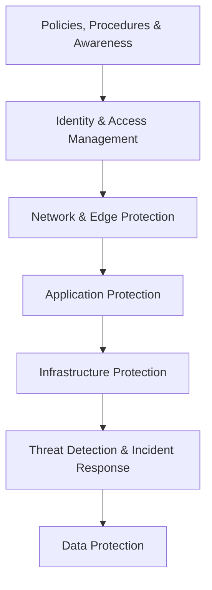
```mermaid
graph TD
    A[Policies, Procedures & Awareness] --> B[Identity & Access Management]
    B --> C[Network & Edge Protection]
    C --> D[Application Protection]
    D --> E[Infrastructure Protection]
    E --> F[Threat Detection & Incident Response]
    F --> G[Data Protection]
```

### Security Layers and AWS Services

- **Policies, Procedures, and Awareness**
    
      
    - Use AWS IAM Access Analyzer to inspect accounts, roles, and resources for overly permissive access.
        
          
        
    - Enforce least privilege by issuing short term credentials.
        
          
        
- **Identity and Access Management (IAM)**
    
      
    - Ensure only authorised users, applications, or services access resources.
        
          
        
    - Core service: AWS Identity and Access Management (IAM).
        
          
        
- **Network and Edge Protection**
    
      
    - Safeguard boundaries to prevent unauthorised ingress and network level attacks.
        
          
        
    - Core services: Amazon Virtual Private Cloud (Amazon VPC), AWS WAF.
        
          
        
- **Application Protection**
    
      
    - Protect applications against denial of service (DoS) attacks, unauthorised access, and code level vulnerabilities.
        
          
        
    - Core services: AWS Shield, Amazon Cognito.
        
          
        
- **Infrastructure Protection**
    
      
    - Defend against data breaches, system failures, and physical or environmental disruption.
        
          
        
    - Features: AWS IAM user groups, Network Access Control Lists (Network ACLs).
        
          
        
- **Threat Detection and Incident Response**
    
      
    - Rapidly detect anomalies and automate containment workflows.
        
          
        
    - Threat detection: Amazon GuardDuty, AWS Security Hub.
        
          
        
    - Incident response: AWS Lambda, Amazon EventBridge.
        
          
        
- **Data Protection**
    
      
    - **Data at Rest:** Encrypt data and model artefacts using AWS Key Management Service (AWS KMS) or customer managed keys. Implement versioning and backups with Amazon S3 versioning.
        
          
        
    - **Data in Transit:** Enforce cryptographic protocols via AWS Certificate Manager (ACM) and AWS Private Certificate Authority (AWS Private CA). Keep traffic internal to VPC architectures with AWS PrivateLink.
        
          
        

## Strategy for AI Governance and Compliance

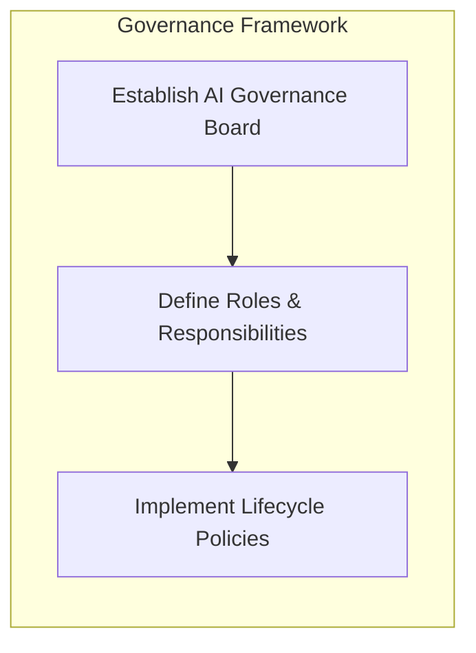
```mermaid
flowchart LR
    subgraph Governance Framework
        A1[Establish AI Governance Board] --> A2[Define Roles & Responsibilities]
        A2 --> A3[Implement Lifecycle Policies]
    end
```

- **Establish an AI Governance Board:** Create a cross functional committee comprising legal, compliance, data privacy, and AI technical subject matter experts.
    
      
    
- **Define Roles and Responsibilities:** Set clear mandates for oversight, policy creation, risk evaluation, and decision making authority.
    
      
    
- **Implement Policies and Procedures:** Build standard operating procedures covering data ingestion, training pipelines, model deployment, and continuous monitoring.
    
      
    

## Related Questions and Short Answers

- **How does AWS IAM Access Analyser verify external or unused access?**
    
      
    - It uses automated reasoning to evaluate resource based policies and CloudTrail activity, alerting you to public access or unused permissions across accounts.
        
          
        
- **Why pair Amazon EventBridge with AWS Lambda in incident response?**
    
      
    - EventBridge routes security findings (from GuardDuty or Security Hub) directly to Lambda functions to trigger remediation actions, such as isolating an EC2 instance or revoking temporary credentials.
        
          
        
- **What is the difference between AWS WAF and AWS Shield?**
    
      
    - AWS WAF inspects and filters Application Layer (Layer 7) HTTP/HTTPS traffic, whereas AWS Shield protects against Infrastructure and Transport Layer (Layers 3 and 4) DDoS attacks.

# AWS Governance, Compliance, and Regulated Workloads

## Regulated Contexts

A workload operates in a regulated context when it must satisfy external regulatory mandates or high industrial operating demands.


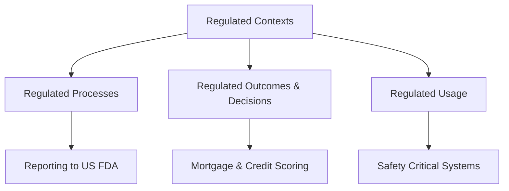
```mermaid
flowchart TD
    A[Regulated Contexts] --> B[Regulated Processes]
    A --> C[Regulated Outcomes & Decisions]
    A --> D[Regulated Usage]
    
    B --> B1[Reporting to US FDA]
    C --> C1[Mortgage & Credit Scoring]
    D --> D1[Safety Critical Systems]
```

### Regulated Workload Types

|**Classification**|**Definition**|**Example Scenario**|
|---|---|---|
|**Regulated Processes**|Operations tied to formal government or agency reporting rules.|Submitting trial data to the US FDA.|
|**Regulated Outcomes**|Automated decisions with direct legal or financial impact on people.|Assessing mortgage and credit applications.|
|**Regulated Usage**|High integrity systems where operational failure causes severe harm.|Running safety critical equipment.|

### High Demand Sectors and Workload Categories

- **Primary Industries:** Financial services, Healthcare, Aerospace.
    
      
    
- **Workload Categories:** HR workloads, Safety workloads, Inspection and compliance monitoring workloads.
    
      
    

## Security and Compliance Standards for Cloud and AI

AWS maintains controls across 143 security standards and compliance certifications.


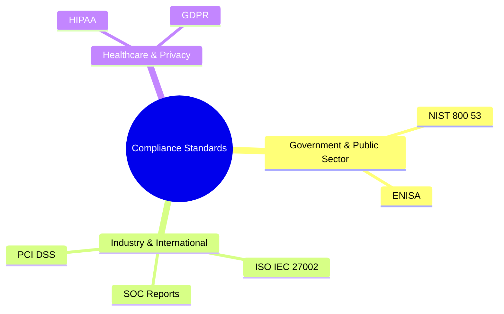
```mermaid
mindmap
  root((Compliance Standards))
    Government & Public Sector
      NIST 800 53
      ENISA
    Industry & International
      ISO IEC 27002
      SOC Reports
      PCI DSS
    Healthcare & Privacy
      HIPAA
      GDPR
```

|**Standard**|**Scope**|**Key Focus**|
|---|---|---|
|**NIST 800 53**|US Federal information systems.|Mandatory security controls to protect system confidentiality, integrity, and availability.|
|**ENISA**|European Union cyber policy.|Cybersecurity certification schemes for digital products, services, and processes.|
|**ISO / IEC 27002**|International security code of practice.|Recommended security management practices and controls.|
|**AWS SOC Reports**|Independent third party audit reports.|Validation of AWS operational controls and compliance objectives.|
|**HIPAA**|US healthcare regulation.|Processing, maintaining, and storing Protected Health Information (PHI).|
|**GDPR**|European Union data privacy law.|Unifies privacy rights and personal data protection for EU citizens.|
|**PCI DSS**|Private payment card council standard.|Safeguards cardholder data during processing, storage, and transmission.|

## AI Specific Compliance Challenges

AI and Large Language Models introduce operational behaviours that differ from traditional software architectures.

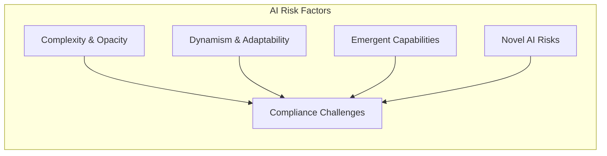
```mermaid
graph LR
    subgraph AI Risk Factors
        A[Complexity & Opacity] --> E[Compliance Challenges]
        B[Dynamism & Adaptability] --> E
        C[Emergent Capabilities] --> E
        D[Novel AI Risks] --> E
    end
```

### Core Differences

- **Complexity and Opacity:** Deep neural networks and Large Language Models make auditable decision paths difficult to trace.
    
      
    
- **Dynamism and Adaptability:** Post deployment updates and continuous learning undermine static policy controls.
    
      
    
- **Emergent Capabilities:** Systems develop untracked abilities through unexpected internal interactions rather than explicit code paths.
    
      
    
- **Unique Risks and Algorithmic Bias:**
    
      
    - _Biased training data:_ Flawed or unrepresentative datasets cause models to reproduce historical prejudices.
        
          
        
    - _Human bias:_ Developer preconceptions carry over directly into model weights and evaluation rules.
        
          
        

## Algorithm Accountability

Algorithm accountability mandates that AI systems remain transparent, explainable, and subject to human oversight.


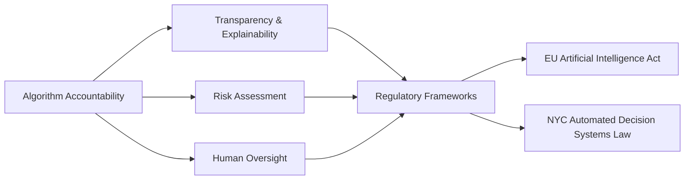
```mermaid
flowchart LR
    A[Algorithm Accountability] --> B[Transparency & Explainability]
    A --> C[Risk Assessment]
    A --> D[Human Oversight]
    
    B & C & D --> E[Regulatory Frameworks]
    E --> F[EU Artificial Intelligence Act]
    E --> G[NYC Automated Decision Systems Law]
```

- **Purpose:** Prevents automated systems from violating human rights, perpetuating bias, or taking unchecked actions.
    
      
    
- **Key Regulations:**
    
      
    - **EU Artificial Intelligence Act:** Imposes transparency, risk classification, and oversight requirements on AI models.
        
          
        
    - **NYC Automated Decision Systems Law:** Regulates automated employment and scoring mechanisms within municipal scope.
        
          
        

## Questions You Might Have Missed

- **What questions determine if a workload needs regulatory controls?**
    
      
    - Does the workload process personal, financial, or healthcare data? Does failure create legal liability or safety hazards? Are outputs used in legal, medical, or financial judgements?
        
          
        
- **How does AWS help customers prove compliance for regulated workloads?**
    
      
    - AWS Artifact gives on demand access to AWS SOC reports, ISO certifications, and PCI DSS assessment documents.
        
          
        
- **What is the difference between legal compliance frameworks and industry standards?**
    
      
    - Legal frameworks (GDPR, HIPAA) carry statutory penalties for non compliance, whereas industry standards (PCI DSS, ISO) represent technical baselines required by industry groups or commercial contracts.

# AWS Services for Governance and Compliance

Governance and compliance in AWS ensure that cloud infrastructure adheres to regulatory frameworks, security standards, and organizational policies, particularly within machine learning and generative computing pipelines.


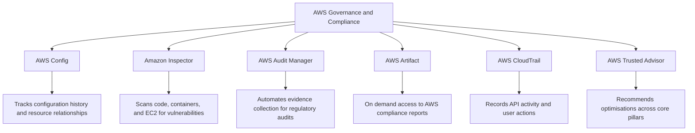
```mermaid
graph TD
    A[AWS Governance and Compliance] --> B[AWS Config]
    A --> C[Amazon Inspector]
    A --> D[AWS Audit Manager]
    A --> E[AWS Artifact]
    A --> F[AWS CloudTrail]
    A --> G[AWS Trusted Advisor]

    B --> B1[Tracks configuration history and resource relationships]
    C --> C1[Scans code, containers, and EC2 for vulnerabilities]
    D --> D1[Automates evidence collection for regulatory audits]
    E --> E1[On demand access to AWS compliance reports]
    F --> F1[Records API activity and user actions]
    G --> G1[Recommends optimisations across core pillars]
```

## Core Service Breakdown

### AWS Config

AWS Config tracks, evaluates, and documents the configuration history of your AWS resources over time.

  

- **Resource Administration**: Oversees resource states and detects misconfigurations against desired baselines.
    
      
    
- **Auditing and Compliance**: Stores historical configuration data to prove compliance during regulatory reviews.
    
      
    
- **Change Management**: Maps resource relationships so you can evaluate the blast radius before modifying infrastructure.
    
      
    

### Amazon Inspector

Amazon Inspector is an automated vulnerability management service that scans workloads for security flaws and unintended network paths.

  

- **Scan Coverage**: Evaluates Amazon EC2 instances, container images in Amazon ECR, and AWS Lambda functions.
    
      
    
- **Vulnerability Types**:
    
      
    - _Package Vulnerabilities_: Software libraries with known Common Vulnerabilities and Exposures (CVEs).
        
          
        
    - _Code Vulnerabilities_: Flaws in application code, such as unencrypted data or weak cryptographic algorithms.
        
          
        
    - _Network Reachability_: Open access routes that expose compute resources to external traffic.
        
          
        
- **Risk Scoring**: Produces contextual risk scores based on National Vulnerability Database metrics adjusted for your specific environment.
    
      
    

### AWS Audit Manager

AWS Audit Manager continually audits your cloud environments to assess control effectiveness and simplify risk management.

  

- **Evidence Collection**: Automatically gathers evidence from services such as AWS CloudTrail, AWS Config, and AWS Security Hub.
    
      
    
- **Multicloud Support**: Allows manual and automated evidence ingestion across hybrid and multicloud setups.
    
      
    
- **Integrity Control**: Verifies that collected audit evidence remains unaltered and tamper evident.
    
      
    

### AWS Artifact

AWS Artifact is a self service portal providing direct downloads of AWS compliance and security documentation.

  

- **Compliance Reports**: Download SOC, PCI DSS, and ISO certifications covering AWS infrastructure.
    
      
    
- **Agreements**: Review, accept, and manage agreements with AWS (such as the Business Associate Addendum for HIPAA compliance).
    
      
    

### AWS CloudTrail

AWS CloudTrail records account activity by logging API calls made via the Management Console, AWS CLI, SDKs, and internal service actions.

  

- **Audit Trail**: Answers who requested which action, on what resource, and at what timestamp.
    
      
    
- **Operational Analysis**: Enables tracking of unauthorized access attempts and operational troubleshooting across all regions.
    
      
    

### AWS Trusted Advisor

AWS Trusted Advisor scans your AWS environment against established architecture guidance to improve efficiency and security.

  

- **Core Evaluation Pillars**: Evaluates cost optimisation, performance, security, resilience, operational excellence, and service quotas.
    
      
    
- **Remediation**: Delivers clear recommendations to resolve configuration deviations from recommended practices.
    
      
    

## Service Comparison

|**Service**|**Primary Purpose**|**Key Output**|**Target Scope**|
|---|---|---|---|
|**AWS Config**|Resource configuration tracking and drift detection|Configuration timelines and compliance state|AWS Resource configurations|
|**Amazon Inspector**|Vulnerability scanning and network exposure analysis|Severity findings and contextual risk scores|EC2, Lambda, ECR containers|
|**AWS Audit Manager**|Continuous evidence collection for regulatory audits|Audit assessment reports|Internal controls and compliance frameworks|
|**AWS Artifact**|Portal for official AWS compliance documents|AWS SOC, ISO, and PCI reports|AWS global infrastructure|
|**AWS CloudTrail**|API and user activity logging|Event history and JSON log files|AWS API requests and account actions|
|**AWS Trusted Advisor**|Guidance on architectural efficiency|Actionable recommendations and status alerts|Overall AWS environment posture|

## Questions You Might Have Missed

### What is the distinction between AWS CloudTrail and AWS Config?

CloudTrail tracks **actions** (who made an API call, when, and from where), whereas Config tracks **state** (what the resource looked like before and after that call).

  

### How does AWS Artifact differ from AWS Audit Manager in terms of audit evidence?

AWS Artifact supplies evidence that AWS itself is compliant (audits of AWS data centres and systems), whilst AWS Audit Manager collects evidence showing that your workloads and configurations are compliant.

  

### Can AWS Config automatically remediate non compliant resources?

Yes. AWS Config can trigger automated remediation actions through AWS Systems Manager Automation documents when a resource fails an evaluation rule.

# AI Data Governance Strategies and Management


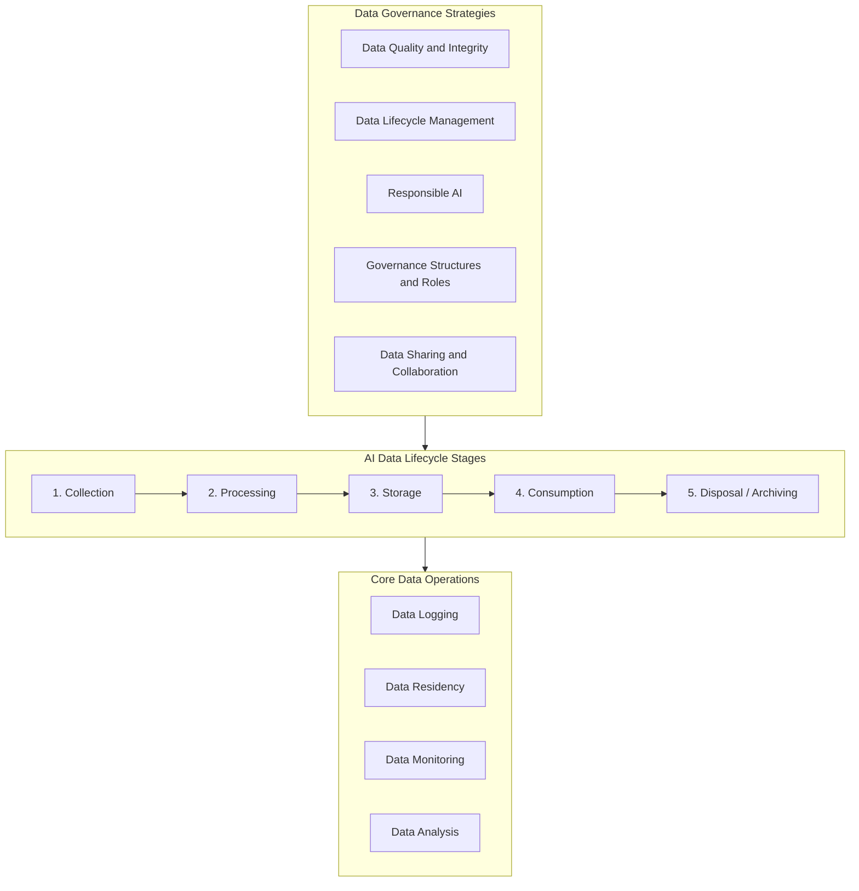
```mermaid
flowchart TD
    subgraph Governance["Data Governance Strategies"]
        DQI["Data Quality and Integrity"]
        DLM["Data Lifecycle Management"]
        RAI["Responsible AI"]
        GSR["Governance Structures and Roles"]
        DSC["Data Sharing and Collaboration"]
    end

    subgraph Lifecycle["AI Data Lifecycle Stages"]
        COL["1. Collection"] --> PRC["2. Processing"]
        PRC --> STO["3. Storage"]
        STO --> CON["4. Consumption"]
        CON --> DIS["5. Disposal / Archiving"]
    end

    subgraph Operations["Core Data Operations"]
        LOG["Data Logging"]
        RES["Data Residency"]
        MON["Data Monitoring"]
        ANA["Data Analysis"]
    end

    Governance --> Lifecycle
    Lifecycle --> Operations
```

## Key Governance Strategies

|**Strategy**|**Core Focus**|**Implementation Actions**|
|---|---|---|
|**Data Quality and Integrity**|Accuracy and trust in model inputs|Establish quality standards for completeness and consistencyApply validation and cleansing to remove anomaliesMaintain data lineage and provenance tracking|
|**Data Lifecycle Management**|Asset tracking from creation to deletion|Classify and catalogue assets by sensitivity and valueEnforce retention and disposition rulesBuild backup and disaster recovery plans|
|**Responsible AI**|Ethical and unbiased outcomes|Set guidelines for bias, fairness, transparency, and accountabilityAudit models regularly for unintended consequencesDeliver team training on ethical AI standards|
|**Governance Structures**|Accountability and leadership|Form a central data governance councilAssign data stewards, data owners, and data custodiansTrain technical teams on compliance requirements|
|**Data Sharing and Collaboration**|Controlled access across domains|Draft data sharing agreements and security protocolsUse data virtualisation or federation to query distributed sourcesEncourage collaborative data usage across teams|

## AI Data Management Concepts

### Data Lifecycles

The data lifecycle covers five sequential phases critical to artificial intelligence and machine learning pipelines:

  

1. **Collection**: Gathering raw data from source systems.
    
      
    
2. **Processing**: Cleaning, transforming, and preparing data for training or inference.
    
      
    
3. **Storage**: Securing data in appropriate repositories (e.g. object stores, data lakes, or databases).
    
      
    
4. **Consumption**: Feeding processed data into models for training, validation, or inference.
    
      
    
5. **Disposal or Archiving**: Retaining historical records or purging data in accordance with regulatory requirements.
    
      
    

### Core Operational Principles

- **Data Logging**: Systematic recording of system telemetry, including model inputs, inference outputs, performance metrics, and system events. Essential for troubleshooting and auditing.
    
      
    
- **Data Residency**: The geographic and physical location of data storage and processing. Influenced by sovereignty legislation, compliance mandates, and network proximity to compute clusters.
    
      
    
- **Data Monitoring**: Continuous assessment of production data streams:
    
      
    - _Quality Assessment_: Verifying ongoing schema and value integrity.
        
          
        
    - _Anomaly Detection_: Identifying isolated data points that deviate from expected ranges.
        
          
        
    - _Drift Tracking_: Spotting shifts in input distributions over time that degrade model performance.
        
          
        
- **Data Analysis**: Techniques applied to understand underlying patterns:
    
      
    - _Statistical Analysis_: Calculating distributions, variance, and summary statistics.
        
          
        
    - _Data Visualisation_: Plotting features to identify correlations.
        
          
        
    - _Exploratory Data Analysis (EDA)_: Systematic discovery of trends, assumption validation, and outlier identification.


# Generative AI Security, Governance, and Scoping Matrix

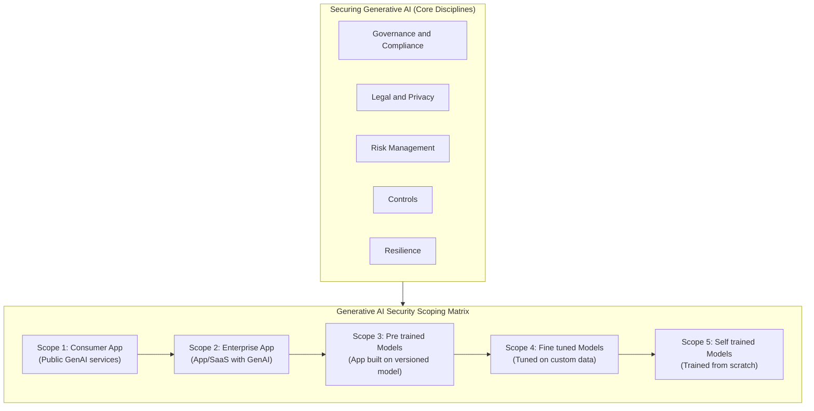
```mermaid
flowchart TD
    subgraph Disciplines["Securing Generative AI (Core Disciplines)"]
        GC["Governance and Compliance"]
        LP["Legal and Privacy"]
        RM["Risk Management"]
        CTL["Controls"]
        RES["Resilience"]
    end

    subgraph Matrix["Generative AI Security Scoping Matrix"]
        S1["Scope 1: Consumer App\n(Public GenAI services)"]
        S2["Scope 2: Enterprise App\n(App/SaaS with GenAI)"]
        S3["Scope 3: Pre trained Models\n(App built on versioned model)"]
        S4["Scope 4: Fine tuned Models\n(Tuned on custom data)"]
        S5["Scope 5: Self trained Models\n(Trained from scratch)"]
    end

    S1 --> S2 --> S3 --> S4 --> S5
    Disciplines --> Matrix
```

## Security Disciplines

### Governance and Compliance

- Deals with policies, procedures, and reporting required to empower business operations whilst minimising operational risk.
    
      
    
- **Examples**:
    
      
    - Establishing a formal governance framework for developing and deploying AI services.
        
          
        
    - Setting up compliance monitoring and reporting processes.
        
          
        

### Legal and Privacy

- Addresses specific regulatory, legal, and privacy constraints when building or consuming solutions.
    
      
    
- **Key Considerations**:
    
      
    - Assessing whether organizational data is shared with external third parties.
        
          
        
    - Verifying the origin and licensing of the training datasets utilised by the base model.
        
          
        

### Risk Management

- Identifies potential threats unique to generative workloads and enforces practical mitigations.
    
      
    
- **Key Risk Vectors**:
    
      
    - Insecure output handling (unvalidated model output passed to downstream components).
        
          
        
    - Sensitive information disclosure (unintentional data leaks in prompts or completions).
        
          
        

### Controls

- Implementation of technical and administrative guardrails designed to mitigate operational risks.
    
      
    
- **Examples**:
    
      
    - Restricting model access via identity policies to authorise only specific foundation models.
        
          
        
    - Implementing identity and network controls across inference endpoints.
        
          
        

### Resilience

- Architectural strategies ensuring generative AI solutions maintain high availability and satisfy Service Level Agreements (SLAs).
    
      
    
- **Example**:
    
      
    - Deploying infrastructure across multiple Availability Zones or Regions to guarantee AWS service availability.
        
          
        

## Generative AI Security Scoping Matrix

|**Scope**|**Description**|**Implementation Details**|**Common Examples**|
|---|---|---|---|
|**Scope 1: Consumer App**|Public generative AI services|Third party tools consumed directly without enterprise data tenancy agreements.|PartyRock, ChatGPT, Midjourney|
|**Scope 2: Enterprise App**|Enterprise SaaS with GenAI features|Commercial enterprise applications with embedded generative functionality.|Salesforce Einstein GPT, Amazon CodeWhisperer|
|**Scope 3: Pre trained Models**|Custom application on a versioned model|Base foundation models consumed via standard API calls without weight modifications.|Amazon Bedrock base models|
|**Scope 4: Fine tuned Models**|Adapting existing models with custom data|Taking an existing foundation model and adjusting parameters using internal datasets.|Amazon Bedrock customised models, Amazon SageMaker JumpStart|
|**Scope 5: Self trained Models**|Training from scratch on proprietary data|Complete model architecture creation and pre training using custom compute clusters.|Amazon SageMaker|

## Governance Strategies and Lifecycle Monitoring

### Implementation Pillars

- **Policies and Cadence**: Define concrete operational guardrails and enforce a recurring review cadence.
    
      
    
- **Transparency Standards**: Ensure clear traceability for model inputs, algorithmic logic, and source data provenance.
    
      
    
- **Team Training Requirements**:
    
      
    - Deliver role specific training on bias mitigation and responsible development practices.
        
          
        
    - Foster cross functional collaboration to maintain shared compliance awareness.
        
          
        
    - Mandate continual training and certification programmes to stay aligned with evolving regulatory updates.
        
          
        

### AI Monitoring Architecture

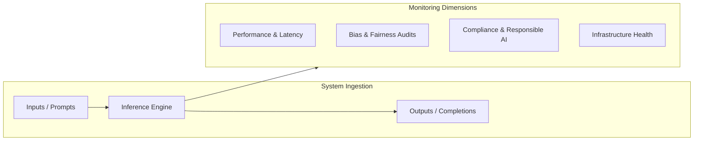
```mermaid
flowchart LR
    subgraph Ingestion["System Ingestion"]
        INP["Inputs / Prompts"]
        INF["Inference Engine"]
        OUT["Outputs / Completions"]
    end

    subgraph Tracking["Monitoring Dimensions"]
        PERF["Performance & Latency"]
        BIAS["Bias & Fairness Audits"]
        COMP["Compliance & Responsible AI"]
        INFRA["Infrastructure Health"]
    end

    INP --> INF --> OUT
    INF --> Tracking
```

- **Performance Metrics**:
    
      
    - **Model Accuracy**: Ratio of total correct predictions relative to all predictions.
        
          
        
    - **Precision**: True positive predictions relative to total positive predictions ($Precision = \frac{TP}{TP + FP}$).
        
          
        
    - **Recall**: True positive predictions relative to total actual positive instances ($Recall = \frac{TP}{TP + FN}$).
        
          
        
    - **F1 Score**: Harmonic mean balancing precision and recall ($F1 = 2 \cdot \frac{Precision \cdot Recall}{Precision + Recall}$).
        
          
        
    - **Latency**: End to end response duration per inference call.
        
          
        
- **Infrastructure Monitoring**: Tracking compute utilisation, memory overhead, and network throughput of hosting endpoints.
    
      
    
- **Fairness and Compliance Tracking**: Continual auditing to identify algorithmic bias, data drift, and regulatory non compliance.
    
      
    

## Missed Questions

**What is the core difference between Scope 3 and Scope 4 in the AWS Scoping Matrix?**

  

Scope 3 uses pre trained base models as they are via API calls without altering weights, whereas Scope 4 updates model parameters by fine tuning on custom proprietary datasets.

  

**How does data responsibility change as an organisation shifts from Scope 1 to Scope 5?**

  

Responsibility shifts from a pure consumer model with zero data pipeline control (Scope 1) to full ownership of raw data collection, sanitisation, training infrastructure, and intellectual property protection (Scope 5).

  

**Why is latency evaluated alongside accuracy in production AI workloads?**

  

A highly accurate model is commercially impractical if its inference processing time breaches application SLAs or degrades user experience.

  

This [AWS Generative AI Security Scoping Matrix Guide](https://www.youtube.com/watch?v=Z3dnN4Uy5yM) breaks down each scope from consumer applications to custom-trained models for cloud certification preparation.

# Security and Privacy Considerations for AI Systems

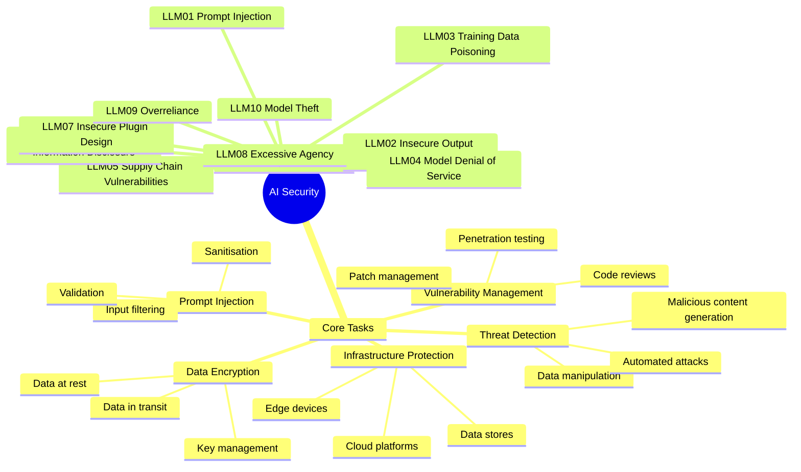
```mermaid
mindmap
  root((AI Security))
    Core Tasks
      Threat Detection
        Malicious content generation
        Data manipulation
        Automated attacks
      Vulnerability Management
        Penetration testing
        Patch management
        Code reviews
      Infrastructure Protection
        Cloud platforms
        Edge devices
        Data stores
      Prompt Injection
        Input filtering
        Sanitisation
        Validation
      Data Encryption
        Data at rest
        Data in transit
        Key management
    OWASP Top 10 for LLMs
      LLM01 Prompt Injection
      LLM02 Insecure Output Handling
      LLM03 Training Data Poisoning
      LLM04 Model Denial of Service
      LLM05 Supply Chain Vulnerabilities
      LLM06 Sensitive Information Disclosure
      LLM07 Insecure Plugin Design
      LLM08 Excessive Agency
      LLM09 Overreliance
      LLM10 Model Theft
```

## Core Security Tasks

### Threat Detection

- Identify and monitor potential security threats, such as malicious actors attempting to exploit weaknesses in AI systems or using generative AI for hostile purposes.
    
      
    
- Examples of malicious activity include generating fake content, manipulating data, and automating attacks.
    
      
    
- Build and deploy AI powered threat detection systems to analyse network traffic, user behaviour, and other telemetry sources to detect and respond to threats.
    
      
    

### Vulnerability Management

- Identify and remediate weaknesses in AI and generative AI systems, including software bugs, model vulnerabilities, and attack vectors such as malware, viruses, and malicious email attachments.
    
      
    
- Conduct regular security assessments, penetration testing, and code reviews.
    
      
    
- Establish patch management and update processes to ensure systems remain patched and current.
    
      
    

### Infrastructure Protection

- Secure the underlying environments supporting AI systems, including cloud computing platforms, edge devices, and data stores.
    
      
    
- Enforce access controls, network segmentation, encryption, and additional defensive layers against unauthorised access.
    
      
    
- Maintain infrastructure resilience to withstand operational failures, attacks, or disruptions.
    
      
    

### Prompt Injection

- Mitigate attempts by adversaries to manipulate input prompts sent to generative AI models to force undesirable or malicious execution.
    
      
    
- Apply defensive techniques including prompt filtering, sanitisation, and input validation to verify input safety.
    
      
    
- Train models and structure procedures to withstand adversarial prompt techniques.
    
      
    

### Data Encryption

- Maintain confidentiality and integrity for data utilised during training and deployment phases.
    
      
    
- **Data at rest**: Protect stored data on servers, databases, or local devices.
    
      
    
- **Data in transit**: Secure communication pathways between AI components.
    
      
    
- Implement robust cryptographic key management to prevent unauthorised access.
    

## OWASP Top 10 for LLMs

|**Rank**|**Vulnerability**|**Description**|
|---|---|---|
|LLM01|Prompt Injection|Manipulation of model behaviour via crafted, untrusted user inputs|
|LLM02|Insecure Output Handling|Missing validation or sanitisation of model outputs before consumption downstream|
|LLM03|Training Data Poisoning|Tampering with training data to introduce security flaws or backdoors|
|LLM04|Model Denial of Service|Resource heavy operations designed to degrade performance or take systems offline|
|LLM05|Supply Chain Vulnerabilities|Compromised third party datasets, pre trained models, or application dependencies|
|LLM06|Sensitive Information Disclosure|Unauthorised exposure of confidential data via model completions|
|LLM07|Insecure Plugin Design|Defective extensions or integrations that expose operational vulnerabilities|
|LLM08|Excessive Agency|Granting models disproportionate permissions or uncontrolled autonomous capabilities|
|LLM09|Overreliance|Unquestioned trust in model outputs without oversight or human verification|
|LLM10|Model Theft|Exfiltration, copying, or reverse engineering of proprietary model weights and architecture|
# Securing AI Systems on AWS

Security forms a fundamental component of all AWS workloads, including generative artificial intelligence. Securing AI systems ensures operational reliability, protects intellectual property, and preserves trust when models integrate into decision making processes.

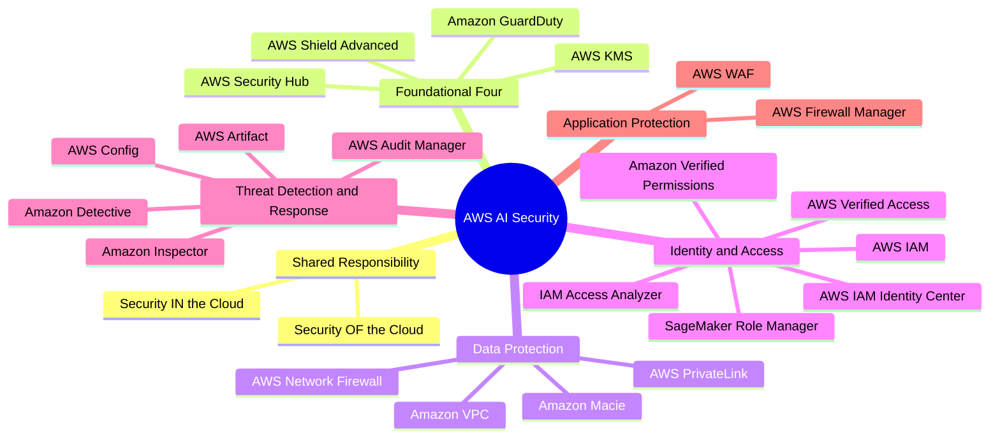
```mermaid
mindmap
  root((AWS AI Security))
    Shared Responsibility
      Security OF the Cloud
      Security IN the Cloud
    Foundational Four
      AWS KMS
      AWS Security Hub
      Amazon GuardDuty
      AWS Shield Advanced
    Data Protection
      Amazon Macie
      AWS Network Firewall
      Amazon VPC
      AWS PrivateLink
    Identity and Access
      AWS IAM
      AWS IAM Identity Center
      IAM Access Analyzer
      SageMaker Role Manager
      AWS Verified Access
      Amazon Verified Permissions
    Threat Detection and Response
      Amazon Inspector
      Amazon Detective
      AWS Config
      AWS Audit Manager
      AWS Artifact
    Application Protection
      AWS WAF
      AWS Firewall Manager
```

## Core Reasons to Secure AI Systems

- **Protection of Sensitive Data:** AI models frequently ingest and process personal information, financial records, and proprietary commercial data. Inadequate controls lead to regulatory violations, financial liabilities, and exposure of confidential assets.
    
      
    
- **Adversarial Attack Mitigation:** Hostile entities target machine learning infrastructure to execute model inversion, prompt manipulation, training data poisoning, or intellectual property theft. Robust perimeter controls, encryption, and continuous telemetry counteract these vectors.
    
      
    
- **Preserving Reliability in Critical Decision Paths:** Workloads integrated directly into operational decisions must resist external tampering to guarantee deterministic, uncompromised outputs.
    
      
    

## The AWS Shared Responsibility Model

Security and compliance operate as a shared framework between AWS and the customer, dividing operational duties into distinct architectural tiers.
  

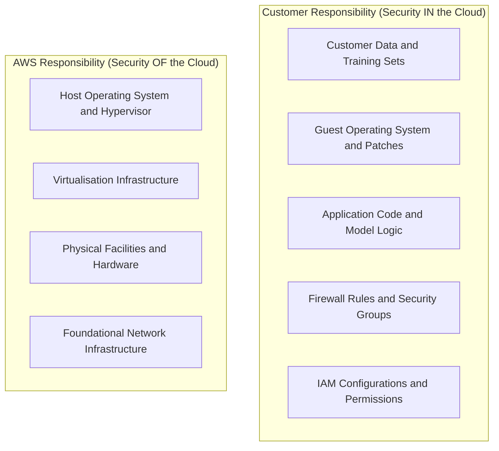
```mermaid
flowchart TD
    subgraph Customer["Customer Responsibility (Security IN the Cloud)"]
        A[Customer Data and Training Sets]
        B[Guest Operating System and Patches]
        C[Application Code and Model Logic]
        D[Firewall Rules and Security Groups]
        E[IAM Configurations and Permissions]
    end

    subgraph AWS["AWS Responsibility (Security OF the Cloud)"]
        F[Host Operating System and Hypervisor]
        G[Virtualisation Infrastructure]
        H[Physical Facilities and Hardware]
        I[Foundational Network Infrastructure]
    end
```

|**Security Domain**|**Responsible Party**|**Scope of Duties**|
|---|---|---|
|**Security of the Cloud**|AWS|Physical facility protection, data centre operations, server hardware, hypervisors, and core platform network controls.|
|**Security in the Cloud**|Customer|Guest operating system updates, firewall rules, identity permissions, training dataset security, application code, and model configuration.|

## Defence in Depth: Foundational Services

A layered security perimeter isolates, slows down, and halts threat actors, preventing lateral movement and privilege escalation across your infrastructure.

  

|**Service**|**Security Domain**|**Core Functionality**|
|---|---|---|
|**AWS KMS**|Data Protection|Encrypts stored assets using AWS managed keys or customer managed keys.|
|**AWS Security Hub**|Incident Response|Centralises security findings across accounts and triggers automated remediation playbooks.|
|**Amazon GuardDuty**|Threat Detection|Continuously monitors behavioural telemetry, API invocations, and account activities for indicators of compromise.|
|**AWS Shield Advanced**|Network Protection|Delivers managed DDoS protection for applications, defending availability and capacity.|

## AWS Services for Machine Learning and AI Security


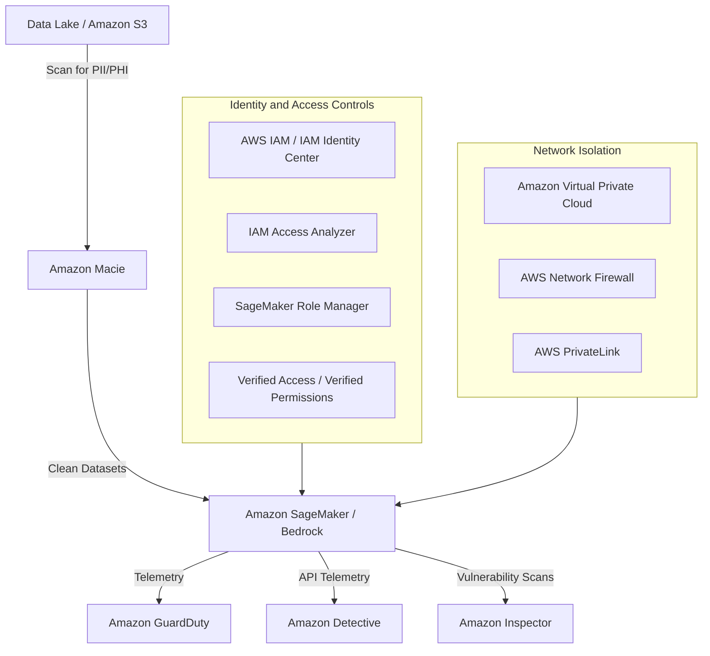
```mermaid
graph TD
    DataIngest[Data Lake / Amazon S3] -->|Scan for PII/PHI| Macie[Amazon Macie]
    Macie -->|Clean Datasets| Train[Amazon SageMaker / Bedrock]
    
    subgraph Identity["Identity and Access Controls"]
        IAM[AWS IAM / IAM Identity Center]
        Analyzer[IAM Access Analyzer]
        RoleMgr[SageMaker Role Manager]
        Verified[Verified Access / Verified Permissions]
    end

    subgraph Network["Network Isolation"]
        VPC[Amazon Virtual Private Cloud]
        NetFW[AWS Network Firewall]
        PLink[AWS PrivateLink]
    end

    Identity --> Train
    Network --> Train

    Train -->|Telemetry| GuardDuty[Amazon GuardDuty]
    Train -->|API Telemetry| Detective[Amazon Detective]
    Train -->|Vulnerability Scans| Inspector[Amazon Inspector]
```

### Sensitive Data Discovery

- **Amazon Macie:** Uses machine learning routines to automate discovery, classification, and reporting of sensitive items (personally identifiable information, personal health information, and financial data) within Amazon S3. Database assets can be extracted to Amazon S3 to enable complete Macie discovery runs before model training.
    
      
    

### Identity and Access Management

- **AWS Identity and Access Management (IAM):** Implements authentication and authorisation policies across resources using users, groups, and explicit roles.
    
      
    
- **Amazon SageMaker Role Manager:** Automates role creation for machine learning activities via three preconfigured personas:
    
      
    - _Data Scientist Persona_
        
          
        
    - _MLOps Persona_
        
          
        
    - _SageMaker AI Compute Persona_
        
          
        
- **Zero Trust Policy Enforcement:**
    
      
    - **AWS IAM Identity Center and IAM Access Analyzer:** Evaluates least privilege policies across AI accounts and environments.
        
          
        
    - **AWS Verified Access:** Validates application requests using corporate identity policies, eliminating standard VPN management overheads.
        
          
        
    - **Amazon Verified Permissions:** Provides fine grained authorisation and policy enforcement for custom application logic.
        
          
        

### Network Isolation and Data Protection

- **Amazon Virtual Private Cloud (Amazon VPC):** Isolates machine learning compute instances within customer configured virtual subnets.
    
      
    
- **AWS PrivateLink:** Connects internal VPC components directly to services like Amazon Bedrock over private network routes, preventing public internet routing.
    
      
    
- **AWS Network Firewall:** Inspects inbound and outbound TLS network traffic using deep packet inspection across internet gateways, cross VPC routes, and internal subnets.
    
      
    

### Threat Detection, Vulnerabilities, and Forensics

- **Amazon Inspector:** Scans operating environments and software dependencies automatically for unintended network exposures and package vulnerabilities.
    
      
    
- **Amazon Detective:** Aggregates telemetry from AWS CloudTrail, Amazon VPC Flow Logs, and Amazon GuardDuty to accelerate root cause investigations and forensic analysis.
    
      
    

### Compliance and Incident Response Automation

Automating operational tasks reduces manual human error, enforces continuous regulatory alignment, and integrates compliance testing directly into development lifecycles.

  

- **AWS Config:** Records configuration history and evaluates compliance rules across infrastructure automatically.
    
      
    
- **AWS Audit Manager:** Gathers evidence continuously to assess alignment with external compliance standards.
    
      
    
- **AWS Artifact:** Serves as a centralised catalogue to review and download AWS compliance reports and certifications.
    
      
    

### Web Application and Perimeter Defence

- **AWS WAF:** Filters incoming HTTP/HTTPS traffic to prevent injection vectors, cross site scripting, and account takeover attempts against generative AI endpoints.
    
      
    
- **AWS WAF Bot Control:** Mitigates automated crawlers, scrapers, and malicious scanning agents that drain compute capacity or distort analytics.
    
      
    
- **AWS Firewall Manager:** Centralises rule management across AWS WAF, AWS Shield Advanced, and AWS Network Firewall policies across multiple accounts.

# Data Lineage, Cataloguing, and Governance in Generative AI

Documenting data origins and tracking model lineage ensures transparency, traceability, and accountability across machine learning systems. Proper attribution supports security, helps identify biases early, and simplifies audit compliance.

  
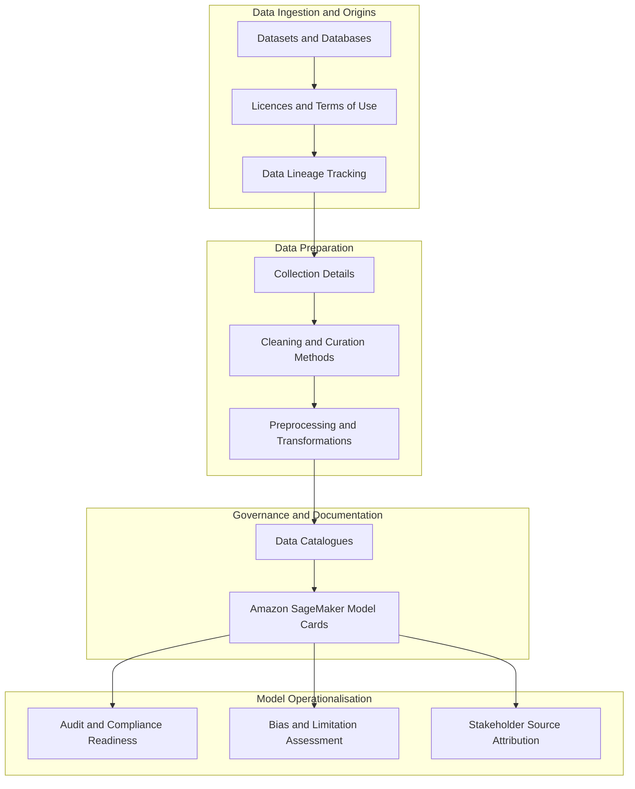
```mermaid
flowchart TD
    subgraph Sourcing[Data Ingestion and Origins]
        A[Datasets and Databases] --> B[Licences and Terms of Use]
        B --> C[Data Lineage Tracking]
    end

    subgraph Curation[Data Preparation]
        C --> D[Collection Details]
        D --> E[Cleaning and Curation Methods]
        E --> F[Preprocessing and Transformations]
    end

    subgraph Cataloguing[Governance and Documentation]
        F --> G[Data Catalogues]
        G --> H[Amazon SageMaker Model Cards]
    end

    subgraph Outcomes[Model Operationalisation]
        H --> I[Audit and Compliance Readiness]
        H --> J[Bias and Limitation Assessment]
        H --> K[Stakeholder Source Attribution]
    end
```

## Core Pillars of Governance

|**Pillar**|**Focus Area**|**Primary Purpose**|**Key Components**|
|---|---|---|---|
|**Data Lineage**|Data journey|Traces transformations from initial source to model deployment|Extraction history, processing stages, system transfers|
|**Cataloguing**|Resource registry|Systematically organises components, metadata, and licensing|Source lists, ownership records, terms of use|
|**Model Cards**|Model reporting|Standardises documentation for model capabilities, risks, and performance|Intended use, evaluation metrics, risk ratings, known biases|

## Understanding Data and Model Lineage

Data and model lineage provides a verifiable record detailing where data originated, how it changed, and how the final model evolved.


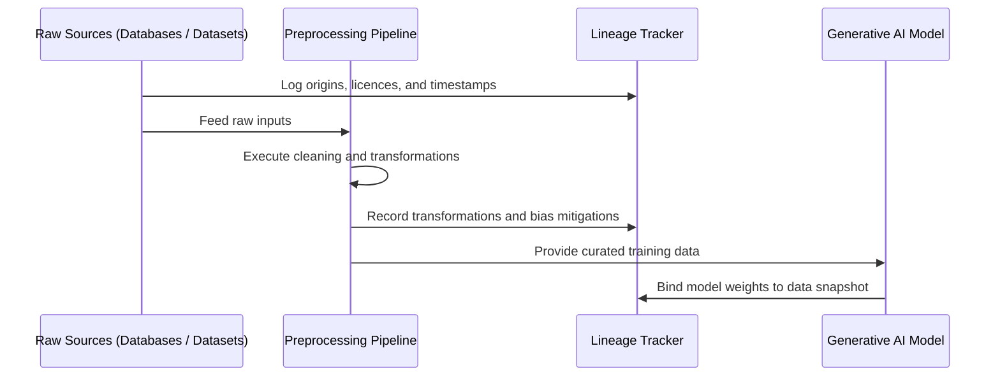
```mermaid
sequenceDiagram
    participant Raw as Raw Sources (Databases / Datasets)
    participant Pipe as Preprocessing Pipeline
    participant Lineage as Lineage Tracker
    participant Model as Generative AI Model

    Raw->>Lineage: Log origins, licences, and timestamps
    Raw->>Pipe: Feed raw inputs
    Pipe->>Pipe: Execute cleaning and transformations
    Pipe->>Lineage: Record transformations and bias mitigations
    Pipe->>Model: Provide curated training data
    Model->>Lineage: Bind model weights to data snapshot
```

Lineage records help teams evaluate:

  

- The reliability of external datasets.
    
      
    
- The evolution of data across each transformation stage.
    
      
    
- Potential vulnerabilities or biases introduced during data ingestion.
    
      
    

## Source Citation and Provenance Documentation

Documenting data provenance requires recording precise operational details about dataset construction.

  

```
+-----------------------------------------------------------------------+
|                       PROVENANCE CHECKLIST                            |
+-----------------------------------------------------------------------+
|  [ ] Data Collection Processes                                        |
|      Detailed log of gathering methods, timestamps, and owners.        |
|                                                                       |
|  [ ] Cleaning and Curation Techniques                                 |
|      Specific sanitisation routines, filtering, and validation steps. |
|                                                                       |
|  [ ] Preprocessing and Transformations                                |
|      Tokenisation, normalisation, and vector transformations.         |
|                                                                       |
|  [ ] Legal and Licensing Attribution                                  |
|      Explicit recording of licences, terms of use, and permissions.   |
+-----------------------------------------------------------------------+
```

Accurate source citations let stakeholders confirm whether outputs are based on verified, legally compliant materials.

  

## Amazon SageMaker Model Cards

Amazon SageMaker Model Cards provide a centralised mechanism to record model governance information for audits and business reporting.


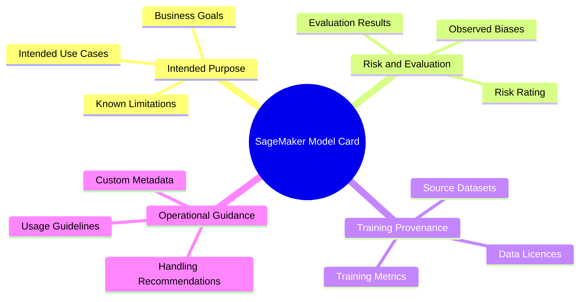
```mermaid
mindmap
  root((SageMaker Model Card))
    Intended Purpose
      Business Goals
      Intended Use Cases
      Known Limitations
    Risk and Evaluation
      Risk Rating
      Evaluation Results
      Observed Biases
    Training Provenance
      Source Datasets
      Data Licences
      Training Metrics
    Operational Guidance
      Usage Guidelines
      Handling Recommendations
      Custom Metadata
```

### Technical Benefits of Model Cards

- **Centralised Governance:** Documents model limitations, intended use cases, and risk ratings in one auditable format.
    
      
    
- **Streamlined Audits:** Provides verifiable evidence of model performance, metrics, and training data provenance to internal and external review teams.
    
      
    
- **Business Communication:** Connects model functionality with organisational objectives and provides deployment teams with explicit operational constraints.
    
      
    

## Questions You Might Have Missed

**How does data lineage directly prevent licensing violations in generative AI?**

  

It maintains an immutable link between training corpora and their original terms of use, preventing restricted commercial datasets from entering fine tuning pipelines.

  

**Where do SageMaker Model Cards sit in automated CI/CD deployment pipelines?**

  

Model cards can be updated programmatically using the AWS Python SDK during training and evaluation jobs, preventing models from advancing to production if compliance thresholds fail.

  

**What distinguishes a data catalogue from a model card in production?**

  

A data catalogue tracks raw input assets and metadata across the enterprise, whereas a model card documents the trained machine learning artefact, its specific parameters, and operational boundaries.

# Secure Data Engineering for Generative AI

## Data Usage in Generative AI

Generative AI systems rely on distinct data tiers. Control and ownership depend on the architecture scope defined by governance frameworks.

  

|**Data Type**|**Definition and Purpose**|**Scope 1 & 2 Control**|**Scope 3 Control**|**Scope 4 Control**|**Scope 5 Control**|
|---|---|---|---|---|---|
|**User Data**|Specific prompts, inputs, and operational parameters supplied by end users to tailor responses.|Customer|Customer|Customer|Customer|
|**Fine Tuning Data**|Domain specific subsets used to adjust model weights and parameters for custom tasks.|Application Provider|Application Provider|Customer|Customer|
|**Training Data**|Comprehensive datasets used to establish foundational capabilities during pretraining.|Application Provider|Application Provider|Application Provider|Customer|

## Application Data Flow Architecture

The interaction flow below represents data movement within Scope 1 and Scope 2 setups, covering user requests, retrieval augmentation, and fine tuned completions.


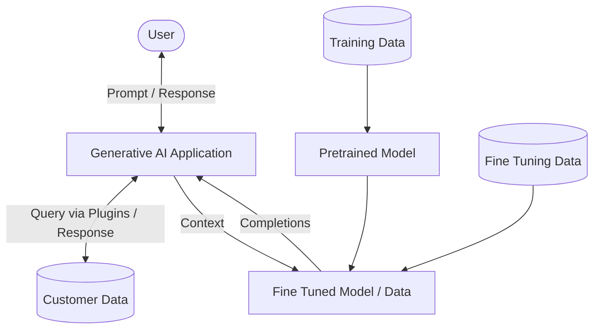
```mermaid
flowchart TD
    User([User]) <-->|Prompt / Response| App[Generative AI Application]
    App <-->|Query via Plugins / Response| CustData[(Customer Data)]
    App -->|Context| FTModel[Fine Tuned Model / Data]
    FTModel -->|Completions| App
    
    TrainData[(Training Data)] --> PreModel[Pretrained Model]
    FTData[(Fine Tuning Data)] --> FTModel
    PreModel --> FTModel
```

## Data Engineering Lifecycle

The data engineering lifecycle runs iteratively to collect, process, validate, and analyse data used for model operations.


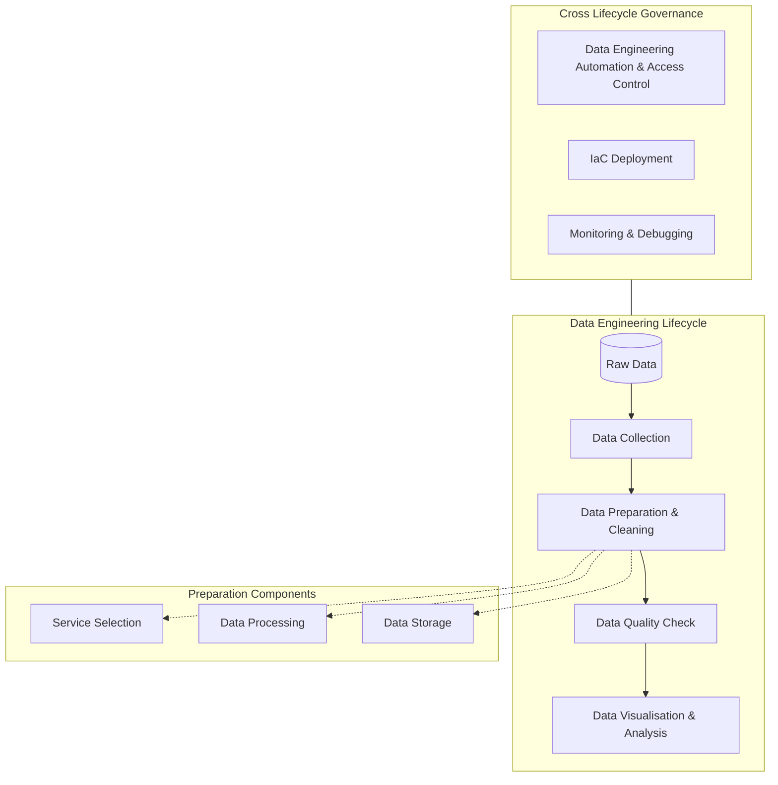
```mermaid
flowchart TD
    subgraph Governance [Cross Lifecycle Governance]
        Automation[Data Engineering Automation & Access Control]
        IaC[IaC Deployment]
        Observability[Monitoring & Debugging]
    end

    subgraph CorePipeline [Data Engineering Lifecycle]
        Raw[(Raw Data)] --> Stage1[Data Collection]
        Stage1 --> Stage2[Data Preparation & Cleaning]
        Stage2 --> Stage3[Data Quality Check]
        Stage3 --> Stage4[Data Visualisation & Analysis]
    end

    subgraph PrepDetails [Preparation Components]
        Stage2 -.-> Svc[Service Selection]
        Stage2 -.-> Proc[Data Processing]
        Stage2 -.-> Stor[Data Storage]
    end

    Governance --- CorePipeline
```

### Automation and Pipeline Governance

- Orchestrate data workflows using tools like **AWS Glue Workflows** to manage extract, transform, and load operations.
    
      
    
- Configure explicit starting triggers, intermediate steps, and segregated branches for passed and failed tasks.
    
      
    
- Record error events without halting unaffected pipeline operations.
    
      
    
- Deploy supporting infrastructure through code to ensure consistent environments.
    
      
    

## Data Quality Assurance

Reliable generative AI outputs require strict data validation.

  

|**Metric**|**Core Focus**|**Exam Application**|
|---|---|---|
|**Completeness**|Full coverage of relevant operational scenarios|Ensures no critical edge cases, scenarios, or systemic biases are missing from training sets.|
|**Accuracy**|Real world fidelity|Guarantees training records reflect current, correct, and verifiable real world conditions.|
|**Timeliness**|Currency of records|Measures the age of data in stores to prevent staleness in model representations.|
|**Consistency**|Logical coherence|Maintains uniform formats, values, and relations across development and serving stages.|

### Engineering Checkpoints

- Embed automated tests and validation rules across pipeline boundaries.
    
      
    
- Run scheduled profiling to catch drift or corrupt values early.
    
      
    
- Implement structured feedback mechanisms to remediate pipeline flaws.
    
      
    
- Maintain complete data lineage and metadata tracking from ingestion to inference.
    
      
    

## Questions You Might Have Missed

**What specific controls separate failed and passed stages in AWS Glue?**

  

AWS Glue workflows use conditional predicates and status watchers. These run downstream jobs only when preceding crawlers or ETL jobs return target success states, routing errors to separate alerting queues.

  

**How does data lineage mitigate security risks during model auditing?**

  

Data lineage records every transform and source system. If malicious inputs or poisoned data enter training sets, engineers can pinpoint the exact origin, isolate contaminated model weights, and roll back changes.

  

**Why does Scope 4 switch fine tuning control to the customer?**

  

In Scope 4, organisations fine tune foundation models inside their own managed environments or dedicated tenants. The organisation provides proprietary domain data rather than relying on external vendor tuning.